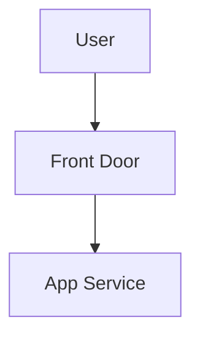
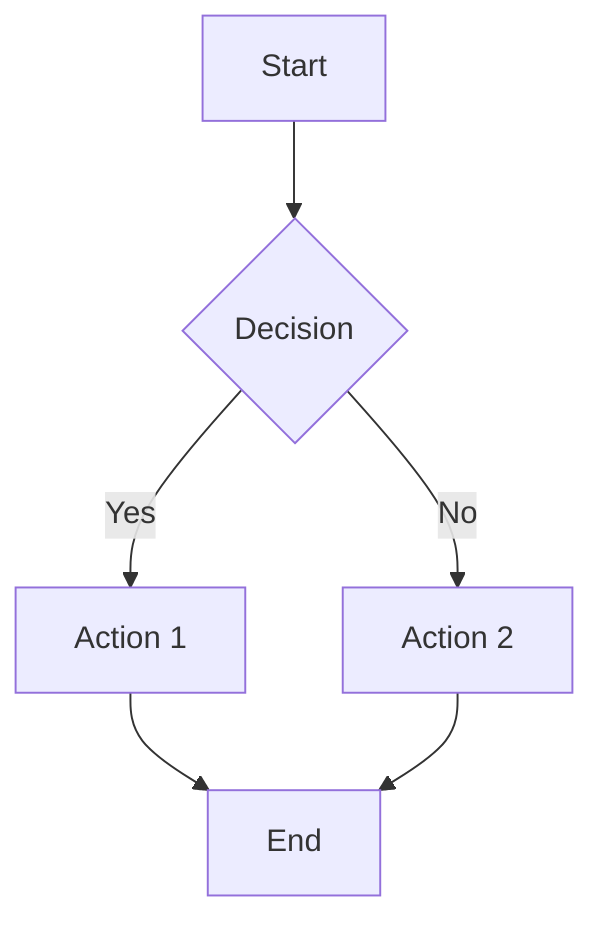
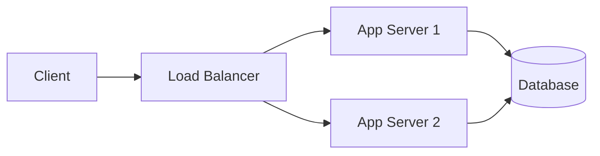
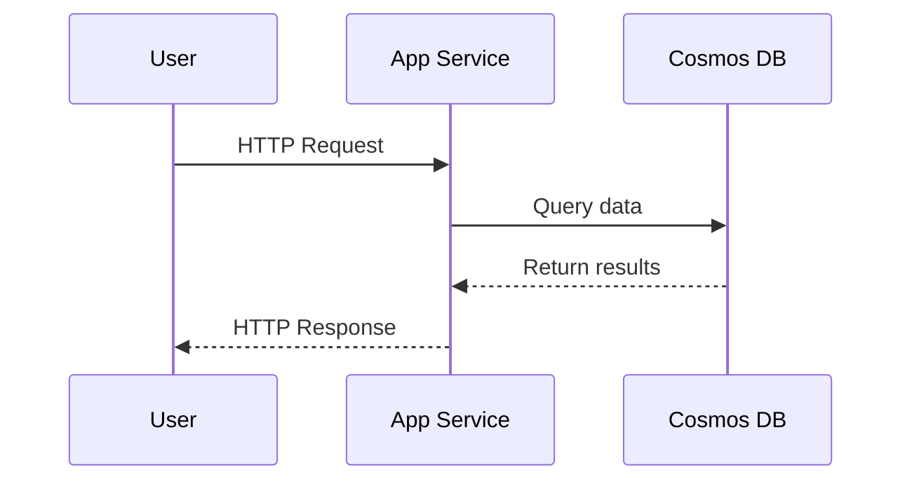
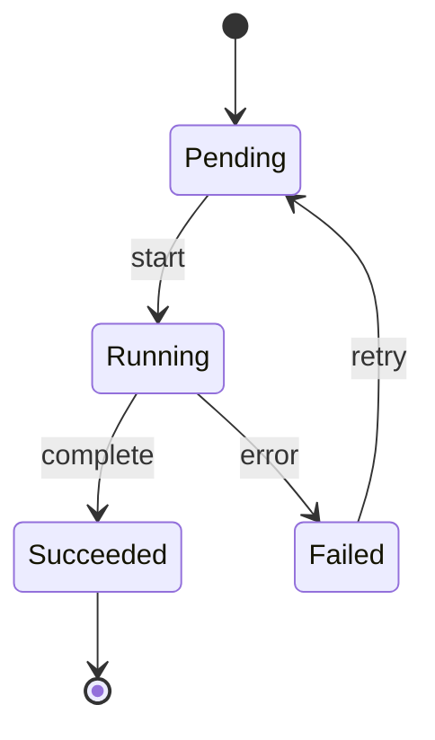
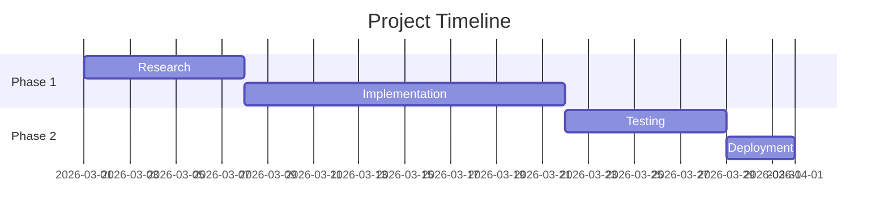
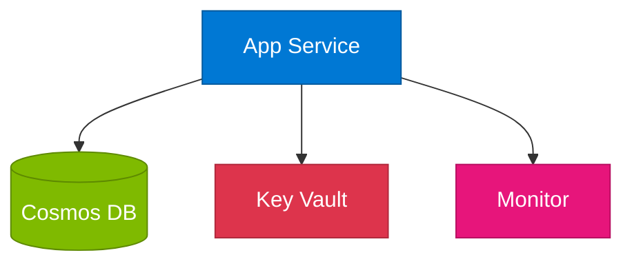

# Mermaid Diagram Skill

Generate Mermaid diagrams for lightweight visualizations in blog posts.

## When to Use Mermaid vs draw.io

| Use Mermaid | Use draw.io |
| ----------- | ----------- |
| Flowcharts (< 10 nodes) | Complex architecture with cloud icons |
| Sequence diagrams | Multi-layer network diagrams |
| State diagrams | Diagrams requiring precise positioning |
| Simple ER diagrams | Diagrams needing cloud-provider icons |
| Decision trees | Diagrams with > 15 components |

## Pelican Integration

### Option 1: Inline with pelican-mermaid plugin

If the `pelican-mermaid` plugin is installed, use fenced code blocks:

````markdown

````

### Option 2: Pre-rendered SVG

Generate SVG via Mermaid CLI and embed as image:

```bash
npx -p @mermaid-js/mermaid-cli mmdc -i diagram.mmd -o content/images/<slug>/diagram.svg
```

Then reference in the post:
```markdown

```

## Diagram Types & Syntax

### Flowchart (Top-Down)



### Flowchart (Left-Right)



### Sequence Diagram



### State Diagram



### Gantt Chart (for timelines)



## Styling Rules

### Node Shapes

| Shape | Syntax | Use for |
| ----- | ------ | ------- |
| Rectangle | `[Text]` | Services, components |
| Rounded | `(Text)` | Processes, actions |
| Diamond | `{Text}` | Decisions |
| Cylinder | `[(Text)]` | Databases |
| Stadium | `([Text])` | Start/End |
| Hexagon | `{{Text}}` | Conditions |

### Color Theming (Azure-aligned)



### Guidelines

- Max 15 nodes per diagram. Split complex flows into multiple diagrams.
- Use descriptive node labels (not abbreviations).
- Add edge labels for protocols/actions: `-->|HTTPS:443|`
- Use consistent direction: `TD` for hierarchies, `LR` for flows.
- Keep node IDs short but meaningful: `app`, `db`, `lb` (not `a1`, `b2`).
