Title: SRE Agent Deck Planning Notes
Date: 2026-01-27
Slug: SRE-Agent-Planning
Lang: en-us
Category: notebook
Tags: azure, SRE Agent, AIOps
Summary: Study notes for building an overview deck about Azure SRE Agent.

This note uses **only facts grounded in Microsoft Learn** and reorganizes them into a PPT-friendly structure: “speaker notes (what I say) + slide takeaways.”

How I cite:
- In the main body, I only place reference IDs like `[chapter-number]` (I don’t paste URLs inline).
- At the end of each chapter, I list **References (numbered / URL + short quote)**.

---

## 0. Official pages (minimal set)

- [Overview](https://learn.microsoft.com/en-us/azure/sre-agent/overview)
- [Create and use an agent](https://learn.microsoft.com/en-us/azure/sre-agent/usage)
- [Roles and permissions overview](https://learn.microsoft.com/en-us/azure/sre-agent/roles-permissions-overview)
- [User access roles](https://learn.microsoft.com/en-us/azure/sre-agent/user-access-roles)
- [Managed identity](https://learn.microsoft.com/en-us/azure/sre-agent/agent-managed-identity)
- [Agent run modes](https://learn.microsoft.com/en-us/azure/sre-agent/agent-run-modes)
- [Scheduled tasks](https://learn.microsoft.com/en-us/azure/sre-agent/scheduled-tasks)
- [Incident management](https://learn.microsoft.com/en-us/azure/sre-agent/incident-management)
- [Incident response plan](https://learn.microsoft.com/en-us/azure/sre-agent/incident-response-plan)
- [Memory system](https://learn.microsoft.com/en-us/azure/sre-agent/memory-system)
- [Subagent builder overview](https://learn.microsoft.com/en-us/azure/sre-agent/subagent-builder-overview)
- [Connectors](https://learn.microsoft.com/en-us/azure/sre-agent/connectors)
- [Custom logic (Python)](https://learn.microsoft.com/en-us/azure/sre-agent/custom-logic-python)
- [Custom MCP server](https://learn.microsoft.com/en-us/azure/sre-agent/custom-mcp-server)
- [FAQ](https://learn.microsoft.com/en-us/azure/sre-agent/faq)

---

## 1. Core behavior (Overview)

### What it is (speaker notes)
Azure SRE Agent is delivered as a chatbot-like experience that uses AI to help with monitoring, troubleshooting, and remediation operations.[1-1]

### Slide takeaways (what I want the audience to remember)
- “Diagnosis (read)” and “change (write)” happen in the same conversation flow (but write requires approval).[1-2]
- The chat UI language is limited to English, so for internal rollout I should standardize runbooks and prompts in English.[1-3]
- Creating an agent also creates Application Insights, Log Analytics, and a Managed Identity—meaning the “places where ops data and permissions live” increase.[1-4]

### Conversation → diagnosis → change flow

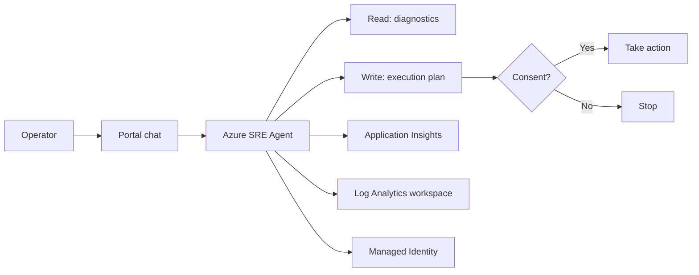

### References (Chapter 1)
- [1-1] [https://learn.microsoft.com/en-us/azure/sre-agent/overview](https://learn.microsoft.com/en-us/azure/sre-agent/overview) — “AI-powered monitoring, troubleshooting, and remediation capabilities.”
- [1-2] [https://learn.microsoft.com/en-us/azure/sre-agent/overview](https://learn.microsoft.com/en-us/azure/sre-agent/overview) — “any action that an agent takes on your behalf requires your approval.”
- [1-3] [https://learn.microsoft.com/en-us/azure/sre-agent/overview](https://learn.microsoft.com/en-us/azure/sre-agent/overview) — “English is the only supported language in the chat interface.”
- [1-4] [https://learn.microsoft.com/en-us/azure/sre-agent/overview](https://learn.microsoft.com/en-us/azure/sre-agent/overview) — “Azure Application Insights / Log Analytics workspace / Managed Identity”

---

## 2. Prerequisites (Usage)

### What is required (speaker notes)
To create an SRE Agent, the user needs the `Microsoft.Authorization/roleAssignments/write` permission.[2-1]

From a network perspective, reachability to `*.azuresre.ai` is also required.[2-2]

### Slide takeaways (common rollout blockers)
- This permission is required not only to create the SRE Agent resource, but also for role assignment operations happening behind the scenes.[2-1]
- If `*.azuresre.ai` is blocked, the portal experience can break; it’s practical to start with a network check.[2-2]

### Prerequisite check

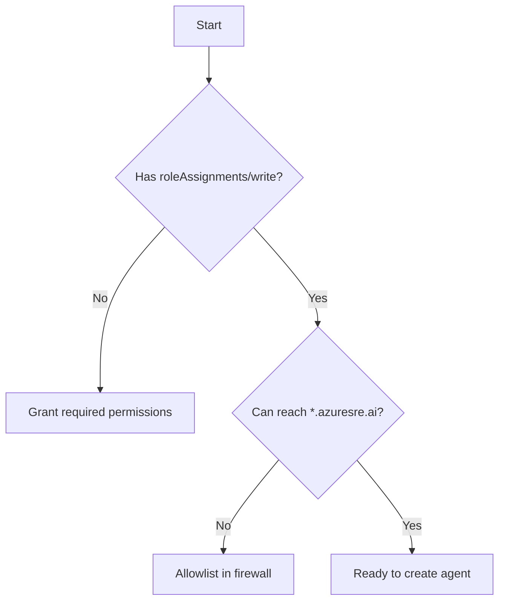

### References (Chapter 2)
- [2-1] [https://learn.microsoft.com/en-us/azure/sre-agent/usage](https://learn.microsoft.com/en-us/azure/sre-agent/usage) — “Make sure that your user account has the `Microsoft.Authorization/roleAssignments/write` permissions”
- [2-2] [https://learn.microsoft.com/en-us/azure/sre-agent/usage](https://learn.microsoft.com/en-us/azure/sre-agent/usage) — “Add `*.azuresre.ai` to the allowlist in your firewall settings.”

---

## 3. Security model (three components + boundary)

### What I should explain (speaker notes)
SRE Agent permissions can be explained with three components: (1) the user’s role for SRE Agent, (2) the agent’s own managed identity, and (3) the run modes.[3-1]

This decomposition maps cleanly to “who (RBAC),” “as what (agent identity),” and “within what guardrails (run mode + consent/credentials).”[3-6]

### Slide takeaways (separation of duties)
- There are three user roles for SRE Agent: Admin / Standard User / Reader.[3-2]
- The agent’s managed identity can have Reader or Privileged permission levels.[3-3]
- “Autonomous” isn’t unconditional; it’s limited to the incident management plan context.[3-4]
- The boundary rule (“agent permissions take precedence”) is the direct answer to privilege-escalation concerns.[3-5]

Additional notes (speaker notes):
- I explain the key points as: “RBAC controls user capabilities,” “MI can be Reader/Privileged,” “run modes affect how consent/credentials are handled,” and “agent scope/permissions take precedence to prevent privilege escalation.”[3-7]

### The 3 components

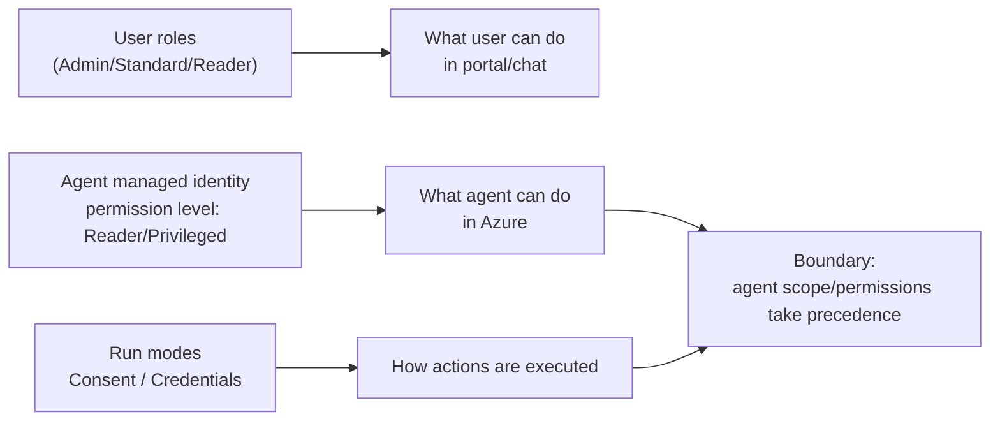

### References (Chapter 3)
- [3-1] [https://learn.microsoft.com/en-us/azure/sre-agent/roles-permissions-overview](https://learn.microsoft.com/en-us/azure/sre-agent/roles-permissions-overview) — “consists of three main components”
- [3-2] [https://learn.microsoft.com/en-us/azure/sre-agent/roles-permissions-overview](https://learn.microsoft.com/en-us/azure/sre-agent/roles-permissions-overview) — “Three primary roles (*SRE Agent Admin*, *SRE Agent Standard User*, and *SRE Agent Reader*)”
- [3-3] [https://learn.microsoft.com/en-us/azure/sre-agent/roles-permissions-overview](https://learn.microsoft.com/en-us/azure/sre-agent/roles-permissions-overview) — “either *Reader* or *Privileged* access”
- [3-4] [https://learn.microsoft.com/en-us/azure/sre-agent/agent-run-modes](https://learn.microsoft.com/en-us/azure/sre-agent/agent-run-modes) — “you can only enable autonomous mode in the context of an incident management plan”
- [3-5] [https://learn.microsoft.com/en-us/azure/sre-agent/roles-permissions-overview](https://learn.microsoft.com/en-us/azure/sre-agent/roles-permissions-overview) — “Agent permissions take precedence … to prevent privilege escalation”
- [3-6] [https://learn.microsoft.com/en-us/azure/sre-agent/roles-permissions-overview#key-concepts](https://learn.microsoft.com/en-us/azure/sre-agent/roles-permissions-overview#key-concepts) — “The security model consists of three main components.”
- [3-7] [https://learn.microsoft.com/en-us/azure/sre-agent/roles-permissions-overview#security-model-at-a-glance](https://learn.microsoft.com/en-us/azure/sre-agent/roles-permissions-overview#security-model-at-a-glance) — “RBAC … permission levels … run modes … agent permissions take precedence.”

---

## 4. Managed Identity (Reader/Privileged and OBO)

### What it’s for (speaker notes)
SRE Agent has its own managed identity and uses that identity to operate on the managed resource groups.[4-1]

When creating an agent in the portal, you choose an access permission level: “Reader” or “Privileged.”[4-5]

### Slide takeaways (can we start with Reader?)
- If the permission level is Reader, the agent can request temporary elevation from the user as needed and complete the task via the OBO flow.[4-2]
- Examples of roles assigned upfront to the managed resource group include Log Analytics Reader / Azure Reader / Monitoring Reader.[4-3]
- When tightening access, organize the scope by excluding resource groups rather than “subtracting individual permissions.”[4-4]

Additional notes (speaker notes):
- The agent executes actions only when both “user consent” and “appropriate RBAC assignment” are satisfied.[4-6]
- Review mode uses explicit consent; incident management plan context is treated as implicit consent.[4-7]

### MI and OBO flow

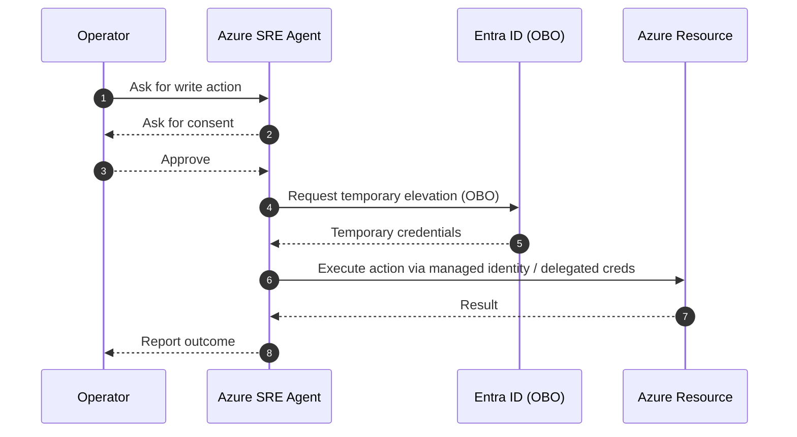

### References (Chapter 4)
- [4-1] [https://learn.microsoft.com/en-us/azure/sre-agent/agent-managed-identity](https://learn.microsoft.com/en-us/azure/sre-agent/agent-managed-identity) — “The agent uses its managed identity to interact with your resources”
- [4-2] [https://learn.microsoft.com/en-us/azure/sre-agent/agent-managed-identity](https://learn.microsoft.com/en-us/azure/sre-agent/agent-managed-identity) — “request temporary elevation (OBO)”
- [4-3] [https://learn.microsoft.com/en-us/azure/sre-agent/agent-managed-identity](https://learn.microsoft.com/en-us/azure/sre-agent/agent-managed-identity) — “Log Analytics Reader / Azure Reader / Monitoring Reader”
- [4-4] [https://learn.microsoft.com/en-us/azure/sre-agent/agent-managed-identity](https://learn.microsoft.com/en-us/azure/sre-agent/agent-managed-identity) — “remove the resource group from the scope”
- [4-5] [https://learn.microsoft.com/en-us/azure/sre-agent/agent-managed-identity](https://learn.microsoft.com/en-us/azure/sre-agent/agent-managed-identity) — “Choose a permission level (Reader or Privileged)”
- [4-6] [https://learn.microsoft.com/en-us/azure/sre-agent/agent-managed-identity#permissions-and-consent](https://learn.microsoft.com/en-us/azure/sre-agent/agent-managed-identity#permissions-and-consent) — “Actions run only with user consent and appropriate RBAC assignments.”
- [4-7] [https://learn.microsoft.com/en-us/azure/sre-agent/agent-managed-identity#permissions-and-consent](https://learn.microsoft.com/en-us/azure/sre-agent/agent-managed-identity#permissions-and-consent) — “Review mode uses explicit consent; incident management plan context is treated as implicit consent.”

---

## 5. Run modes (separating Consent and Credentials)

### What happens (speaker notes)
For write actions, SRE Agent treats (a) consent for the execution plan and (b) temporary access to credentials (when permissions are insufficient) as separate concepts.[5-1]

The default is Review mode: the agent generates an execution plan, waits for consent, and then executes actions.[5-5]

Review mode generates an execution plan and waits for consent before executing.[5-2]

If credentials permission is needed, temporary credentials are used via OBO and revoked after completion.[5-3]

Autonomous mode is treated as “implicit consent,” but it is not unlimited: it’s limited to the incident management plan context.[5-4]

Autonomy cannot be enabled for “any context”; the scope is intentionally restricted to keep actions within a safer boundary.[5-6]

### Flow (Review mode)

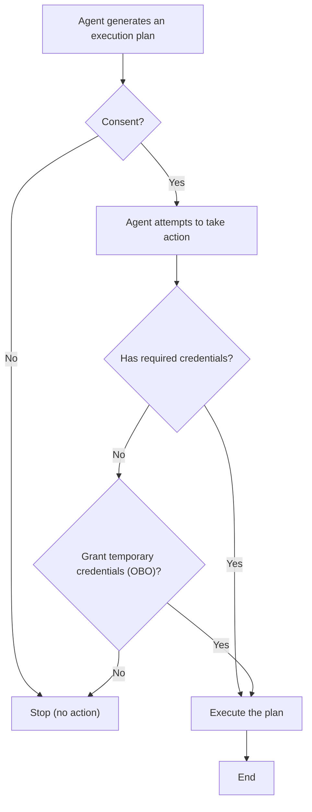

### References (Chapter 5)
- [5-1] [https://learn.microsoft.com/en-us/azure/sre-agent/agent-run-modes](https://learn.microsoft.com/en-us/azure/sre-agent/agent-run-modes) — “Consent / Credentials”
- [5-2] [https://learn.microsoft.com/en-us/azure/sre-agent/agent-run-modes](https://learn.microsoft.com/en-us/azure/sre-agent/agent-run-modes) — “generates an execution plan and waits for your consent”
- [5-3] [https://learn.microsoft.com/en-us/azure/sre-agent/agent-run-modes](https://learn.microsoft.com/en-us/azure/sre-agent/agent-run-modes) — “Any access to user credentials are revoked once the action is complete.”
- [5-4] [https://learn.microsoft.com/en-us/azure/sre-agent/agent-run-modes](https://learn.microsoft.com/en-us/azure/sre-agent/agent-run-modes) — “implicit consent”
- [5-5] [https://learn.microsoft.com/en-us/azure/sre-agent/agent-run-modes#review-vs-autonomous-mode](https://learn.microsoft.com/en-us/azure/sre-agent/agent-run-modes#review-vs-autonomous-mode) — “Default is review mode … generate an execution plan and wait for consent before executing.”
- [5-6] [https://learn.microsoft.com/en-us/azure/sre-agent/agent-run-modes#review-vs-autonomous-mode](https://learn.microsoft.com/en-us/azure/sre-agent/agent-run-modes#review-vs-autonomous-mode) — “Autonomy is not available in every context … restricted scope.”

---

## 6. Scheduled tasks

### What it is (speaker notes)
Scheduled tasks let you run workflows on a schedule (monitoring / maintenance / security checks).[6-1]

### How to create (speaker notes)
You can create tasks in the UI. You can also request them during chat, or have them generated autonomously as part of incident response.[6-2]

There are helpers like “Draft the cron for me” (natural language → cron) and “Polish instructions” (improve task instructions).[6-3][6-4]

### Create + execution paths

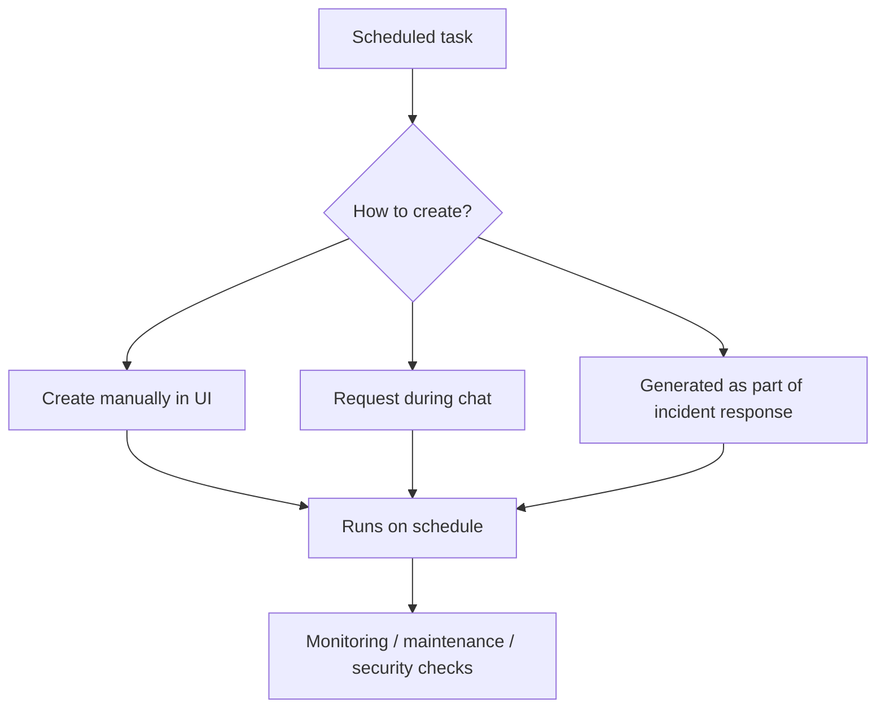

### References (Chapter 6)
- [6-1] [https://learn.microsoft.com/en-us/azure/sre-agent/scheduled-tasks](https://learn.microsoft.com/en-us/azure/sre-agent/scheduled-tasks) — “automate workflows such as monitoring, maintenance, and security checks”
- [6-2] [https://learn.microsoft.com/en-us/azure/sre-agent/scheduled-tasks](https://learn.microsoft.com/en-us/azure/sre-agent/scheduled-tasks) — “create these tasks manually, request them during a chat … allow the agent to generate them autonomously as part of incident response”
- [6-3] [https://learn.microsoft.com/en-us/azure/sre-agent/scheduled-tasks](https://learn.microsoft.com/en-us/azure/sre-agent/scheduled-tasks) — “Draft the cron for me”
- [6-4] [https://learn.microsoft.com/en-us/azure/sre-agent/scheduled-tasks](https://learn.microsoft.com/en-us/azure/sre-agent/scheduled-tasks) — “Polish instructions”

---

## 7. Incident management

### What it is (speaker notes)
Incident management connects to an incident management platform and receives alerts from sources like Azure Monitor alerts, PagerDuty, and ServiceNow.[7-1]

### Where an incident response plan fits (speaker notes)
An incident response plan defines how incidents are detected, reviewed, and mitigated. You can customize filters, execution mode, and custom instructions.[7-2]

### Defaults (speaker notes)
When incident management is enabled, the default connects to Azure Monitor alerts, applies to low priority across all services, and runs in review mode.[7-3]

### Testing (speaker notes)
An incident response plan can be run against past incidents in test mode. Test mode is read-only.[7-4]

### How the agent responds (speaker notes)
- When an incident is detected, a new chat thread is created in chat history with initial analysis.[7-9]
- In Viewer mode, the agent provides recommendations and requires human intervention. In Autonomous mode (depending on configuration) it can auto-close incidents or execute remediation, and may update/close incidents in the management platform.[7-10]
- Platform configuration can control which incident types are sent to SRE Agent (for example: send low priority, but handle high priority with humans).[7-11]
- By customizing incident handlers, you can control autonomy level, available tools, custom instructions, and more.[7-12]

### Dashboard (speaker notes)
The Incident management tab provides a dashboard (central view of incidents the agent manages, key metrics, pending incidents, etc.).[7-13]
It provides aggregated visualizations and AI-generated root cause analysis to understand trends and optimize response plans.[7-14]

### Incident handling flow

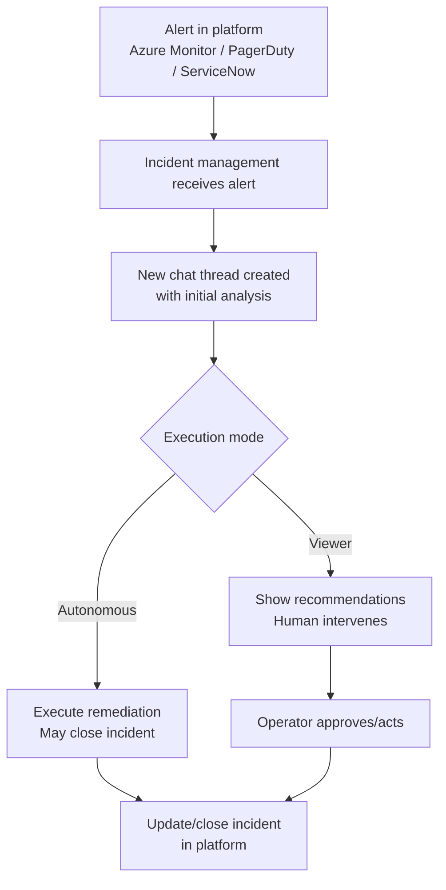

### PagerDuty integration note (speaker notes)
PagerDuty integration requires a User API key. A General API key can’t acknowledge incidents.[7-5]

### References (Chapter 7)
- [7-1] [https://learn.microsoft.com/en-us/azure/sre-agent/incident-management](https://learn.microsoft.com/en-us/azure/sre-agent/incident-management) — “receives alerts from … Azure Monitor alerts … PagerDuty … ServiceNow”
- [7-2] [https://learn.microsoft.com/en-us/azure/sre-agent/incident-response-plan](https://learn.microsoft.com/en-us/azure/sre-agent/incident-response-plan) — “Filters … Execution mode … Customize instructions”
- [7-3] [https://learn.microsoft.com/en-us/azure/sre-agent/incident-response-plan](https://learn.microsoft.com/en-us/azure/sre-agent/incident-response-plan) — “Processes all low priority incidents … Runs in review mode”
- [7-4] [https://learn.microsoft.com/en-us/azure/sre-agent/incident-response-plan](https://learn.microsoft.com/en-us/azure/sre-agent/incident-response-plan) — “In test mode … always operates in a read-only mode.”
- [7-5] [https://learn.microsoft.com/en-us/azure/sre-agent/incident-management](https://learn.microsoft.com/en-us/azure/sre-agent/incident-management) — “You must use a User API key … General API keys don't allow the agent to acknowledge incidents properly”
- [7-6] [https://learn.microsoft.com/en-us/azure/sre-agent/incident-management?tabs=azmon-alerts#platform-integration](https://learn.microsoft.com/en-us/azure/sre-agent/incident-management?tabs=azmon-alerts#platform-integration) — “Azure Monitor (default integration) requires minimal setup … PagerDuty and ServiceNow require additional setup.”
- [7-7] [https://learn.microsoft.com/en-us/azure/sre-agent/incident-management?tabs=azmon-alerts#platform-integration](https://learn.microsoft.com/en-us/azure/sre-agent/incident-management?tabs=azmon-alerts#platform-integration) — “Open the agent and select the Incident platform tab.”
- [7-8] [https://learn.microsoft.com/en-us/azure/sre-agent/incident-management?tabs=azmon-alerts#platform-integration](https://learn.microsoft.com/en-us/azure/sre-agent/incident-management?tabs=azmon-alerts#platform-integration) — “By default, Azure Monitor alerts are configured as the incident management platform.”
- [7-9] [https://learn.microsoft.com/en-us/azure/sre-agent/incident-management?tabs=azmon-alerts#agent-responses](https://learn.microsoft.com/en-us/azure/sre-agent/incident-management?tabs=azmon-alerts#agent-responses) — “When an incident is detected … a new thread is created in chat history.”
- [7-10] [https://learn.microsoft.com/en-us/azure/sre-agent/incident-management?tabs=azmon-alerts#agent-responses](https://learn.microsoft.com/en-us/azure/sre-agent/incident-management?tabs=azmon-alerts#agent-responses) — “Viewer mode provides recommendations; autonomous mode can close incidents or execute remediation … update or close incidents.”
- [7-11] [https://learn.microsoft.com/en-us/azure/sre-agent/incident-management?tabs=azmon-alerts#agent-responses](https://learn.microsoft.com/en-us/azure/sre-agent/incident-management?tabs=azmon-alerts#agent-responses) — “Configuration controls which incident types are sent to the agent.”
- [7-12] [https://learn.microsoft.com/en-us/azure/sre-agent/incident-management?tabs=azmon-alerts#agent-responses](https://learn.microsoft.com/en-us/azure/sre-agent/incident-management?tabs=azmon-alerts#agent-responses) — “Customize incident handlers … autonomy level … available tools … custom instructions.”
- [7-13] [https://learn.microsoft.com/en-us/azure/sre-agent/incident-management?tabs=azmon-alerts#dashboard](https://learn.microsoft.com/en-us/azure/sre-agent/incident-management?tabs=azmon-alerts#dashboard) — “Dashboard … centralized view … key metrics … pending incidents.”
- [7-14] [https://learn.microsoft.com/en-us/azure/sre-agent/incident-management?tabs=azmon-alerts#dashboard](https://learn.microsoft.com/en-us/azure/sre-agent/incident-management?tabs=azmon-alerts#dashboard) — “Aggregated visualizations and AI-generated root cause analysis.”

---

## 8. Memory system

### What it is (speaker notes)
The memory system provides runbooks, team standards, and service-specific context so troubleshooting is more effective.[8-1]

### Components (speaker notes)
The components are: User Memories / Knowledge Base / Documentation connector / Session insights.[8-2]

Additional notes (speaker notes):
- Session insights are memories generated automatically from sessions.[8-7]

### How retrieval works (speaker notes)
`SearchMemory` searches across all four components. For custom subagents, you need to add this tool.[8-3]

For more targeted retrieval, `SearchNodes` supports filters; setting `includeNeighbors` to `true` also returns connected nodes (resources, related incidents, etc.).[8-8]

### Data ingestion cautions (speaker notes)
Secrets (secrets/credentials/API keys) must not be stored.[8-4]

Memories are shared by the team and indexed by the system for search.[8-9]

### Knowledge Base limits (speaker notes)
The knowledge base accepts `.md` and `.txt`, with up to 16MB per file.[8-5]

There is also a total limit of 100MB per upload request.[8-10]

### Memory layout and search

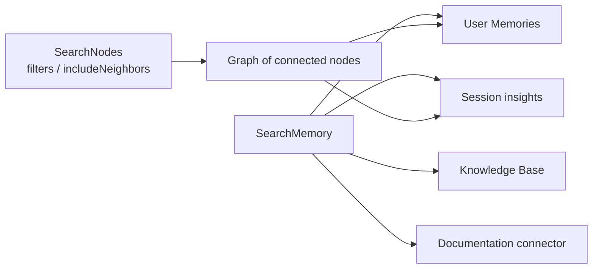

### User memories operations (speaker notes)
User memories use chat commands: `#remember` / `#forget` / `#retrieve`.[8-6]

`#remember` stores facts/standards/context for future conversations; `#forget` searches and deletes stored memories; `#retrieve` searches/displays without triggering agent reasoning.[8-11]

### Session insights (speaker notes)
Session insights capture “symptoms, resolution steps, root causes, and pitfalls” from each session as searchable memories. Related past insights are automatically retrieved in future sessions.[8-12]

Insights are generated automatically on a periodic schedule (about every 30 minutes) after a conversation ends, or you can generate on-demand (about 30 seconds) via the chat footer.[8-13]

### References (Chapter 8)
- [8-1] [https://learn.microsoft.com/en-us/azure/sre-agent/memory-system](https://learn.microsoft.com/en-us/azure/sre-agent/memory-system) — “gives agents the knowledge they need to troubleshoot effectively”
- [8-2] [https://learn.microsoft.com/en-us/azure/sre-agent/memory-system](https://learn.microsoft.com/en-us/azure/sre-agent/memory-system) — “consists of four complementary components”
- [8-3] [https://learn.microsoft.com/en-us/azure/sre-agent/memory-system](https://learn.microsoft.com/en-us/azure/sre-agent/memory-system) — “SearchMemory tool retrieves all memory components … Custom subagents: Add SearchMemory”
- [8-4] [https://learn.microsoft.com/en-us/azure/sre-agent/memory-system](https://learn.microsoft.com/en-us/azure/sre-agent/memory-system) — “Don't store secrets, credentials, API keys”
- [8-5] [https://learn.microsoft.com/en-us/azure/sre-agent/memory-system](https://learn.microsoft.com/en-us/azure/sre-agent/memory-system) — “Upload `.md` or `.txt` files (up to 16 MB each).”
- [8-6] [https://learn.microsoft.com/en-us/azure/sre-agent/memory-system](https://learn.microsoft.com/en-us/azure/sre-agent/memory-system) — “chat commands (`#remember`, `#forget`, `#retrieve`)”
- [8-7] [https://learn.microsoft.com/en-us/azure/sre-agent/memory-system#memory-components](https://learn.microsoft.com/en-us/azure/sre-agent/memory-system#memory-components) — “Session insights … memories generated by the agent from sessions (automatic).”
- [8-8] [https://learn.microsoft.com/en-us/azure/sre-agent/memory-system#advanced-search-parameters](https://learn.microsoft.com/en-us/azure/sre-agent/memory-system#advanced-search-parameters) — “`SearchNodes` … filter options … `includeNeighbors` set to `true` returns connected nodes.”
- [8-9] [https://learn.microsoft.com/en-us/azure/sre-agent/memory-system#tool-configuration](https://learn.microsoft.com/en-us/azure/sre-agent/memory-system#tool-configuration) — “Teams share memory, and the system indexes it for search.”
- [8-10] [https://learn.microsoft.com/en-us/azure/sre-agent/memory-system#supported-file-types-and-limits](https://learn.microsoft.com/en-us/azure/sre-agent/memory-system#supported-file-types-and-limits) — “Per request … total limit of 100 MB.”
- [8-11] [https://learn.microsoft.com/en-us/azure/sre-agent/memory-system#chat-commands](https://learn.microsoft.com/en-us/azure/sre-agent/memory-system#chat-commands) — “`#remember` … `#forget` … `#retrieve`”
- [8-12] [https://learn.microsoft.com/en-us/azure/sre-agent/memory-system#session-insights](https://learn.microsoft.com/en-us/azure/sre-agent/memory-system#session-insights) — “Captures symptoms, resolution steps, root causes, and pitfalls … searchable memory … automatically retrieved.”
- [8-13] [https://learn.microsoft.com/en-us/azure/sre-agent/memory-system#when-insights-are-generated](https://learn.microsoft.com/en-us/azure/sre-agent/memory-system#when-insights-are-generated) — “Generated about every 30 minutes … or on-demand (about 30 seconds).”

---

## 9. Subagent builder / Tools / Connectors / Custom MCP

### Subagent builder (speaker notes)
Subagent builder is a capability to “create, customize, and manage intelligent subagents” for operational workflows.[9-1]

What you can build includes: custom subagents, data integrations (monitoring tools / knowledge sources), automatic triggers (incident response plans / scheduled tasks), and actions (integration with external services).[9-4]

I structure subagent design as: define purpose and operational scope → connect data sources → associate system tools/MCP integrations → add custom instructions → define handoff rules.[9-5]

Incident response plans or scheduled tasks can trigger subagents.[9-6]

### Python custom logic (speaker notes)
You can create Python tools in subagent builder. The creation path is: **[Builder > Subagent builder]** → **Create > Tools** → **Python tool**.[9-7]

Python tools have constraints like: timeout 5–900 seconds (default 120), must include `def main`, and return values are JSON-serialized (dict/list/primitives/None→null).[9-8][9-9]

Tool modes (auto/manual/hidden) control how the agent calls tools. If the tool needs to access Azure resources, configure managed identity access from the **[ID]** tab.[9-10][9-11]

### Connectors (speaker notes)
Connectors are integrations that extend SRE Agent. This includes communication connectors (Outlook/Teams), ingestion of knowledge/telemetry (Datadog/Dynatrace/New Relic), and custom connectors that connect to any MCP endpoint.[9-12]

Connector setup is via **[Settings] > [Connectors]**. Choose the connector type (Outlook/Teams/Custom MCP). Outlook/Teams use OAuth; MCP uses a URL plus credentials or an OAuth token.[9-13]

### Custom MCP (speaker notes)
A custom MCP server must be hosted remotely and reachable over HTTPS. SRE Agent can’t run MCP servers locally.[9-2]

Also, MCP tools aren’t accessible directly from the main agent; they are accessible only through subagents.[9-3]

Additional notes (speaker notes):
- In a custom MCP connection, the connector defines: MCP server endpoint, transport (SSE/HTTP), and authentication mechanism.[9-14]
- Adding a connector uses: **[Settings] → [Connectors] → [Add connector] → Type: MCP Server**, then fill in name, connection type (SSE/HTTP), MCP server URL, auth, and validate.[9-15]

### Main agent / Subagent / Tools relationship

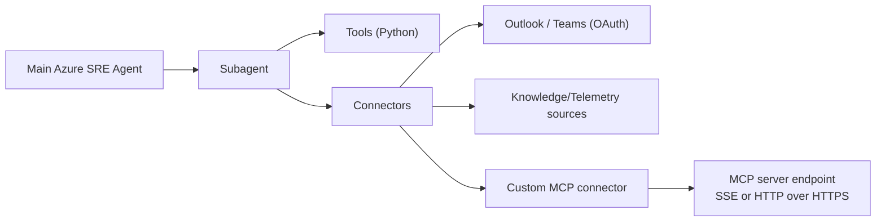

### References (Chapter 9)
- [9-1] [https://learn.microsoft.com/en-us/azure/sre-agent/subagent-builder-overview](https://learn.microsoft.com/en-us/azure/sre-agent/subagent-builder-overview) — “Incident response plans or scheduled tasks trigger subagents.”
- [9-2] [https://learn.microsoft.com/en-us/azure/sre-agent/custom-mcp-server](https://learn.microsoft.com/en-us/azure/sre-agent/custom-mcp-server) — “must host … remotely and make them reachable over HTTPS … doesn't support running MCP servers locally”
- [9-3] [https://learn.microsoft.com/en-us/azure/sre-agent/custom-mcp-server](https://learn.microsoft.com/en-us/azure/sre-agent/custom-mcp-server) — “only accessible through subagents and aren't directly accessible to main Azure SRE Agent.”
- [9-4] [https://learn.microsoft.com/en-us/azure/sre-agent/subagent-builder-overview#what-you-can-build-with-subagent-builder](https://learn.microsoft.com/en-us/azure/sre-agent/subagent-builder-overview#what-you-can-build-with-subagent-builder) — “Custom subagents … data integrations … automated triggers … actions.”
- [9-5] [https://learn.microsoft.com/en-us/azure/sre-agent/subagent-builder-overview#work-with-subagent-builder](https://learn.microsoft.com/en-us/azure/sre-agent/subagent-builder-overview#work-with-subagent-builder) — “Primary purpose and operational scope … data sources … system tools and MCP integrations … custom instructions … handoff rules.”
- [9-6] [https://learn.microsoft.com/en-us/azure/sre-agent/subagent-builder-overview#work-with-subagent-builder](https://learn.microsoft.com/en-us/azure/sre-agent/subagent-builder-overview#work-with-subagent-builder) — “Incident response plans or scheduled tasks trigger subagents.”
- [9-7] [https://learn.microsoft.com/en-us/azure/sre-agent/custom-logic-python#create-a-python-tool](https://learn.microsoft.com/en-us/azure/sre-agent/custom-logic-python#create-a-python-tool) — “From the left navigation: [Builder > Subagent builder] … Create > Tools … Python tool.”
- [9-8] [https://learn.microsoft.com/en-us/azure/sre-agent/custom-logic-python#create-a-python-tool](https://learn.microsoft.com/en-us/azure/sre-agent/custom-logic-python#create-a-python-tool) — “Timeout (seconds) 5–900 … default 120 … must include a `def main` function.”
- [9-9] [https://learn.microsoft.com/en-us/azure/sre-agent/custom-logic-python#write-the-main-function](https://learn.microsoft.com/en-us/azure/sre-agent/custom-logic-python#write-the-main-function) — “The system automatically serializes the return value to JSON … supported types …”
- [9-10] [https://learn.microsoft.com/en-us/azure/sre-agent/custom-logic-python#configure-tool-mode](https://learn.microsoft.com/en-us/azure/sre-agent/custom-logic-python#configure-tool-mode) — “Automatic … Manual … Hidden”
- [9-11] [https://learn.microsoft.com/en-us/azure/sre-agent/custom-logic-python#set-up-identity](https://learn.microsoft.com/en-us/azure/sre-agent/custom-logic-python#set-up-identity) — “Tools that need to access Azure resources … [ID] tab … set up managed identity access.”
- [9-12] [https://learn.microsoft.com/en-us/azure/sre-agent/connectors#what-are-connectors](https://learn.microsoft.com/en-us/azure/sre-agent/connectors#what-are-connectors) — “Communication connectors … knowledge connectors … custom connectors … MCP server endpoint.”
- [9-13] [https://learn.microsoft.com/en-us/azure/sre-agent/connectors#configure-a-connector](https://learn.microsoft.com/en-us/azure/sre-agent/connectors#configure-a-connector) — “Settings … connectors … Outlook and Teams … OAuth … MCP URL and credentials or OAuth token.”
- [9-14] [https://learn.microsoft.com/en-us/azure/sre-agent/custom-mcp-server#how-custom-mcp-connections-work](https://learn.microsoft.com/en-us/azure/sre-agent/custom-mcp-server#how-custom-mcp-connections-work) — “Connector defines … endpoint … transport … authentication.”
- [9-15] [https://learn.microsoft.com/en-us/azure/sre-agent/custom-mcp-server#add-a-custom-mcp-server-connector](https://learn.microsoft.com/en-us/azure/sre-agent/custom-mcp-server#add-a-custom-mcp-server-connector) — “Azure portal … Settings → Connectors … Add connector … MCP server … SSE … HTTP … URL … authentication.”

---

## 10. Demo ideas: two troubleshooting stories that are not “copying Learn tutorials”

> Note: This section is **demo design (proposal)**: what to break and how to fix it.
> However, any parts I state as “facts” are grounded in Microsoft Learn and referenced by IDs.

### Demo A: “App Service is slow/timeouts” → isolate Cosmos DB 429 (throttling) / hot partitions

#### Goal (proposal)
- Start from an “App Service symptom,” then prove the root cause is “Cosmos DB throughput/partitioning” using portal metrics.
- Then use Azure SRE Agent (Cosmos DB SRE Agent) to create a repeatable troubleshooting conversation starter.[10A-1]

#### High-level overview

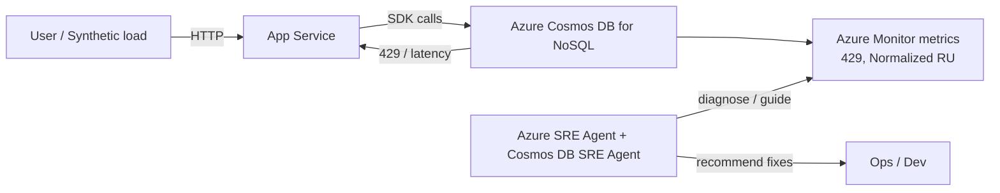

#### Setup (portal steps / separating facts vs proposals)

**A) Create Cosmos DB (NoSQL) in the Azure portal (facts)**
1) In the Azure portal, search for **Azure Cosmos DB**, select **Create**, then select **Azure Cosmos DB for NoSQL**.[10A-2]
2) Select **Review + create** → **Create** → **Go to resource** to create the account.[10A-3]

**B) Create a DB/container in Data Explorer (facts)**
1) In the Cosmos account menu, open **Data Explorer**.[10A-4]
2) Select **New Container** and create the database and container (set partition key and throughput: Manual/Autoscale).[10A-5][10A-6]

**C) Create App Service and deploy an app (facts + proposal)**
1) In the Azure portal: **App Services** → **+ Create > Web App**.[10A-7]
2) For the demo app, (proposal) implement endpoints that read/write Cosmos DB (for example, `/healthz` and `/burst`).
3) If following portal guidance: configure deployment via **Deployment Center** (example: **Source: External Git** → set **Repository/Branch** → **Save**).[10A-8]
4) After deployment, in App Service **Overview**, select **Browse** to confirm the app starts (startup can take some time).[10A-18]

**D) Inject Cosmos connection settings into App Service (facts)**
1) In App Service, open **Settings > Environment variables > Connection strings**.[10A-9]
2) Add with **Add**, apply with **Apply** (dialog) → **Apply** (Environment variables page).[10A-19]
3) You can register Cosmos DB connection strings, and App Service provides them as environment variables (Cosmos uses the `DOCDBCONNSTR_` prefix).[10A-10][10A-11]
4) In the portal, connection string values are hidden by default; show them via **Show value** / **Show values** when needed.[10A-20]

#### How to create the failure (proposal)
- To “produce 429,” (proposal) generate a burst of requests against a low RU/s container.
- To intentionally create a “hot partition,” (proposal) keep sending requests biased to a specific partition key value.

#### Triage (portal steps / facts)

**Step 1: Check if 429 is happening (facts)**
- 429 is “Request rate too large,” indicating Cosmos DB is returning rate limiting.[10A-12]
- In the Cosmos DB account, check **Insights > Requests > Total Requests by Status Code** and confirm the 429 share.[10A-13]

**Step 2: Decide whether it’s acceptable or a problem (facts)**
- If you see 1–5% of requests with 429s, that is mentioned as a “healthy sign” (if end-to-end latency is acceptable, no action needed).[10A-14]
- If 429 is high and persistent, proceed to the next step.

**Step 3: Check if it’s a hot partition (facts)**
- With a hot partition, a partition key range can stick at 100% and 429s can occur.[10A-15]
- Use **Insights > Throughput > Normalized RU Consumption (%) By PartitionKeyRangeID** to check skew (a high PartitionKeyRangeId indicates a hot partition candidate).[10A-16]

**Step 4: Branch on what to fix (facts)**

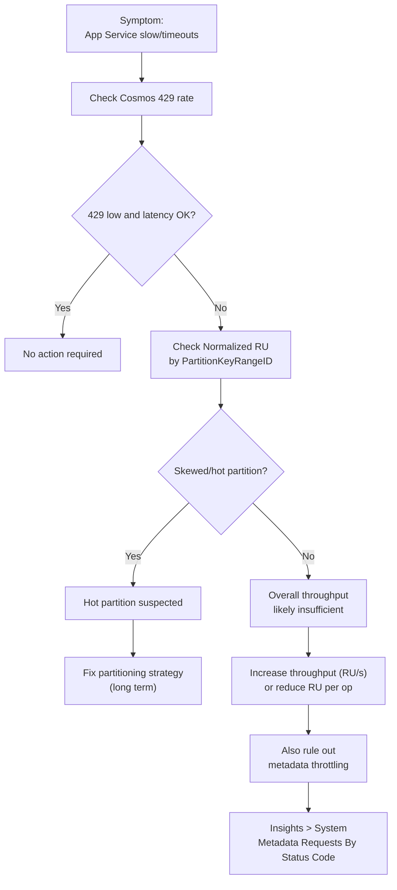

Additional notes (facts):
- Metadata operations (DB/container CRUD, listing, throughput checks, etc.) have a system-reserved RU limit, and “increasing RU/s has no effect” is explicitly stated.[10A-21]
- As an investigation path, **Insights > System > Metadata Requests By Status Code** is suggested.[10A-22]

#### Create a “conversation starter” with SRE Agent (facts + proposal)
- Cosmos DB SRE Agent is described as an “AI-powered diagnostic tool … simplify troubleshooting” using Azure SRE Agent.[10A-1]
- Setup is described as: create an SRE Agent → add Cosmos resources → enable the Preview Upgrade Channel → start a conversation.[10A-17]
- (proposal) As a prompt pattern, explicitly state “symptom → hypothesis,” e.g. `My App Service is slow. Check Cosmos throttling/hot partitions.`

#### References (Demo A)
- [10A-1] [https://learn.microsoft.com/en-us/azure/cosmos-db/site-reliability-engineering-agent](https://learn.microsoft.com/en-us/azure/cosmos-db/site-reliability-engineering-agent) — “AI-powered diagnostic tool … simplify troubleshooting”
- [10A-2] [https://learn.microsoft.com/en-us/azure/cosmos-db/quickstart-portal#create-an-account](https://learn.microsoft.com/en-us/azure/cosmos-db/quickstart-portal#create-an-account) — “select **Create**, and then **Azure Cosmos DB for NoSQL**.”
- [10A-3] [https://learn.microsoft.com/en-us/azure/cosmos-db/quickstart-portal#create-an-account](https://learn.microsoft.com/en-us/azure/cosmos-db/quickstart-portal#create-an-account) — “select **Review + create** … select **Create** … select **Go to resource**”
- [10A-4] [https://learn.microsoft.com/en-us/azure/cosmos-db/quickstart-portal#create-a-database-and-container](https://learn.microsoft.com/en-us/azure/cosmos-db/quickstart-portal#create-a-database-and-container) — “select **Data Explorer**”
- [10A-5] [https://learn.microsoft.com/en-us/azure/cosmos-db/quickstart-portal#create-a-database-and-container](https://learn.microsoft.com/en-us/azure/cosmos-db/quickstart-portal#create-a-database-and-container) — “select the **New Container** option.”
- [10A-6] [https://learn.microsoft.com/en-us/azure/cosmos-db/how-to-create-container](https://learn.microsoft.com/en-us/azure/cosmos-db/how-to-create-container) — “Enter a **Partition key** … Select **Autoscale** or **Manual** throughput”
- [10A-7] [https://learn.microsoft.com/en-us/azure/sre-agent/troubleshoot-azure-app-service](https://learn.microsoft.com/en-us/azure/sre-agent/troubleshoot-azure-app-service) — “search for **App Services** … select **+ Create** > **Web App**.”
- [10A-8] [https://learn.microsoft.com/en-us/azure/sre-agent/troubleshoot-azure-app-service](https://learn.microsoft.com/en-us/azure/sre-agent/troubleshoot-azure-app-service) — “select **Deployment Center** … **Source** … **Save**”
- [10A-9] [https://learn.microsoft.com/en-us/azure/app-service/configure-common#configure-connection-strings](https://learn.microsoft.com/en-us/azure/app-service/configure-common#configure-connection-strings) — “select **Settings** > **Environment variables** … select **Connection strings**.”
- [10A-10] [https://learn.microsoft.com/en-us/azure/app-service/configure-common#configure-connection-strings](https://learn.microsoft.com/en-us/azure/app-service/configure-common#configure-connection-strings) — “Connection strings are always encrypted … (encrypted at rest).”
- [10A-11] [https://learn.microsoft.com/en-us/azure/app-service/reference-app-settings#variable-prefixes](https://learn.microsoft.com/en-us/azure/app-service/reference-app-settings#variable-prefixes) — “`DOCDBCONNSTR_` | Connection string to a database in Azure Cosmos DB.”
- [10A-12] [https://learn.microsoft.com/en-us/azure/cosmos-db/troubleshoot-request-rate-too-large](https://learn.microsoft.com/en-us/azure/cosmos-db/troubleshoot-request-rate-too-large) — “A "Request rate too large" … indicates that your requests … are being rate limited.”
- [10A-13] [https://learn.microsoft.com/en-us/azure/cosmos-db/troubleshoot-request-rate-too-large#request-rate-is-large](https://learn.microsoft.com/en-us/azure/cosmos-db/troubleshoot-request-rate-too-large#request-rate-is-large) — “navigate to **Insights** > **Requests** > **Total Requests by Status Code**.”
- [10A-14] [https://learn.microsoft.com/en-us/azure/cosmos-db/monitor-normalized-request-units](https://learn.microsoft.com/en-us/azure/cosmos-db/monitor-normalized-request-units) — “if you see between 1-5% of requests with 429s … this is a healthy sign … No action is required.”
- [10A-15] [https://learn.microsoft.com/en-us/azure/cosmos-db/troubleshoot-request-rate-too-large#step-2-determine-if-theres-a-hot-partition](https://learn.microsoft.com/en-us/azure/cosmos-db/troubleshoot-request-rate-too-large#step-2-determine-if-theres-a-hot-partition) — “A hot partition … can lead to 429 responses”
- [10A-16] [https://learn.microsoft.com/en-us/azure/cosmos-db/troubleshoot-request-rate-too-large#step-2-determine-if-theres-a-hot-partition](https://learn.microsoft.com/en-us/azure/cosmos-db/troubleshoot-request-rate-too-large#step-2-determine-if-theres-a-hot-partition) — “navigate to **Insights** > **Throughput** > **Normalized RU Consumption (%) By PartitionKeyRangeID**.”
- [10A-17] [https://learn.microsoft.com/en-us/azure/cosmos-db/site-reliability-engineering-agent](https://learn.microsoft.com/en-us/azure/cosmos-db/site-reliability-engineering-agent) — “Create an Azure SRE Agent … Add your Azure Cosmos DB resources … Enable the Preview Upgrade Channel”
- [10A-18] [https://learn.microsoft.com/en-us/azure/sre-agent/troubleshoot-azure-app-service](https://learn.microsoft.com/en-us/azure/sre-agent/troubleshoot-azure-app-service) — “select **Overview** … select **Browse**”
- [10A-19] [https://learn.microsoft.com/en-us/azure/app-service/configure-common#configure-connection-strings](https://learn.microsoft.com/en-us/azure/app-service/configure-common#configure-connection-strings) — “select **Add** … select **Apply** … select **Apply** on the **Environment variables** page.”
- [10A-20] [https://learn.microsoft.com/en-us/azure/app-service/configure-common#configure-connection-strings](https://learn.microsoft.com/en-us/azure/app-service/configure-common#configure-connection-strings) — “values for connection strings are hidden … select **Show value** … **Show values**.”
- [10A-21] [https://learn.microsoft.com/en-us/azure/cosmos-db/troubleshoot-request-rate-too-large#rate-limiting-on-metadata-requests](https://learn.microsoft.com/en-us/azure/cosmos-db/troubleshoot-request-rate-too-large#rate-limiting-on-metadata-requests) — “There's a system-reserved RU limit … increasing … RU/s … has no effect”
- [10A-22] [https://learn.microsoft.com/en-us/azure/cosmos-db/troubleshoot-request-rate-too-large#rate-limiting-on-metadata-requests](https://learn.microsoft.com/en-us/azure/cosmos-db/troubleshoot-request-rate-too-large#rate-limiting-on-metadata-requests) — “Navigate to **Insights** > **System** > **Metadata Requests By Status Code**.”

---

### Demo B: “App Service intermittently times out” → isolate Cosmos DB 408 (Request timeout) + hot partition angle

Intent (proposal):
- Observe “timeouts” on the app side as Cosmos DB 408 (Request timeout), and triage including the possibility of hot partitions and concurrent 429s.

Triage axes (facts):
- One potential cause of 408 is “Hot partition key,” and the guidance points to using **Normalized RU Consumption** for judgment.[10B-1]
- Whether 408 is an SLA violation affects whether you “handle with retries” or “contact Azure Support.”[10B-2]

#### References (Demo B)
- [10B-1] [https://learn.microsoft.com/en-us/azure/cosmos-db/troubleshoot-request-time-out](https://learn.microsoft.com/en-us/azure/cosmos-db/troubleshoot-request-time-out) — “Hot partition key … Use the Normalized RU Consumption metric”
- [10B-2] [https://learn.microsoft.com/en-us/azure/cosmos-db/troubleshoot-request-time-out](https://learn.microsoft.com/en-us/azure/cosmos-db/troubleshoot-request-time-out) — “The application should handle this scenario and retry … Contact Azure Support”

---

## 11. Troubleshooting quick reference (facts, from FAQ)

| Symptom | Cause (Learn) | Fix (Learn) |
| --- | --- | --- |
| portal is unresponsive | firewall blocks Azure domains | add `*.azuresre.ai` to allowlist |
| 403/CORS, cannot chat | insufficient permissions / assignment issues | confirm Contributor/Owner, avoid relying solely on group-based assignments, use Check Access |

- Adding `*.azuresre.ai` to allowlist is cited as a fix for portal unresponsive.[11-1]
- Permission error guidance includes “Avoid relying solely on group-based role assignments” and “Check Access.”[11-2]

### Decision flow

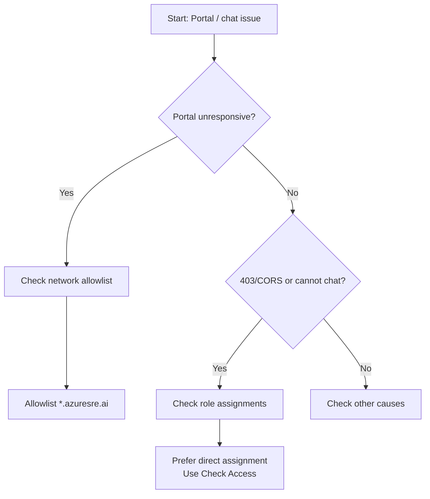

### References (Chapter 11)
- [11-1] [https://learn.microsoft.com/en-us/azure/sre-agent/faq](https://learn.microsoft.com/en-us/azure/sre-agent/faq) — “add `*.azuresre.ai` to the allow list”
- [11-2] [https://learn.microsoft.com/en-us/azure/sre-agent/faq](https://learn.microsoft.com/en-us/azure/sre-agent/faq) — “Avoid relying solely on group-based role assignments … Use the Check Access feature”

---

## Appendix: Official Learn tutorials (references only)

- There is a walkthrough for troubleshooting App Service with SRE Agent.[A-1]
- There is a walkthrough for troubleshooting Container Apps with SRE Agent.[A-2]

### References (Appendix)
- [A-1] [https://learn.microsoft.com/en-us/azure/sre-agent/troubleshoot-azure-app-service](https://learn.microsoft.com/en-us/azure/sre-agent/troubleshoot-azure-app-service) — “Troubleshoot an App Service app by using Azure SRE Agent Preview”
- [A-2] [https://learn.microsoft.com/en-us/azure/sre-agent/troubleshoot-azure-container-apps](https://learn.microsoft.com/en-us/azure/sre-agent/troubleshoot-azure-container-apps) — “Troubleshoot a container app by using Azure SRE Agent Preview”
