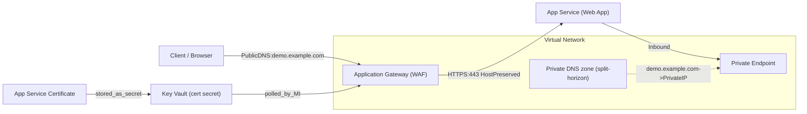
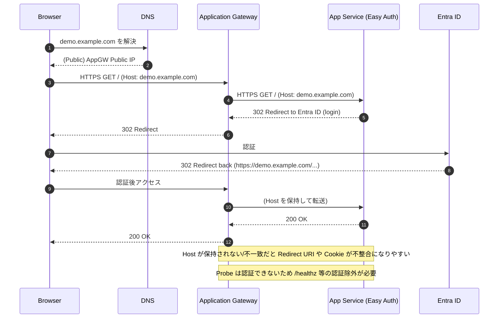
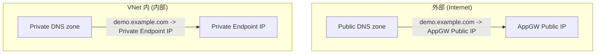
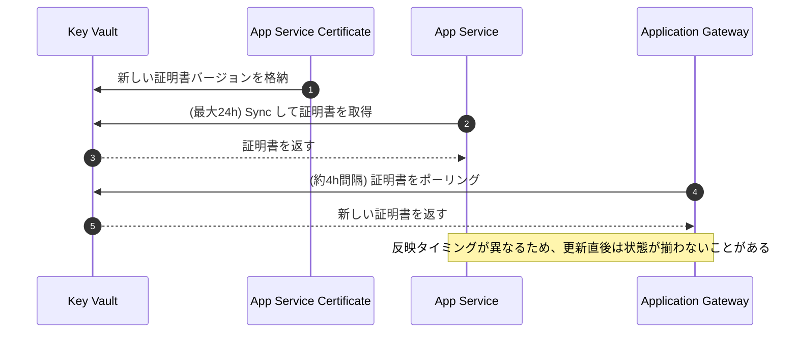

Title: Application Gateway + App Service の証明書/Easy Auth/DNS（PDF要約と検証）
Date: 2026-02-26
Slug: appgw-appservice-certificate-guideline
Lang: ja-jp
Category: notebook
Tags: azure, application-gateway, app-service, key-vault, certificate, dns, entra-id
Summary: 「App Service 証明書を Application Gateway と App Service の両方で使う」構成を、ホスト名保持/Easy Auth/正常性プローブ/DNS まで含めて手順化したメモ（Microsoft Learn で要点を検証）。

本稿は、添付PDF「20251107 ニコン様 AppGW App Service 証明書に関して」の内容を、実装・運用で迷いやすいポイント（証明書、ホスト名、Easy Auth、正常性プローブ、DNS）に沿って整理したものです。
あわせて、PDF内の重要主張について **Microsoft Learn** の記述と突き合わせ、妥当性を確認しています。

---

## 1. この資料が扱うこと（スコープ）

- Application Gateway（WAF想定）をフロントに置き、バックエンドに App Service（Web App）を置く
- App Service 側は Private Endpoint（プライベート化）を前提にし、VNet 内の DNS 解決が必要
- フロント（AG）⇄バックエンド（App Service）を **HTTPS** にする（end-to-end TLS）
- App Service の組み込み認証（Easy Auth）を有効にしたときに、
  - **リダイレクトURLが壊れない**
  - **正常性プローブが 401 で落ちない**
  ようにする

---

## 2. 想定アーキテクチャ（PDFの図を文章化）

PDFの構成イメージは、概ね次の要素で成り立っています。

- 入口
  - パブリックDNS（外部向け）: カスタムドメイン → Application Gateway の Public IP
  - Application Gateway: WAF を有効化し、HTTPS(443) リスナーで終端
- バックエンド
  - App Service（Web App）: カスタムドメインを登録し、証明書をバインド
  - Private Endpoint: App Service のプライベート到達性
  - VNet Integration Subnet（App Service 側の送信やVNet連携の文脈で登場）
- 証明書保管
  - Key Vault: App Service 証明書を保持
  - Application Gateway は Key Vault 参照で証明書を取得（自動ローテーション期待）
- 内部DNS
  - Private DNS（スプリットホライズン）: 内部からの FQDN 解決を Private Endpoint のプライベートIPへ向ける

図にすると、データパスと名前解決は次のイメージです。

---

## 3. Application Gateway のコンポーネント整理（何を設定するか）

PDFでは、Application Gateway の必須コンポーネントとして以下を挙げています。

- フロントエンド IP
- リスナー（HTTPS/443）
- ルール（リスナー → バックエンドへの紐付け）
- バックエンドプール
- バックエンド設定（HTTP(S) settings）
- （必要に応じて）証明書、カスタムプローブ

この整理は、ポータルで設定を追うときにもそのまま役立ちます。

---

## 4. 設計の重要ポイント（PDFの「ポイント」）

### 4.1 ポイント1: ホスト名の保持（Host name preservation）

- フロント（カスタムドメイン）とバックエンド（App Service）で **同じカスタムドメインを使う**
- Application Gateway のバックエンド設定で **ホスト名を書き換えない**

これを崩すと、認証時のリダイレクトURL（Entra ID など）が、`*.azurewebsites.net` 側で生成されてしまい、
Entra ID 側に登録したリダイレクトURLと不一致でログイン失敗になりやすい、という説明でした。

#### Microsoft Learn での整合性
- 「リバースプロキシ前段では、元のホスト名を保持するべき」というガイダンスがあり、
  ホスト名不一致で **redirect/cookie/URL** が壊れる問題が整理されています。

補足（実装上の落とし穴）
- Application Gateway 側で「バックエンドのターゲットを `*.azurewebsites.net` にしておき、Host を上書きする」などの設定にすると、
  Easy Auth のリダイレクトや Cookie のドメイン整合が崩れやすくなります。
- 正常性プローブは “受信リクエストの文脈外” で送られるため、**プローブ側で Host を明示**しないと、意図しないホストでバックエンドに届くことがあります。

### 4.2 ポイント2: Easy Auth と正常性プローブ（401問題）

- Application Gateway の正常性プローブは認証情報を持たないため、Easy Auth が有効だと 401 になりがち
- 解決策として、
  - **専用の Health Check エンドポイント（例: `/healthz`）を用意**し
  - **そのパスを Easy Auth の認証対象から除外**する

PDFでは、`authsettingsV2` を `az rest` で取得→ `auth-settings.json` を編集→ PUT で反映、という手順例が載っています。
併せて、リダイレクトFQDNの整合のために `httpSettings.forwardProxy` を
`Custom + X-ORIGINAL-HOST` にする例が提示されています。

#### Microsoft Learn での整合性
- App Service + Application Gateway 統合の注意点として、Easy Auth が「元のホスト名を知らない」問題が説明され、
  `X-Original-Host` を使う構成例が提示されています。
- また、Application Gateway のプローブは資格情報を送れないため、401 になるなら
  「401 を許可する」「認証不要パスを叩く」などの対処が必要、という趣旨の記載があります。

図にすると、Easy Auth が絡むときの “壊れやすいところ” はここです。

---

## 5. 手順まとめ（PDFの手順をそのまま実行可能な形に整理）

PDFの「設定の概要」は大きく4ブロックです。

### 5.1 App Service 証明書の作成

- App Service 証明書（購入/作成）
- Key Vault に格納
- ドメイン検証（PDFでは手動検証、DNS TXT を推奨）
- 自動更新（制約がなければ有効推奨）

補足（検証で重要）
- App Service 証明書が利用する Key Vault は、現時点で **Vault access policy** モデルが前提（RBACモデルではない）

### 5.2 Web App（App Service）側の設定

1) 証明書のインポート
- Web App → Certificates → Bring your own certificates (.pfx)
- ソース: App Service 証明書のインポート

2) カスタムドメイン登録
- Web App → カスタム ドメイン
- ドメイン検証
  - PDFでは段階的検証として CNAME も追加しておく旨が記載

3) 証明書バインド
- 登録したカスタムドメインに、証明書をバインド

補足（運用観点）
- Key Vault 参照の証明書を App Service にバインドしている場合、証明書更新の “反映タイミング” がずれることがあります。
  Learn の記述どおり、既定では 24 時間内に自動同期され、必要ならポータルの **Sync** で手動同期します。

### 5.3 Application Gateway の設定

1) HTTPS リスナー
- HTTPS/443 のリスナーを作り、証明書を設定
- PDFでは「ポータル既定だと App Service 証明書が表示されない」前提で、
  Application Gateway の managed identity 付与と、Key Vault シークレット読み取り許可が必要と説明

補足（ここが一番詰まりやすい）
- Application Gateway が Key Vault から証明書を読むには、
  - Application Gateway の **managed identity (MI)** を有効化
  - Key Vault 側で MI に対して **secrets の Get / List** 相当の権限を付与
  が最低限の要件になります。
- Key Vault に Firewall / Private Endpoint を設定している場合、
  Application Gateway から Key Vault の名前解決（DNS）と到達性が成立していないと取得に失敗します。

2) バックエンド設定（HTTPS）
- バックエンドプロトコル: HTTPS
- バックエンドポート: 443
- ホスト名オーバーライド: しない（ホスト名保持）

補足（バックエンドが Private Endpoint のとき）
- バックエンドプールを **FQDN** で登録する場合、Application Gateway は DNS 解決に依存します。
  Private DNS のリンク後に設定した方が安全で、後追いで直した場合は DNS キャッシュ問題に当たりやすくなります。

3) カスタムプローブ（正常性プローブ）
- HTTPS
- Host は（原則）カスタムドメイン
- Path は `/healthz` 等の「Easy Auth 除外パス」

補足（プローブ設計の最小要件）
- まずは「認証不要で 200 を返すパス」を 1 つ用意するのが最も確実です。
- それが難しい場合は、プローブの許容ステータス（例: 401 を許可）で回避できるケースもありますが、
  “本当に正常か” の判定が弱くなるので優先度は下がります。

4) ルーティング規則
- リスナー → バックエンドプール → バックエンド設定 の紐付け

### 5.4 DNS（Split-horizon を前提）

狙いは「外からは AppGW の Public IP に解決」「内からは Private Endpoint の Private IP に解決」です。

- パブリックDNS:
  - カスタムドメイン（例: `demo.example.com`）の A レコード → Application Gateway の Public IP
- プライベートDNS:
  - 同じカスタムドメイン（例: `demo.example.com`）の A レコード → App Service Private Endpoint の Private IP
  - 対象 VNet に Private DNS ゾーンをリンク

名前解決だけに絞って図示すると次のとおりです。

運用メモ（PDFの注意点）
- Application Gateway は DNS 結果をキャッシュするため、
  バックエンドをFQDNで構成していて **後から DNS を更新 / Private DNS をリンク**した場合、
  stop/start による再起動が必要になることがある

補足（証明書更新の “伝播” も別ループで動く）
- App Service（Key Vault 参照）の同期と、Application Gateway（Key Vault poll）の同期は別物なので、
  “証明書を更新したのに片側だけ反映された/されない” が起こりえます。
  ここも図にすると混乱しづらいです。

---

## 6. Microsoft Learn で確認できた「正しい／補足が必要」ポイント

PDFの記述は概ね妥当でした。特に重要な補足（Learn 側で明示されている事項）をまとめます。

- Application Gateway の Key Vault 証明書連携は **v2 SKU** が前提
- Key Vault 参照の証明書は、PFX（秘密鍵込み）で、Key Vault 上で **Enabled** 状態が必要
- Key Vault 証明書は **4時間間隔でポーリング**され、更新があれば自動ローテーションされる
- App Service 証明書の Key Vault モデルは（少なくとも購入～設定の流れでは）
  **Vault access policy のみサポート**という記載がある
- Easy Auth を使う場合、`X-Original-Host` を見てリダイレクトのホスト名を合わせる設計は Learn にも記載がある

---

## 7. 参考（Microsoft Learn / 重要箇所の抜粋）

- https://learn.microsoft.com/azure/app-service/configure-ssl-app-service-certificate
  - “Maintains the certificate in Azure Key Vault.”
  - “Select … Vault access policy. Currently, App Service certificates support only Key Vault access policies, not the role-based access control model.”
  - “If you don't select Sync, App Service automatically syncs your certificate within 24 hours.”

- https://learn.microsoft.com/azure/application-gateway/key-vault-certs
  - “This support is limited to the v2 SKU of Application Gateway.”
  - “The instances poll Key Vault at four-hour intervals … automatically rotated.”

- https://learn.microsoft.com/azure/application-gateway/renew-certificates
  - “The instances poll Key Vault at four-hour intervals to retrieve a renewed version of the certificate … automatically rotated.”

- https://learn.microsoft.com/azure/architecture/best-practices/host-name-preservation
  - “We recommend that you preserve the original HTTP host name … authentication can fail …”
  - “Because health probes are sent outside the context of an incoming request … create a custom health probe … explicitly specify the host name.”

- https://learn.microsoft.com/azure/app-service/overview-app-gateway-integration
  - “Application Gateway caches the DNS lookup results … you might need to restart the application gateway if the DNS update or the link to an Azure private DNS zone happened after you configured the back-end pool.”
  - “Application Gateway uses a header called X-Original-Host … file-based configuration …”
