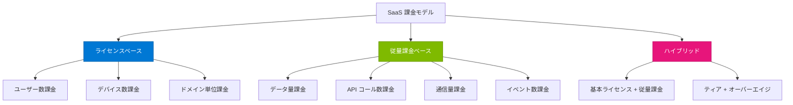
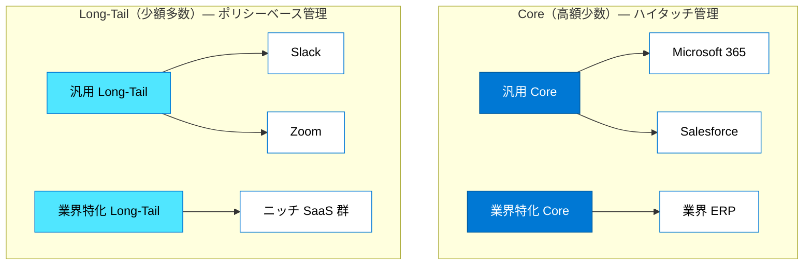
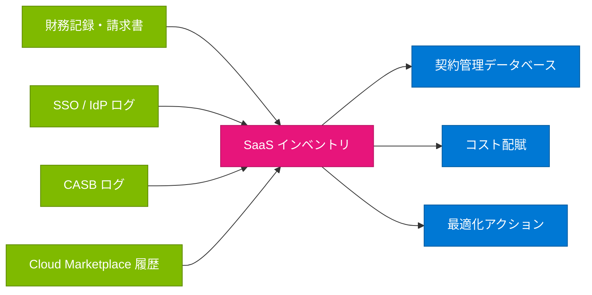
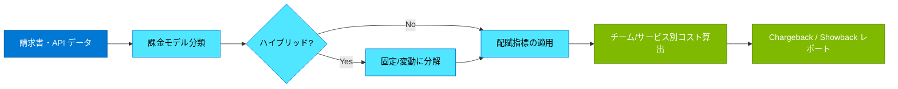
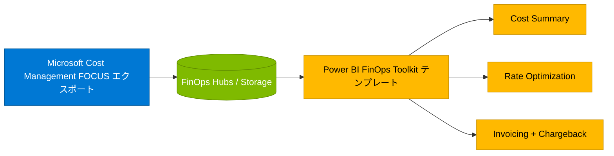
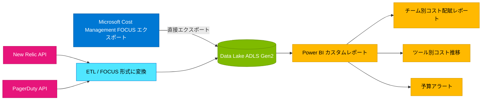
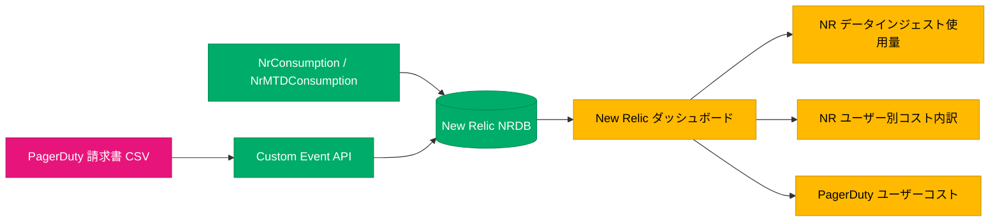

Title: FinOps for SaaS — SaaS コスト管理のフレームワークと実践
Date: 2026-04-07
Slug: finops-saas-management
Lang: ja-jp
Category: notebook
Tags: finops, saas, cost-optimization, focus, licensing, chargeback
Summary: FinOps フレームワークにおける SaaS 製品の扱い方を体系的に整理。価格モデル・分類・Shadow SaaS 対策・主要ツール別の課金モデル・コスト配賦指標・KPI・FOCUS 仕様との整合・Power BI 統合の方向性まで包括的に解説。

## はじめに

FinOps Foundation は 2026 年のフレームワーク更新で、FinOps の適用範囲をパブリッククラウドだけでなく **7 つのテクノロジーカテゴリ**に拡大しました[^1]。その中でも **SaaS（Software-as-a-Service）** は、分散化された調達チャネルと不透明な支出構造から、多くの組織が可視性に課題を抱える領域です。

本稿では、FinOps Foundation の公式ガイダンスに基づき、SaaS のコスト管理におけるフレームワーク適用の考え方と具体的な打ち手を整理します。後半では、New Relic や PagerDuty 等の具体的なサードパーティツールの課金モデル分析、コスト配賦指標の設計、FOCUS 仕様との整合、Power BI 統合による可視化の方向性まで踏み込みます。

## FinOps フレームワークにおける SaaS の位置づけ

### テクノロジーカテゴリの全体像

FinOps フレームワークは以下の 7 つのテクノロジーカテゴリに適用されます[^1]。

| カテゴリ | 対象 |
| --- | --- |
| **Public Cloud** | Azure / AWS / GCP の IaaS / PaaS |
| **SaaS** | ライセンスベースと従量課金ベースのソフトウェア |
| **AI** | AI/ML のトレーニング・推論・トークン消費 |
| **Data Platforms** | Snowflake, Databricks 等 |
| **Private Cloud** | オンプレミス仮想化基盤 |
| **Licenses** | 従来型ソフトウェアライセンス |
| **Data Center** | 物理インフラ |

SaaS はこれらの中で独自の特性を持ちます。調達が部署ごとに分散しやすく、法人クレジットカードでの購入（いわゆる Shadow SaaS）が発生しやすい点が、パブリッククラウドとの大きな違いです[^2]。

### 4 ドメイン × 22 ケイパビリティの適用

FinOps フレームワークの 4 ドメイン・22 ケイパビリティは、SaaS にも同様に適用されます[^3]。

```mermaid
graph TD
    classDef domain fill:#0078D4,stroke:#005A9E,color:#fff
    classDef cap fill:#50E6FF,stroke:#0078D4,color:#000

    D1[Understand Usage & Cost]:::domain --> C1[Data Ingestion]:::cap
    D1 --> C2[Allocation]:::cap
    D1 --> C3[Reporting & Analytics]:::cap
    D1 --> C4[Anomaly Management]:::cap

    D2[Quantify Business Value]:::domain --> C5[Planning & Estimating]:::cap
    D2 --> C6[Forecasting]:::cap
    D2 --> C7[Budgeting]:::cap
    D2 --> C8[KPIs & Benchmarking]:::cap
    D2 --> C9[Unit Economics]:::cap

    D3[Optimize Usage & Cost]:::domain --> C10[Architecting & Workload Placement]:::cap
    D3 --> C11[Rate Optimization]:::cap
    D3 --> C12[Usage Optimization]:::cap
    D3 --> C13[Licensing & SaaS]:::cap
    D3 --> C14[Sustainability]:::cap

    D4[Manage the FinOps Practice]:::domain --> C15[Practice Operations]:::cap
    D4 --> C16[Governance, Policy & Risk]:::cap
    D4 --> C17[Invoicing & Chargeback]:::cap
    D4 --> C18[Intersecting Disciplines]:::cap
```

## SaaS 製品の特性を理解する

### SaaS の価格モデル

SaaS 製品の価格モデルは大きく 3 種類に分かれ、それぞれ最適化戦略が異なります[^2]。

| 価格モデル | 特徴 | 例 | 配賦の難易度 |
| --- | --- | --- | --- |
| **ライセンスベース** | ユーザー/デバイス単位の固定課金 | Microsoft 365, Salesforce, PagerDuty | 低 — ユーザー数・所属チームで按分可能 |
| **従量課金ベース** | 利用量に応じた変動課金 | Splunk, Snowflake | 中〜高 — 利用主体の特定が必要 |
| **ハイブリッド** | 基本ライセンス + 追加従量課金 | New Relic, Datadog, GitHub Enterprise | 高 — 固定部分と変動部分を分けて配賦 |

### SaaS の分類（タクソノミー）

SaaS 製品はビジネス機能と重要度の 2 軸で分類し、ガバナンスの粒度を変えることが推奨されています[^2]。

| 分類 | ガバナンス方針 |
| --- | --- |
| **Core（高額少数）** | ハイタッチ管理 — 専任オーナー、定期的な契約レビュー、詳細な使用状況分析 |
| **Long-Tail（少額多数）** | ポリシーベース管理 — 承認ワークフロー、自動棚卸し、一定期間未使用なら自動停止 |

### 調達チャネルの多様性

SaaS 調達は複数チャネルに分散するため、FinOps の第一歩は支出の統合的可視化です[^2]。

| 調達チャネル | 特徴 |
| --- | --- |
| **直接購入（Publisher Direct）** | ベンダーとの直接契約 |
| **VAR（Value Added Reseller）** | リセラー経由。ボリュームディスカウントの可能性 |
| **MSP（Managed Service Provider）** | マネージドサービスに含まれる場合 |
| **Cloud Marketplace** | Azure / AWS Marketplace。既存のクラウドコミットメントを消化可能 |
| **法人クレジットカード** | 部署ごとの Shadow SaaS の主な発生源 |

## Shadow SaaS の発見と統制

Shadow SaaS とは、IT 部門の管理外で導入された SaaS 製品のことです。FinOps Foundation では、以下のデータソースを組み合わせてインベントリを構築することが推奨されています[^2]。

| データソース | 発見できるもの |
| --- | --- |
| 財務記録・請求書 | 購買部門を通じた契約済み SaaS |
| SSO / IdP ログ | 認証フローに乗っている SaaS（利用実態付き） |
| CASB（Cloud Access Security Broker） | ネットワーク経由で検出された未承認 SaaS |
| Cloud Marketplace 履歴 | Marketplace 経由で購入された SaaS |

## 主要ツール別の課金モデル整理

### 課金モデル一覧

| ツール | 主な用途 | 課金モデル | 主な課金指標 | 配賦に使える指標の候補 |
| --- | --- | --- | --- | --- |
| **New Relic** | オブザーバビリティ | ハイブリッド | データインジェスト量（GB）+ ユーザー数（3 種類）+ CCU | チーム別データインジェスト量、ユーザー種別ごとの所属チーム |
| **PagerDuty** | インシデント管理 | ライセンスベース | ユーザー数（ティア別単価） | チーム別ユーザー数、アドオンの利用有無 |
| **Datadog** | オブザーバビリティ | ハイブリッド | ホスト数 + データインジェスト量 + ユーザー数 | チーム別ホスト数、サービス別データ量 |
| **Splunk** | ログ分析 | 従量課金 | データインジェスト量（GB/日） | ソース別・チーム別インジェスト量 |
| **Jira / Confluence** | プロジェクト管理 | ライセンスベース | ユーザー数（ティア別） | チーム別ユーザー数 |
| **Slack** | コミュニケーション | ライセンスベース | ユーザー数 | 部署別ユーザー数 |
| **GitHub Enterprise** | ソースコード管理 | ハイブリッド | ユーザー数 + Actions 分（分） + Packages（GB） | チーム別ユーザー数、リポジトリ別 Actions 消費 |
| **Snowflake** | データプラットフォーム | 従量課金 | クレジット（仮想通貨） + ストレージ（TB） | ウェアハウス別・クエリ別クレジット消費 |

### New Relic の課金構造詳細

New Relic は 3 軸で課金される[^7]。

| 課金軸 | 内容 | 単価例 |
| --- | --- | --- |
| **データインジェスト** | 月 100 GB まで無料、超過分は $0.40/GB（Data Plus は $0.60/GB） | $0.40/GB |
| **ユーザー** | Basic（無料）、Core（$49/月）、Full Platform（Standard: $10/1人目・$99/追加ユーザー（最大5名）、Pro: $349/月（年払い）/$418.80（月払い）、エディション依存） | $0〜$349+/月 |
| **Advanced Compute（CCU）** | AI 機能・Live Archives 等の高度な機能の計算量 | 要見積もり |

**配賦の考え方**:

- データインジェスト → サービス別・チーム別の送信データ量で按分（New Relic のクエリで取得可能）
- ユーザー → ユーザー種別 × 所属チームで配賦
- CCU → 利用した機能・チームで按分（利用ログが取れる場合）

### PagerDuty の課金構造詳細

PagerDuty はユーザー数ベースの段階制課金[^8]。

| プラン | 単価 | 主な機能差 |
| --- | --- | --- |
| **Free** | $0（5 ユーザーまで） | オンコール 1 スケジュール、エスカレーション 1 ポリシー |
| **Professional** | $21/ユーザー/月（年払い） | SSO、チャット連携、ワークフローテンプレート |
| **Business** | $41/ユーザー/月（年払い） | カスタムフィールド、高度な ITSM 連携、ステータスページ |
| **Enterprise** | 要見積もり | フル機能、Slack Premium Actions、インシデントタスク |

アドオン:

| アドオン | 課金モデル | 単価 |
| --- | --- | --- |
| AIOps | 従量課金 | $699/月〜 |
| Stakeholder License | ユーザー数 | $150/50 ユーザー/月 |
| Status Pages | サブスクライバー数 | $89/1,000 サブスクライバー/月 |
| PagerDuty Advance（生成 AI） | クレジット | $415/月〜 |

**配賦の考え方**:

- ベースライセンス → チーム別のユーザー数で按分
- AIOps → 利用しているサービス/チームで配賦
- Stakeholder → ステークホルダーの所属部門で配賦

## コスト配賦指標の設計

### 配賦指標の選定基準

FinOps Foundation の Allocation ケイパビリティでは、以下の基準でコスト配賦指標を選定することが推奨されている[^9]。

| 基準 | 内容 |
| --- | --- |
| **因果関係** | コストの発生と指標の間に明確な因果関係があること |
| **計測可能性** | 指標が定量的に取得・計測可能であること |
| **公平性** | 利用実態を反映し、関係者の納得感があること |
| **実装容易性** | データ取得と計算の仕組みが現実的に構築可能であること |

### 課金モデル別の推奨配賦指標

| 課金モデル | 推奨配賦指標 | 算出方法 |
| --- | --- | --- |
| **ユーザー数課金** | チーム別ユーザー数 | `チームのユーザー数 ÷ 全体ユーザー数 × コスト` |
| **データ量課金** | チーム/サービス別のデータ送信量 | ツール側の API やクエリでデータソース別の送信量を取得 |
| **ホスト数課金** | チーム/サービス別のホスト台数 | CMDB またはタグ付けベースで所有者を特定 |
| **仮想通貨課金** | ウェアハウス/クエリ別のクレジット消費 | ツール側の使用状況レポートで取得 |
| **ハイブリッド** | 固定部分はユーザー数、変動部分はデータ量等で分離配賦 | 請求書を固定・変動に分解して個別に按分 |

### 配賦のフロー

## FinOps ドメイン別の SaaS 管理手法

### ドメイン 1：Understand Usage & Cost

| ケイパビリティ | SaaS での実践 |
| --- | --- |
| **Data Ingestion** | ベンダー API・請求書・SSO ログ等を統合し、全 SaaS 支出を単一リポジトリに集約 |
| **Allocation** | Chargeback / Showback で SaaS コストを事業部門・チーム・プロダクトにマッピング |
| **Reporting & Analytics** | ライセンス利用率・アクティブユーザー率・支出トレンドの定期レポート |
| **Anomaly Management** | 従量課金 SaaS の消費スパイク検知、コミットメント消化率の急激な変動をアラート |

### ドメイン 2：Quantify Business Value

| ケイパビリティ | SaaS での実践 |
| --- | --- |
| **Planning & Estimating** | ヘッドカウント増減・トランザクション成長を織り込んだ SaaS 消費予測 |
| **Forecasting** | 契約更新時の値上げ（uplift）、自動更新条項を織り込んだ見通し |
| **Budgeting** | SaaS 支出を含む IT 予算の策定。予実差異の定期レビュー |
| **KPIs & Benchmarking** | SaaS Unit Cost、License Utilisation Rate 等の指標でベンチマーク |
| **Unit Economics** | 「SaaS コスト / トランザクション」「SaaS コスト / アクティブユーザー」でビジネス効率を測定 |

### ドメイン 3：Optimize Usage & Cost

| ケイパビリティ | SaaS での実践 |
| --- | --- |
| **Licensing & SaaS** | ライセンスのライトサイジング（ティア引き下げ）、未使用シートの回収（デプロビジョニング）、冗長アプリの合理化 |
| **Rate Optimization** | ボリュームディスカウント交渉、Cloud Marketplace 経由でのコミットメント消化、契約条件の最適化 |
| **Usage Optimization** | 過剰なログ設定・API コール・データ保持等の見直し。Feature Adoption Rate の低い上位ティアの引き下げ |
| **Architecting & Workload Placement** | Build vs. Buy 分析 — SaaS を購入するか内製するかの TCO 比較 |
| **Sustainability** | ベンダーのサステナビリティ報告（Scope 3 排出量）を更新・選定時に考慮 |

### ドメイン 4：Manage the FinOps Practice

| ケイパビリティ | SaaS での実践 |
| --- | --- |
| **Governance, Policy & Risk** | SaaS 調達ポリシーの策定。承認ワークフローの整備。Shadow SaaS の統制 |
| **Invoicing & Chargeback** | 請求書照合ワークフローの構築。契約条件と実利用ログの突合 |
| **Intersecting Disciplines** | ITAM / SAM / 調達 / 法務 / セキュリティとの連携。既存データの相互活用 |
| **FinOps Education & Enablement** | SaaS コスト意識の組織浸透。各部門のオーナーシップ醸成 |

## SaaS 向け KPI（8 指標）

FinOps Foundation は SaaS カテゴリに対して以下の 8 つの KPI を定義しています[^4]。

| KPI | 定義 | 活用場面 |
| --- | --- | --- |
| **SaaS Unit Cost** | 消費単位あたりの SaaS コスト（コスト / アクティブユーザー等） | 効率性の全体把握 |
| **License Utilisation Rate** | 購入ライセンスに対する割当率 | 未使用ライセンスの特定 |
| **Active-to-Provisioned User Ratio** | プロビジョニング済みユーザー中のアクティブ率 | シート回収の判断 |
| **Consumption vs. Commitment** | 契約コミットメントに対する実消費比率 | オーバーエイジ/過小利用の検知 |
| **Feature Adoption Rate** | 上位ティアの機能利用率 | ティア引き下げの判断 |
| **Allocation Accuracy Index (AAI)** | コスト配賦の正確性 | Chargeback 精度の改善 |
| **Redundant Application Coverage %** | 重複 SaaS の支出割合 | ベンダー統合の判断 |
| **SaaS Optimization ROI** | 最適化施策の投資対効果 | 施策の継続判断 |

## FOCUS 仕様と SaaS データの統合

FOCUS（FinOps Open Cost and Usage Specification）1.2 では、SaaS / PaaS の課金データをパブリッククラウドと同一スキーマで扱うための列定義（仮想通貨カラム等）が仕様に追加されました。ただし、**仕様への追加と各ベンダーの実装対応は別物**です。2026年4月時点で FOCUS ネイティブ対応（公式エクスポート提供）しているのは Azure・AWS・GCP 等のクラウドプロバイダーおよび Databricks・Grafana などに限られます[^5]。

### 各ツールの FOCUS 対応状況（2026年4月時点）

| ツール | FOCUS 公式対応 | データ取得方法 | 備考 |
| --- | --- | --- | --- |
| **Azure** | ◎ ネイティブ対応（v1.2） | Microsoft Cost Management の FOCUS エクスポート | Microsoft が FOCUS に直接貢献 |
| **New Relic** | × 非対応 | NerdGraph API + 請求書 | FOCUS エクスポート機能なし。API でデータ量・ユーザー数を取得し手動で FOCUS 形式に変換が必要 |
| **PagerDuty** | × 非対応 | 請求書 + REST API | FOCUS エクスポート機能なし。ユーザー数ベースのため変換は比較的単純 |
| **Datadog** | × 非対応 | Usage API + 請求書 | FOCUS エクスポート機能なし。ホスト別・サービス別データは API で取得可能 |
| **Snowflake** | × 非対応 | Account Usage スキーマ | FOCUS エクスポート機能なし。クレジット消費の詳細データは Account Usage スキーマで取得可能 |
| **GitHub** | × 非対応 | Billing API + Actions 使用量 API | FOCUS エクスポート機能なし。Actions 消費分・Packages 容量は API で取得可能 |

> **ベンダーへの確認推奨事項**: FOCUS 形式の請求データエクスポートへの対応予定があるか、各ベンダーに確認することを推奨する。FinOps Foundation は SaaS ベンダーへの FOCUS 準拠を要請するための[レターテンプレート](https://www.finops.org/assets/requesting-focus-conformance-saas/)も公開している。

### FOCUS 形式へのマッピング例（Snowflake クレジット消費の場合）

| カラム | 値の例 | 用途 |
| --- | --- | --- |
| `ProviderName` | Snowflake | SaaS/PaaS のソース特定 |
| `ConsumedQuantity` | 25 | 消費されたクレジット数 |
| `ConsumedUnit` | Credit | 仮想通貨単位 |
| `PricingCurrency` | USD | ベンダーの請求通貨 |
| `PricingCurrencyListUnitPrice` | 3.00 | リスト単価 |
| `PricingCurrencyContractedUnitPrice` | 2.70 | 交渉後の単価 |
| `PricingCurrencyEffectiveCost` | 67.50 | 実効コスト（25 × 2.70） |
| `BillingCurrency` | EUR | 請求書の表示通貨 |
| `EffectiveCost` | 67.95 | 為替換算後の実効コスト |

### FOCUS 形式への変換に必要なカラムマッピング

FOCUS に対応していないツールのデータを統合する場合、最低限以下のカラムへのマッピングが必要になる[^10]。

| FOCUS カラム | 意味 | マッピング元の例 |
| --- | --- | --- |
| `ProviderName` | SaaS プロバイダー名 | "New Relic", "PagerDuty" 等 |
| `ServiceName` | サービス/製品名 | "Data Ingest", "Full Platform User" 等 |
| `ChargePeriodStart/End` | 課金期間 | 請求書の期間 |
| `ConsumedQuantity` | 消費量 | データ GB、ユーザー数、クレジット数 |
| `ConsumedUnit` | 消費単位 | "GB", "User", "Credit" |
| `BillingCurrency` | 請求通貨 | "USD", "JPY" |
| `EffectiveCost` | 実効コスト | 請求金額 |
| `Tags` | 配賦用メタデータ | チーム名、サービス名、コストセンター |

## 契約管理のベストプラクティス

SaaS の契約管理で追跡すべきメタデータは以下の通りです[^2]。

| メタデータ | 重要性 |
| --- | --- |
| **更新日** | 更新前に十分な分析・交渉期間を確保 |
| **解約通知期間** | 通知期限を過ぎると自動更新されるリスク |
| **自動更新条項** | 意図しない更新と値上げの防止 |
| **価格保証（Price Lock）** | 更新時の値上げ幅の制御 |
| **True-up 要件** | 実利用が契約数を超えた場合の追加課金条件 |
| **エンタイトルメント** | 利用可能な機能・容量の上限 |

## ペルソナ別の役割

FinOps Foundation は SaaS 管理における各ペルソナの役割を以下のように定義しています[^6]。

| ペルソナ | 主な役割 |
| --- | --- |
| **FinOps Practitioner** | 一元的なインベントリの構築、異常検知の実装、最適化機会の特定・報告、タグ付け/配賦標準の策定 |
| **Engineering** | 新規 SaaS 導入時のコスト影響評価、タグ付け戦略の実装、退職者のアクセス除去 |
| **Finance** | SaaS 支出の財務モデルへの統合、Chargeback モデルの定義、Unit Economics の分析、請求書照合 |
| **Product** | Build vs. Buy の判断、SaaS の ROI 評価、従量課金ツールの設定最適化 |
| **Procurement** | ベンダー交渉、需要予測に基づく購入量の調整、契約ライフサイクル管理、Cloud Marketplace 活用の検討 |
| **Leadership** | SaaS コストの説明責任体制の確立、調達ガバナンスポリシーの策定、ベンダー統合の戦略判断 |

## コスト可視化の選択肢

SaaS コストの可視化基盤として、**Option A: Power BI（外部 BI 基盤）** と **Option B: New Relic（既存オブザーバビリティ基盤の拡張）** の 2 つのアプローチが考えられる。それぞれのアーキテクチャと適合条件を以下に示す。

### Option A: Power BI による統合ダッシュボード

#### A-1: FinOps Toolkit テンプレートをそのまま使う（Azure のみ）

Microsoft が提供する [FinOps Toolkit](https://microsoft.github.io/finops-toolkit/power-bi) には、Microsoft Cost Management / FinOps Hubs を対象とした Power BI テンプレートが 5 種類（Cost Summary・Rate Optimization・Invoicing + Chargeback・Policy + Governance・Workload Optimization）同梱されている[^11]。テンプレートは FOCUS 形式に対応しており、Azure コストの分析には即戦力となる。

ただし、**データソースは Microsoft Cost Management / FinOps Hubs に限定**されており、New Relic・PagerDuty 等の SaaS データはネイティブには含まれない。既存テンプレートに SaaS データを追加するには、テンプレート自体の改修が必要になる。

#### A-2: SaaS データを統合したカスタムレポート（Azure + New Relic + PagerDuty）

SaaS コストも同じ Power BI 画面で見たい場合は、FinOps Toolkit テンプレートとは**別の PBIX ファイル**として構築するか、テンプレートにカスタムページを追加する形になる。

Microsoft Cost Management は FOCUS 形式で **Azure Storage（ADLS Gen2）に直接エクスポート**できるため、Azure コストデータは ETL 不要で Data Lake に入れられる。一方、New Relic・PagerDuty は API や請求書からデータを取得し、FOCUS 形式への変換（ETL）が別途必要になる。

| 観点 | 評価 |
| --- | --- |
| **対象ユーザー** | FinOps・Finance・経営層 |
| **強み** | 全ソースを横断した単一ダッシュボード。FOCUS 形式への統合パスが明確 |
| **弱み** | ETL パイプラインの構築・運用が必要。FinOps Toolkit テンプレートとは別管理になる |
| **前提条件** | Azure Data Factory 等の ETL 基盤、Power BI ライセンス、カスタム開発工数 |

### Option B: New Relic による可視化（既存基盤の拡張）

New Relic をすでに導入済みの場合、NRQL クエリと New Relic ダッシュボードを活用してコスト可視化を実現する。新たなツールを追加せずに済む反面、New Relic 以外の SaaS コストの取り込みには工夫が必要。

| 観点 | 評価 |
| --- | --- |
| **対象ユーザー** | SRE・インフラエンジニア・プラットフォームチーム |
| **強み** | 新規ツール不要。NRQL で既存データとコストを同一画面で可視化可能。アラート設定が容易 |
| **弱み** | New Relic 以外の SaaS コストは Custom Event API 経由での手動投入が必要。Finance 向けの説明資料としては不足する場合あり |
| **前提条件** | New Relic Pro 以上のエディション、Custom Event API の利用 |

### 選択の判断基準

| 条件 | 推奨 |
| --- | --- |
| FinOps・Finance チームが主な消費者 | Option A（Power BI） |
| エンジニアが主な消費者で New Relic 導入済み | Option B（New Relic） |
| 複数 SaaS を横断した配賦レポートが必要 | Option A（Power BI） |
| まず低コストで始めたい（Crawl 段階） | Option B（New Relic）または Excel |
| FOCUS 形式への統合を将来的に見据えている | Option A（Power BI） |

## 成熟度別のアプローチ

| 成熟度 | 状態 | 推奨アクション |
| --- | --- | --- |
| **Crawl** | SaaS の全体像が見えていない。請求書ベースで手動集計 | 財務記録 + SSO ログでインベントリを構築。Excel / CSV で月次コストを集約。上位 10 SaaS のコストと利用率を可視化。チーム別にユーザー数で大まかに按分 |
| **Walk** | インベントリはあるが最適化と配賦が進んでいない | 各ツール API でデータ量・ユーザー数を取得。Power BI で自動レポート化。配賦ルールを定義。KPI の定期測定。Core SaaS の契約レビュー。未使用ライセンスの回収プロセスを確立 |
| **Run** | 自動化されたガバナンスと継続的最適化 | 全ツールのデータを FOCUS 形式に変換。Data Lake に統合。API 連携による自動棚卸し。Chargeback の自動化。Anomaly Detection で異常検知を自動化 |

## 次のステップ

| # | アクション | 担当 | 優先度 |
| --- | --- | --- | --- |
| 1 | 各ツールの請求書・API データの棚卸し | インフラ担当 | 高 |
| 2 | 課金モデルの確定と配賦指標の合意 | FinOps + 各ツールオーナー | 高 |
| 3 | FOCUS 対応状況のベンダー確認 | 調達 / インフラ担当 | 中 |
| 4 | Power BI ダッシュボードのプロトタイプ作成 | インフラ / データ担当 | 中 |
| 5 | Chargeback / Showback プロセスの運用開始 | FinOps + Finance | 低（Walk 段階で実施） |

## 参考情報

[^1]: "FinOps Technology Categories", https://www.finops.org/framework/technology-categories/

[^2]: "FinOps for SaaS (Software-as-a-Service)", https://www.finops.org/framework/technology-categories/saas/

[^3]: "FinOps Domains", https://www.finops.org/framework/domains/

[^4]: "FinOps for SaaS - KPIs", https://www.finops.org/framework/technology-categories/saas/

[^5]: "FinOps for SaaS - FOCUS Alignment", https://www.finops.org/framework/technology-categories/saas/

[^6]: "FinOps for SaaS - Personas", https://www.finops.org/framework/technology-categories/saas/

[^7]: "New Relic Pricing", https://newrelic.com/pricing

[^8]: "PagerDuty Plans and Pricing", https://www.pagerduty.com/pricing/

[^9]: "FinOps Allocation Capability", https://www.finops.org/framework/capabilities/allocation/

[^10]: "FOCUS Specification", https://focus.finops.org

[^11]: "FinOps Toolkit Power BI reports", https://microsoft.github.io/finops-toolkit/power-bi