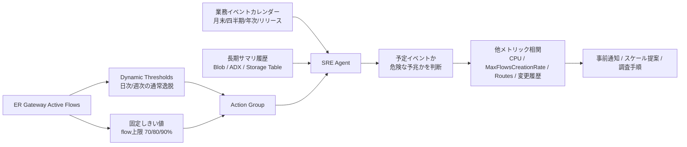

# ER Gateway Active Flows 予兆監視 — SRE Agent 活用ソリューション提案

## Purpose

このドキュメントは、ExpressRoute Gateway（以下 ER Gateway）の **Active Flows** に対する予兆監視を、Azure SRE Agent と Azure Monitor を組み合わせて実現するための設計提案資料です。
お客様への提案に使える形で、検討の前提・選択肢比較・推奨アーキテクチャ・段階導入・追加アイデアを体系的にまとめます。

監視の主目的は、単なる異常スパイクの検知ではなく、**flow 上限への接近（枯渇の予兆）と、業務イベント由来の通信増を区別して捉えること**です。

---

## 1. 背景と課題

ER Gateway の Active Flows は、オンプレミスから Azure 方向への inbound active flow 数を表すメトリックです。flow 上限に近づくとパケットドロップや性能劣化に直結するため、上限到達前に気づけることが重要です。

お客様の主な懸念は次の 2 点です。

- 標準の Metrics Explorer では 1 つのチャートで最大 30 日しか一度に表示できず、長期的な傾向が見えづらい。
- 月末・四半期・年次などの長周期イベントを考慮した監視ができていない。

---

## 2. 確認済みの技術前提（公式ドキュメント根拠）

### 2.1 Active Flows メトリック

| 項目 | 内容 |
|---|---|
| メトリック名 | `ExpressRouteGatewayActiveFlows`（Scale Units 構成は `ScalableExpressRouteGatewayActiveFlows`） |
| 単位 / 集計 | Count / Average・Minimum・Maximum |
| 次元 | `roleInstance`（ゲートウェイインスタンス単位で split 可能。Scalable 版は次元なし） |
| 時間粒度 | PT5M〜P1D |
| 診断設定での Log Analytics 書き出し（DS Export） | **不可（No）** |
| 意味 | オンプレ→Azure 方向の inbound active flow のみを対象 |

重要なのは、Active Flows は **診断設定（AllMetrics）で Log Analytics へそのまま流せない**点です。「Log Analytics に入れて KQL で分析」する案は、自前の取り込み工程が前提になります[^1][^2]。

### 2.2 メトリックの保持期間

- platform / custom metrics は **93 日間**保持される。
- ただし Metrics Explorer の 1 チャートで一度にクエリできるのは **最大 30 日**。30 日を選択後にパンすれば保持期間内を閲覧できる。
- 長期トレンドが必要な場合は、診断設定で Log Analytics に送るか、別ストアに集約することが公式に案内されている[^3]。

つまり「30 日しか見られない」は表示上の制約であり、データ自体は 93 日残る。一方で月次を超える季節性には 93 日でも不足する。

### 2.3 Dynamic Thresholds（動的しきい値）の挙動

| 観点 | 公式仕様 |
|---|---|
| 初期学習 | ルール作成時に直近 10 日分で hourly / daily パターンを計算 |
| 発火開始条件 | 3 日分かつ 30 サンプル以上が必要 |
| 週次季節性 | 約 3 週間分で weekly パターンを識別 |
| 継続学習 | 利用可能な履歴を継続的に学習（バンドは直近 10 日基準で再計算） |
| 苦手領域 | ゆっくり進行する変化、複数条件の同時監視、細かすぎる／長周期の季節性 |
| 制約 | **複数条件アラートでは利用不可** |

ER Gateway 関連で Dynamic Thresholds が**使えない**メトリック（公式の非対応リスト）: `ExpressRouteGatewayPacketsPerSecond`、`ExpressRouteGatewayBitsPerSecond`、`ExpressRouteGatewayNumberOfVmInVnet`、`ExpressRouteGatewayFrequencyOfRoutesChanged`。
一方で **`ExpressRouteGatewayActiveFlows` は非対応リストに無く、利用可能**[^4]。

---

## 3. 監視対象として見るべきシグナル

Active Flows 単独はノイズが多いため、相関用のシグナルを併せて持つと誤検知を抑えられる。

- `ExpressRouteGatewayActiveFlows`（主指標）
- `ExpressRouteGatewayMaxFlowsCreationRate`（flow 生成レート）
- `ExpressRouteGatewayCpuUtilization`（CPU）
- `ExpressRouteGatewayFrequencyOfRoutesChanged`（経路変化）
- `ExpressRouteGatewayNumberOfVmInVnet`（VNet 内 VM 数）
- デプロイ / リリース履歴（GitHub / Azure DevOps など）
- 業務イベントカレンダー（月末・四半期・年次・リリース）

---

## 4. 選択肢の比較

| 案 | 仕組み | コスト / 運用負荷 | 向き |
|---|---|---|---|
| 案 A: Blob + CSV + Python ML | メトリックを定期 export → Blob → Python ツールで ML 検知 | 高（export パイプライン＋ストレージ＋Python 依存＋agent 実行課金） | 独自モデルが必須なとき |
| 案 B: Log Analytics + KQL | LA に取り込み `series_decompose_anomalies()` 等で分析 | 中（ActiveFlows は DS Export 不可のため自前取り込みが必要） | 履歴で多変量に見たいとき |
| 案 C（推奨）: Dynamic Thresholds + 固定しきい値 + SRE Agent | Azure 側で検知し、agent は発火時のみ調査・判断 | 低（export/ストレージ不要、ML 内蔵、agent は信号時のみ） | まずこれ |

ポイントは、**重い ML を agent のスケジュールで毎回回すと active flow（AAU / トークン）課金が積み上がる**こと。検知は安価な Azure Monitor 側に寄せ、SRE Agent は発火時の RCA・対処に集中させるのがコスト効率上もっとも効く。

---

## 5. 推奨アーキテクチャ

### 5.1 二層の季節性で分けて考える

予兆監視の肝は、「通常の周期パターン」と「長周期の業務イベント」を別物として扱うこと。

**第 1 層: 日次 / 週次の通常季節性 → Dynamic Thresholds が得意**

- 毎日 2:00 のバックアップ通信
- 毎週月曜朝のバッチ
- 平日昼だけ通信量が多い

これらは hourly / daily / weekly を学習する Dynamic Thresholds と相性が良い。

**第 2 層: 月次 / 四半期 / 年次 / リリース日の業務イベント → SRE Agent の知識で補完**

- 月末締め処理
- 四半期バッチ
- 年 1 回の棚卸 / 大規模処理
- 特定リリース日の一時的な通信増

これらは 93 日保持でもサンプルが少なく、Dynamic Thresholds だけでは安定して学習できない。業務イベントとして **明示的に SRE Agent へ教える**方が、精度も説明性も高い。

### 5.2 全体像



### 5.3 役割分担

| 層 | 担当 | 内容 |
|---|---|---|
| 通常外れ値の検知 | Dynamic Thresholds | 日次 / 週次パターンからの逸脱 |
| 枯渇予兆の検知 | 固定しきい値 | flow 上限に対する 70 / 80 / 90% |
| 文脈判断 | SRE Agent | 予定イベントか異常かを判断、相関、対処案生成 |
| 独自モデル | Python ツール | 誤検知が多い／多変量判断が必要になってから追加 |

---

## 6. SRE Agent 側で使える機能

| 機能 | 予兆監視での使いどころ |
|---|---|
| Knowledge（ナレッジ） | 業務イベントカレンダー、期待される通信増、しきい値の運用ルールを保持 |
| Scheduled Tasks | 既知イベントの N 日前に事前キャパシティチェックを自動実行 |
| Response Plans | アラート発火時の調査・相関・推奨アクションを定型化 |
| Kusto ツール | ADX / LA に貯めた長期サマリへパラメータ化 KQL で問い合わせ |
| HTTP client ツール | Azure Monitor Metrics REST API を直叩きし、貯めずに直近 N 点を取得 |
| Python ツール | イベント別ベースライン算出や独自予測など、KQL で表現しづらい処理 |

Python ツールは自然言語の説明からコード生成・テスト・登録ができ、説明に合致したタスクで agent が自動的に呼び出す[^5]。

### 6.1 ナレッジに持たせるイベント定義（例）

```yaml
events:
  - name: month_end_close
    schedule: monthly_last_business_day
    expected_window: "20:00-03:00"
    expected_effect: "ActiveFlows may increase 1.5x-2.5x"
    action: "Check headroom before event; escalate if >80% of flow limit"

  - name: quarterly_batch
    schedule: quarter_end
    expected_window: "Saturday 00:00-08:00"
    expected_effect: "Sustained high flow creation rate"
    action: "Review CPU, MaxFlowsCreationRate, and ActiveFlows together"

  - name: annual_inventory
    schedule: fiscal_year_end
    expected_effect: "One-time large traffic spike"
    action: "Pre-event capacity review required; rely on static limit threshold"

  - name: release_window
    source: "GitHub / Azure DevOps release calendar"
    expected_effect: "Temporary traffic increase after deployment"
    action: "Correlate with deployment; suppress only if within expected bounds"
```

これにより、Dynamic Thresholds が「いつもと違う」と検知した後に、SRE Agent が「それは予定された業務イベントか？」を判断できる。単なる異常検知から一段進んだ、運用文脈を踏まえた予兆判断になる。

### 6.2 Python ツールで機械学習まで踏み込む

SRE Agent の Python ツール実行環境には、主要な ML / AI ライブラリがあらかじめインストールされている。追加のセットアップなしに、本格的な機械学習・統計処理を agent のタスクとして実行できる。

| 分野 | 利用可能なパッケージ（例） |
|---|---|
| 深層学習 | TensorFlow / PyTorch / Keras |
| 機械学習 | scikit-learn / XGBoost / LightGBM / JAX |
| 自然言語処理 | spaCy / NLTK / OpenAI API / Hugging Face Hub |
| 画像認識 | OpenCV / PIL / torchvision |

**使えるシナリオ**

過去インシデントを格納した Storage Account（例: JSON / CSV / ログ）をデータソースにすることで、インシデントの傾向分析や、分類・重篤度推定・類似事例検索などの機械学習 / AI 分析を実施できる。運用データを継続的に蓄積・整形し、学習用データセットとして再利用することで、トリアージの高速化と再発防止につなげられる。

**何ができるか（アイデア）**

- 傾向分析: サービス別 / リージョン別 / 時間帯別の件数推移、Sev 別比率、MTTA / MTTR の推移
- 分類: インシデント種別（ネットワーク / 認証 / 容量 / 依存サービス等）の自動分類、担当チームの自動振り分け候補提示
- 予測 / 検知: 事故件数やエラー増加の予兆検知、季節性を踏まえた増加予測（要員計画にも活用）
- 類似事例検索: タイトル / 本文 / ログ断片から類似インシデントを検索し、過去の対処・回避策を提示
- 要約 / 整理: 長いタイムラインやチャットログを要約し、ポストモーテムの下書きを支援
- 原因探索の補助: 変更履歴・アラート・構成差分と突合し、関連の強い要因候補を絞り込む

本テーマの ER Gateway 予兆監視に当てはめると、Active Flows の長期サマリ（第 7 章）や過去のキャパシティ枯渇インシデントを学習データとして、XGBoost / LightGBM などで「枯渇に至りやすいパターン」を分類・予測するところまで Python ツール内で完結できる。Dynamic Thresholds では扱えない多変量・非線形の判断を、運用データを使って継続的に高度化していける。

---

## 7. 長期データの軽量な持ち方

「30 日しか見られない」という懸念に対しては、**生データを長期間すべて保存する必要はない**ことを提案できる。

Active Flows の 5 分粒度をそのまま長期保存すると重くなるため、集約サマリのみを保存する。

| 粒度 | 保存する値 |
|---|---|
| 1 時間単位 | max / avg / p95 / p99 ActiveFlows |
| 1 日単位 | 日次 max、上限比率、異常回数 |
| イベント単位 | 処理中の max / p95 / 継続時間 |
| 付加情報 | event_name、release_id、gateway SKU、roleInstance |

保存先の選択:

- 最初は **Blob の JSON / CSV** で十分。
- KQL で分析したいなら **ADX**（`series_decompose_anomalies()` / `series_decompose_forecast()` がそのまま使える）。
- Log Analytics は ActiveFlows が診断設定で直接出せないため、自前取り込みが必要になる点に注意。

この長期サマリを SRE Agent が参照すれば、次のような説明ができる。

- 「今回の月末処理は過去 6 か月の月末より 35% 高い」
- 「四半期バッチとしては通常範囲内」
- 「リリース直後の増加だが、過去リリース時より flow 生成レートが高い」
- 「年次棚卸は過去データが少ないので固定上限しきい値で厳しめに見る」

---

## 8. 段階導入プラン

| フェーズ | 内容 | コスト / 運用 |
|---|---|---|
| Phase 1 | Dynamic Thresholds + 固定しきい値 + SRE Agent response plan | 低 |
| Phase 2 | 業務イベントカレンダーを SRE Agent の知識として追加 | 低〜中 |
| Phase 3 | Active Flows の長期サマリを Blob / ADX に保存 | 中 |
| Phase 4 | Python ツールでイベント別ベースライン / 予測を計算 | 中〜高 |

まずは **Phase 1 + Phase 2** を推奨する。月末・四半期・年次イベントは「機械学習で自然に見つける」より、業務イベントとして明示的に教えた方が精度も説明性も高く、SRE Agent の強み（運用文脈に基づく判断）が活きるため。

---

## 9. 精度の考え方

| パターン | 適した手段 | Python ML との精度差 |
|---|---|---|
| 日次 / 週次 | Dynamic Thresholds | 大差は出にくい（入力が単一時系列のため） |
| 月次 / 四半期 | イベントカレンダー + 固定しきい値 | カレンダーを入れると向上 |
| 年次 / 一回限り | SRE Agent の運用知識 + 事前チェック | ML はほぼ学習不能 |
| リリース日 | 変更履歴との相関 | メトリック単独では判断不能 |

Active Flows 単独だけを見るなら、Python ML と Dynamic Thresholds の精度差は大きく出にくい。Python / ML が効くのは、複数メトリックや業務イベント、変更履歴を合わせて多変量で判断する場合に限られる。

---

## 10. 追加アイデア

提案の幅を広げる候補を、目的別に 4 グループへ整理した。
Python ツールで機械学習まで踏み込める（第 6.2 章）ことを前提に、「安価な検知」から「データを資産化した高度な予測」までを連続的に並べている。下に行くほど投資は増えるが、運用データを活かした差別化につながる。


### A. 検知を賢くする（低コストで効く）

- **A-1. 予測ベースの「上限到達まであと何日」アラート**
  異常検知ではなく `series_decompose_forecast()` で外挿し、「このペースだと N 日で flow 上限」を出す。予兆監視の本質（枯渇の事前察知）に直結し、キャパシティ計画に使える。ADX / LA に長期サマリがある前提。
- **A-2. ゲートウェイインスタンス間の偏り検知**
  Active Flows は `roleInstance` で split できる。総量が上限に達していなくても、インスタンス間の偏りは性能問題の早期サインになりうる。
- **A-3. Dynamic Thresholds の「Ignore data before」活用**
  過去の障害や一度きりの大規模イベントを学習対象から除外し、バンドが不自然に広がるのを防ぐ。

### B. 先回りで動く（プロアクティブ運用）

- **B-1. 既知イベント前の事前キャパシティチェック（Scheduled Task）**
  月末・四半期末の数日前に SRE Agent のスケジュールタスクを走らせ、現在の headroom を確認。余裕が閾値を切っていれば事前にスケール提案。「起きてから」ではなく「起きる前」に動ける。
- **B-2. 構造的な緩和策の提示**
  予兆検知後の対処として、Scale Units 構成（Scalable ER Gateway）や上位 SKU への移行を、Well-Architected の観点を踏まえて提案する。検知だけでなく恒久対策まで踏み込む。

### C. 文脈で判断する（誤検知を抑える）

- **C-1. デプロイ / リリースイベントとの相関**
  GitHub / Azure DevOps のリリースカレンダーと突き合わせ、リリース直後の通信増は「予定された増加」として扱う。メトリック単独では判断できない部分で agent の価値が出る。
- **C-2. メンテナンス枠の抑制（Alert Processing Rules）**
  既知メンテナンスや大規模処理の時間帯は通知を抑制し、ノイズと対応コストを下げる。
- **C-3. フィードバックループ（継続学習）**
  誤検知（予定イベントだったのにアラートした等）を SRE Agent のナレッジへ追記し、イベントカレンダーを継続的に精緻化。運用するほど精度が上がる。

### D. データを資産化する（ML / 可視化）

ここが Python ツール（第 6.2 章）の本領。蓄積した運用データを学習資産に変え、Azure Monitor 単体では届かない多変量・非線形の判断まで踏み込む。

- **D-1. 複合ヘルススコアの機械学習化**
  ActiveFlows・MaxFlowsCreationRate・CPU・経路変化頻度を入力に、Python ツール（scikit-learn / XGBoost / LightGBM）で「枯渇に至りやすいパターン」を分類・スコア化。Dynamic Thresholds が単一条件しか扱えない制約を、agent 側の多変量モデルで補う。
- **D-2. 過去インシデントからの類似事例検索**
  Storage Account に貯めた過去の枯渇インシデント（JSON / CSV / ログ）を、NLP / 埋め込み（spaCy / Hugging Face / OpenAI API）で検索可能にし、発火時に「過去の似た事例と対処」を即提示。トリアージを高速化する。
- **D-3. イベント別ベースライン / 予測モデル**
  月末・四半期・年次など業務イベントごとに過去の通信パターンを学習し、「このイベントの想定レンジ」を Python ツールで生成。Dynamic Thresholds では学習しづらい長周期を、イベント単位のモデルで補完する。
- **D-4. 長期サマリの可視化（Workbook / Dashboard）**
  Blob / ADX の長期サマリを Azure Workbook で可視化し、月次・四半期の傾向を人間とエージェントの双方が参照できるようにする。
- **D-5. 運用データの学習データセット化（再発防止の循環）**
  インシデント・アラート・メトリックサマリを継続的に整形し、学習用データセットとして蓄積。モデルを定期再学習することで、運用するほど予兆検知の精度が上がる循環を作る。

> 推奨順序: まず **A グループ**（低コストで即効）→ **B / C**（先回り・誤検知抑制）→ 運用データが貯まってから **D**（ML で高度化）。Python ツールでの ML は「いきなり全部」ではなく、A〜C で貯めたデータを土台に段階的に投資するのが費用対効果が高い。

---

## 11. 提案メッセージ（要約）

> 通常の時間帯 / 曜日パターンは Azure Monitor Dynamic Thresholds に任せ、flow 上限への接近は固定しきい値で確実に捉える。月末・四半期・年次・リリース起因の通信増は、SRE Agent に業務イベントカレンダーと長期サマリを参照させ、「予定された増加」か「危険な予兆」かを判断させる。検知は安価な Azure Monitor 側へ寄せ、SRE Agent は発火時の相関・判断・対処に集中させることで、コストと運用負荷を抑えつつ説明性の高い予兆監視を実現する。

---

## References

[^1]: Supported metrics for microsoft.network/expressroutegateways, https://learn.microsoft.com/azure/azure-monitor/reference/supported-metrics/microsoft-network-expressroutegateways-metrics

[^2]: Azure ExpressRoute monitoring data reference, https://learn.microsoft.com/azure/expressroute/monitor-expressroute-reference#metrics

[^3]: Azure Monitor Metrics overview - Retention of metrics, https://learn.microsoft.com/azure/azure-monitor/metrics/data-platform-metrics#retention-of-metrics

[^4]: Alert rules with dynamic thresholds overview, https://learn.microsoft.com/azure/azure-monitor/alerts/alerts-dynamic-thresholds

[^5]: Create a Python Tool | Azure SRE Agent, https://sre.azure.com/docs/tutorials/tools/create-python-tool
