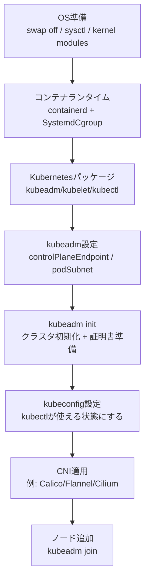
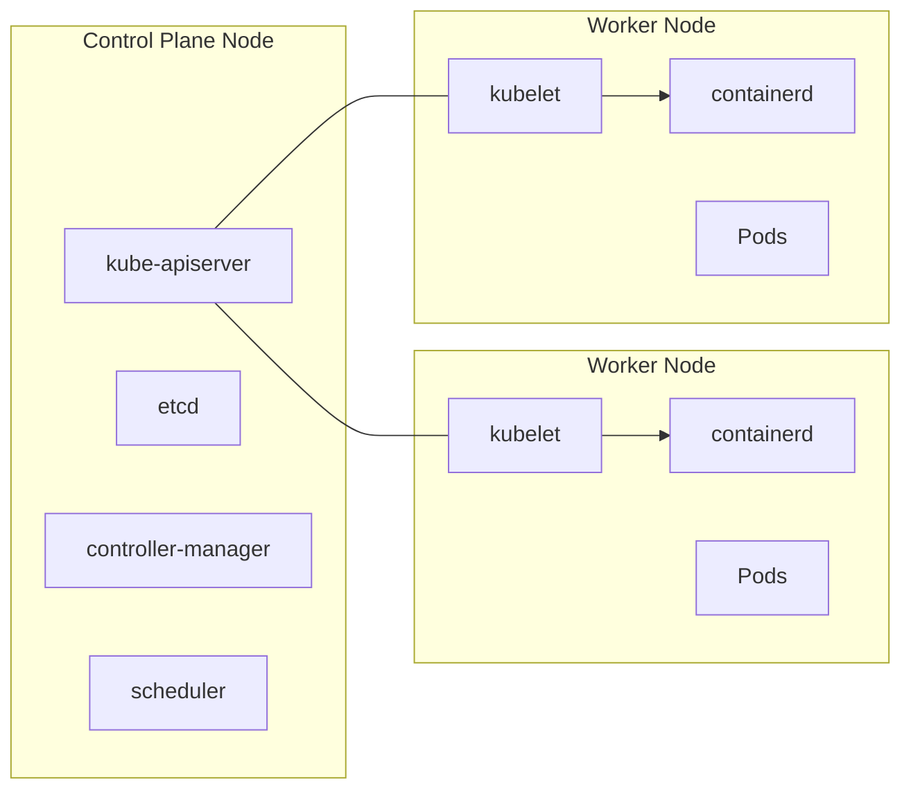

Title: CKA学習メモ: kubeadm 演習メモ（課題3.1）
Date: 2026-02-14
Slug: cka-training-memo
Lang: ja-jp
Category: notebook
Tags: kubernetes,cka,cni
Summary: kubeadm を使ったKubernetesクラスタ構築手順（init/CNI/join）を図解して整理します。

## 課題3.1（kubeadmでクラスタ構築）まとめ

この演習でやっていることを、**最短で理解できる形**にまとめると以下です。

- 目的: kubeadm を使って Kubernetes クラスタを初期化し、CNI（Podネットワーク）を入れて、ノードを join できる状態にする
- 考え方: 「OS/カーネル準備 → コンテナランタイム → Kubernetesパッケージ → kubeadm init → CNI → join」

### アジェンダ

- [全体フロー図](#flow)
- [何をしているか（ステップ別）](#steps)
- [最低限の注意点（詰まりどころ）](#pitfalls)

---

<a id="flow"></a>

### 全体フロー図（シンプル）



### クラスタ構成イメージ



---

<a id="steps"></a>

### 何をしているか（ステップ別）

1) OS/カーネル周りを Kubernetes 向けに整える

- `swapoff -a`: kubelet は swap が有効だと動作を拒否しやすい（学習環境では基本OFF）
- `modprobe overlay` / `modprobe br_netfilter`: コンテナとブリッジ経由の通信で必要になることが多い
- `sysctl`（例: `net.ipv4.ip_forward=1` など）: Pod間/ノード間の転送に必要

2) コンテナランタイム（例: containerd）を入れる

- Kubernetes はコンテナを直接動かすのではなく、ランタイム（containerd など）を介して動かす
- cgroup 設定を揃えるため、`SystemdCgroup = true` に寄せる構成が一般的

3) Kubernetes コンポーネント（kubeadm/kubelet/kubectl）を入れる

- `kubeadm`: クラスタ初期化/参加（init/join）を担当
- `kubelet`: 各ノードで Pod を実際に動かすエージェント
- `kubectl`: 操作用CLI

4) `kubeadm-config.yaml` を用意する

- `controlPlaneEndpoint`: 後でLB等を置いても証明書が壊れにくいように、IP直書きではなく名前を使うことが多い
- `podSubnet`: CNI の設定（例: Calico の IPv4 pool）と一致させる

5) `kubeadm init` でクラスタ初期化する

- Control Plane の主要コンポーネントを立ち上げる
- join コマンド（Control Plane追加用 / Worker追加用）が出力される
- `--upload-certs` を付けると Control Plane 追加がしやすい（ただし鍵は機密）

6) kubeconfig を設定して `kubectl` を使えるようにする

- `admin.conf` をユーザーの `$HOME/.kube/config` に配置して管理者権限で操作できるようにする

7) CNI（Podネットワーク）を apply する

- CNI が入って初めて Pod にIPが付与され、Pod-to-Pod 通信の土台ができる
- ここが終わると Node が Ready になりやすい

8) 追加ノードを `kubeadm join` で参加させる

- join に必要な token や証明書情報は機密なので、Git 管理のメモには実値を残さない

---

<a id="pitfalls"></a>

### 最低限の注意点（詰まりどころ）

- ファイアウォール/セキュリティグループ: ノード間通信やAPI（6443）などが塞がれていると詰まりやすい
- CNI と `podSubnet` の不一致: Node が `NotReady` のまま/Pod が通信できない原因になりやすい
- YAML はタブ禁止: インデントはスペースのみ（コピペ時に崩れがち）
- join の情報は秘匿: `--token` / `--certificate-key` は共有しない

---

## kubeadm init 実行メモ

実行コマンド（ログ保存）:

```bash
kubeadm init --config=kubeadm-config.yaml --upload-certs | tee kubeadm-init.out
```

---

## kubectl を使えるようにする（kubeconfig 設定）

通常ユーザーで使う場合:

```bash
mkdir -p $HOME/.kube
sudo cp -i /etc/kubernetes/admin.conf $HOME/.kube/config
sudo chown $(id -u):$(id -g) $HOME/.kube/config
```

root のまま使う場合:

```bash
export KUBECONFIG=/etc/kubernetes/admin.conf
```

---

## Pod Network（CNI）をデプロイする

`kubeadm init` 後は、まず Pod Network を入れる必要がある。

```bash
kubectl apply -f <podnetwork>.yaml
```

参考: <https://kubernetes.io/docs/concepts/cluster-administration/addons/>

メモ:

- CNI が入っていないと Node が `NotReady` のままになったり、CoreDNS が `Pending` になりやすい。

---

## ノード参加（join）

注意:

- `--token` / `--discovery-token-ca-cert-hash` / `--certificate-key` は **クラスター参加や機密データへのアクセスに関わる情報**。
- 学習メモに残す場合でも、Git 管理される場所には **実値を貼らない**（ここではプレースホルダ化）。

### Control Plane ノードを追加する（root で実行）

```bash
kubeadm join k8scp:6443 --token <token> \
	--discovery-token-ca-cert-hash sha256:<hash> \
	--control-plane --certificate-key <certificate-key>
```

補足:

- `--certificate-key` は機密。`--upload-certs` でアップロードした cert は 2 時間で削除される。
- 必要なら再アップロード:

```bash
kubeadm init phase upload-certs --upload-certs
```

### Worker ノードを追加する（root で実行）

```bash
kubeadm join k8scp:6443 --token <token> \
	--discovery-token-ca-cert-hash sha256:<hash>
```

