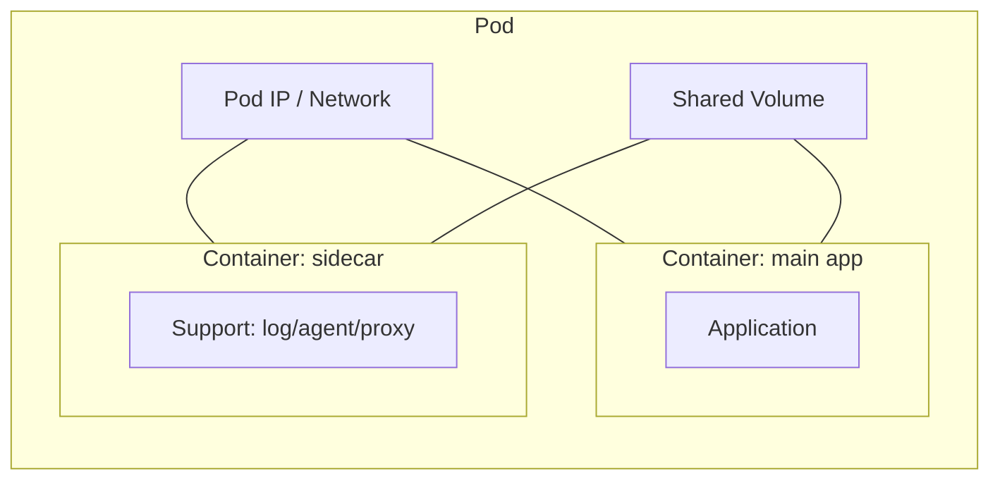
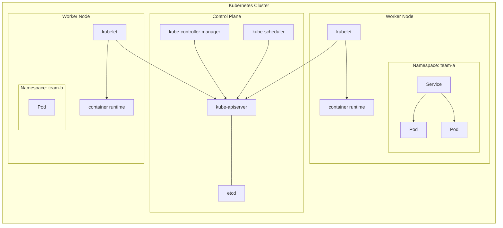
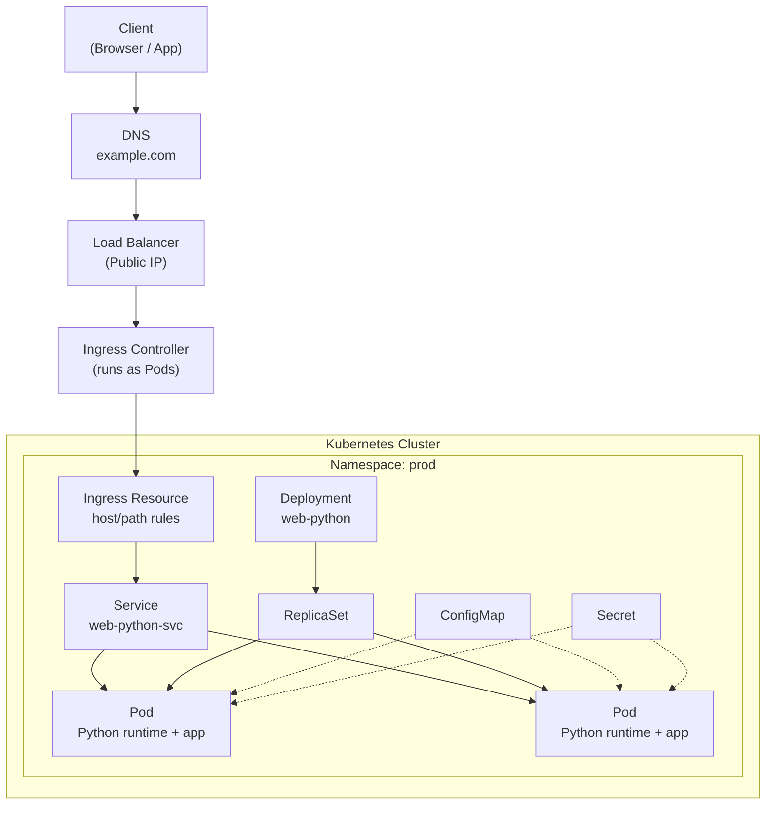
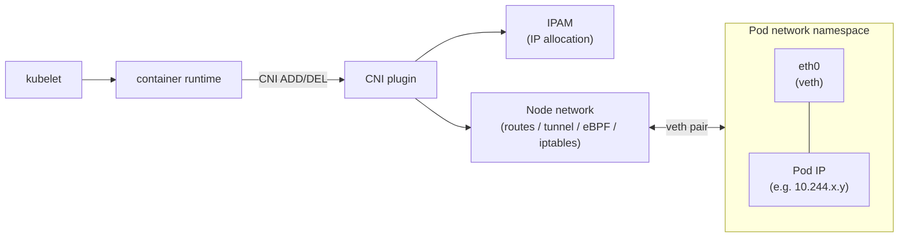
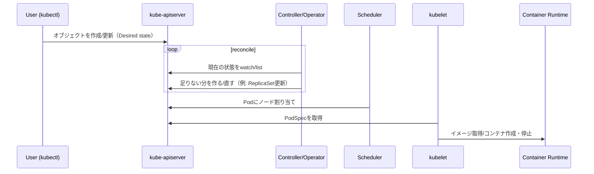
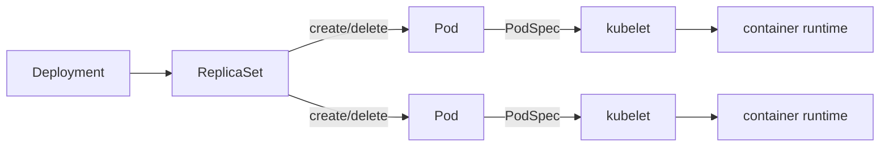
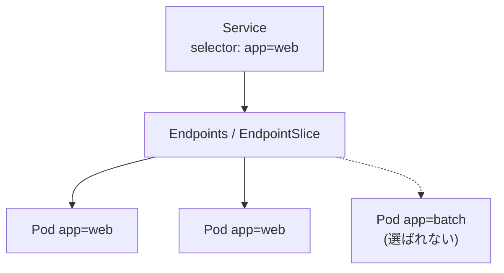
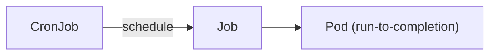

Title: CKA学習メモ: Kubernetes 基礎（Pod / Namespace / Controller / Service）
Date: 2026-02-14
Slug: cka
Lang: ja-jp
Category: notebook
Tags: kubernetes,cka,cni
Summary: CKAに向けてKubernetesの基本概念（Pod、Namespace、コントローラ、Service、ラベル等）を図解して整理します。

CKA の勉強用に、いただいた文章を **図解（Mermaid + ASCII）** と **やさしい説明** で整理します。

<a id="agenda"></a>

## アジェンダ

- [1. Kubernetesはオブジェクトを管理](#s1)
- [2. Pod（最小実行単位）](#s2)
- [3. Namespace（分離の境界）](#s3)
- [3.5 クラスター全体イメージ](#s35)
- [3.6 Pythonマイクロサービスのホスト構成](#s36)
- [3.7 CNI と Pod ネットワーク（詳細）](#s37)
- [4. コントローラの監視ループ](#s4)
- [5. Deployment → ReplicaSet → Pod](#s5)
- [6. Service / Endpoint](#s6)
- [7. Job / CronJob](#s7)
- [8. Label / Selector](#s8)
- [9. Taint / Toleration](#s9)
- [10. Annotation](#s10)
- [まとめ](#summary)

---

<a id="s1"></a>

## 1. Kubernetes は「コンテナを直接」ではなく「オブジェクト」を管理する

Kubernetes は「コンテナをデプロイして管理する」ためのオーケストレーション基盤ですが、実際には **コンテナ単体を直接管理する** というより、
**Pod / Deployment / Service などの Kubernetes オブジェクト** を通して状態（あるべき姿）を管理します。

ポイント:

- Kubernetes は「宣言した理想状態（Desired）」に「実状態（Current）」を近づけ続ける仕組み
- コンテナは多くの場合 **Pod の一部** として扱われる

---

<a id="s2"></a>

## 2. Pod とは: 1つ以上のコンテナをまとめる最小の実行単位

**Pod** は Kubernetes における最小のデプロイ単位です。
1つの Pod は、1つ以上のコンテナで構成され、次のようなものを **共有** します。

- **IP アドレス（= Pod IP）**
- **ストレージ（Volume）**
-（文脈上）同じ “実行環境” としてのまとまり（例: 同じノード上で一緒に動く）

よくある構成:

- メインのアプリコンテナが処理を実行
- サイドカーなどの補助コンテナがログ転送・プロキシ・設定配布などで支援

### 図: Pod の中身（イメージ）



ASCII での見え方（Mermaidが表示されない場合）:

```
+------------------------------+
| Pod (1つのIPを持つ)          |
|  - Shared Volume             |
|                              |
|  +-----------+  +----------+ |
|  | main app  |  | sidecar  | |
|  | container |  | container| |
|  +-----------+  +----------+ |
+------------------------------+
```

---

<a id="s3"></a>

## 3. Namespace とは: マルチテナント/リソース分割のための「境界」

Kubernetes はリソース管理やマルチテナント（チーム/環境の分離）を考慮して、
**Namespace** でオブジェクトを区別できるようにしています。

### スコープの違い

- **クラスタスコープ（cluster-scoped）**: クラスタ全体に属する
- **Namespaced**: どれか1つの Namespace に所属する

例（ざっくり）:

- cluster-scoped: Node, Namespace, PersistentVolume, CustomResourceDefinition
- namespaced: Pod, Service, Deployment, ReplicaSet, Job, CronJob, ConfigMap, Secret

### 「Namespace で分割される」ので Service が重要になる

Namespace によってリソースは分割されるため、Pod 間連携（安定した到達先）には
**Service** のような仕組みが必要になります。

---

<a id="s35"></a>

## 3.5 クラスター全体イメージ（Control Plane / Worker / Namespace）

「クラスタの中で何がどこにいるか」を、まずは1枚で把握する用の図です。

ポイント:

- **Control Plane** は「状態を保存し、調整して、割り当てる」側
- **Worker Node** は「Pod（コンテナ）を実際に動かす」側
- 多くの操作は `kube-apiserver` を経由して行われる
- Namespace は論理的な区切り（ノードの物理的分割ではない）



---

<a id="s36"></a>

## 3.6 Python runtime のWebマイクロサービスをクラスタでホストするイメージ

「Python の runtime を持つコンテナ（例: FastAPI/Flask/Django）で Web サイト/API をマイクロサービスとして動かす」時の典型パターンです。

ざっくり流れ:

- 外部アクセス（ブラウザ/クライアント） → **Ingress（入口）**
- Ingress は **Ingress Controller（例: nginx ingress）** が実際にルーティング
- ルーティング先は **Service（安定した宛先）**
- Service が **ラベルで Pod を選択**（Pod は Deployment/ReplicaSet が管理）



覚えどころ（CKA向け）:

- **Ingress は「入口のルール」**、実処理は Ingress Controller
- **Service は Pod の IP が変わっても安定**（selector で追従する）
- **Deployment はローリングアップデート**やスケールの中心（Pod を直接ではなく ReplicaSet 経由で管理）

---

<a id="s37"></a>

## 3.7 CNI（Container Network Interface）と Pod ネットワーク（詳細）

ここまでの話で「Pod は IP を持つ」「Service が Pod を束ねる」ことは出てきました。
次に知りたいのは、**その Pod IP を誰が割り当て、ノードをまたいだ Pod-to-Pod 通信をどう成立させるか**です。
そこで登場するのが **CNI（Container Network Interface）** です。

### 3.7.1 CNI とは

- CNI は、コンテナ（Pod）へネットワークを割り当てるための **標準インターフェース**
- Kubernetes 自体が「ネットワークを実装」するのではなく、CNI 仕様に沿った **ネットワークプラグイン**（Calico/Flannel/Cilium等）を使う
- Pod の作成/削除時に、`kubelet` → コンテナランタイム経由で CNI が呼ばれ、ネットワーク設定を行う

### 3.7.2 まずやるべきこと: IP 競合しない Pod CIDR を決める

クラスタ構築時は、先に **Pod用のCIDR** を設計して競合を避けます（例: `10.244.0.0/16`）。
その上で、選んだ CNI がその Pod CIDR を使ってクラスタ全体の Pod ネットワークを構成します。

補足（よくある落とし穴）:

- CNI を入れていない/壊れていると Node が `NotReady` になりやすい
- CoreDNS などの Pod が `Pending` のままになりやすい（特に kubeadm 直後）

### 3.7.3 Pod が起動する時の流れ（CNI 呼び出し）

CNI がやることを一言で言うと「Pod に `eth0` と IP を与え、到達できるようにルーティング等を整える」です。



### 3.7.4 ノード間通信（Pod-to-Pod）を実現する代表パターン

ノードをまたいで Pod に到達させる方法は CNI によって異なりますが、代表的には次の2つです。

- **Overlay（VXLANなど）**: ノード間をカプセル化して運ぶ（導入しやすい）
- **L3 routing（BGP/ルート配布）**: ルーティングで到達させる（シンプルで性能が出やすい）

```mermaid
flowchart TB
  PA["Pod A<br/>10.244.1.2"] --> NA["Node A"]
  NA -->| (A) overlay: VXLAN encap | NB["Node B"]
  NA -->| (B) L3 routing: BGP/routes | NB
  NB --> PB["Pod B<br/>10.244.2.3"]
```

### 3.7.5 Service と CNI の関係（混同しやすい）

- **CNI**: Pod に IP を付け、Pod-to-Pod の土台を作る
- **Service**: Pod の集合に対して「変わらない宛先（名前/仮想IP的な入口）」を提供
- Service の実現は、環境により `kube-proxy`（iptables/IPVS）または eBPF で行われる

### 3.7.6 よく見る CNI の特徴（参考）

| 選択肢 | ざっくり特徴 |
|---|---|
| Calico | L3寄りで大規模にスケールしやすい。NetworkPolicy も実装 |
| Flannel | シンプル。VXLAN などでノード間をつなげやすい |
| Cilium | eBPF ベースで高機能（ネットワーク/セキュリティ/可観測性） |
| Kube-router | ルーティング/ポリシーなどをまとめる設計 |

---

<a id="s4"></a>

## 4. オーケストレーションの本質: コントローラの監視ループ

オーケストレーションは、**コントローラ（controller / operator）** と呼ばれる監視ループで実現します。

基本動作:

1. コントローラが `kube-apiserver` から対象オブジェクトの状態を観測
2. 「望ましい状態」と一致していなければ変更を加える
3. 一致するまで繰り返す

多くの標準コントローラは `kube-controller-manager` に集約されています。
また CRD（Custom Resource Definition）により、独自のオペレータ/コントローラを追加できます。

### 図: Desired → Current を近づけるループ



---

<a id="s5"></a>

## 5. Deployment → ReplicaSet → Pod: デフォルトの（超重要）流れ

コンテナのための代表的コントローラは **Deployment** です。
ただし Deployment は Pod を直接いじるのではなく、基本的に次の関係になります。

- **Deployment** が **ReplicaSet** を管理
- **ReplicaSet** が **Pod** の数を PodSpec に従って増減

### 図: Deployment から Pod が動くまで



補足:

- **PodSpec** は「どのイメージを」「何個」「どんな設定で」などを記述
- `kubelet` がノード上で PodSpec を実行に落とし込み、コンテナの作成/終了を行う

---

<a id="s6"></a>

## 6. Service / Endpoint: ラベルを使って通信先を束ねる

Service（および関連するオペレータ）は、ラベルに基づいてネットワーク接続（到達先の集合）を管理します。

ざっくり言うと:

- Service は **selector（ラベル条件）** で「どの Pod を束ねるか」を決める
- 実際の到達先（Pod IP の集合）が Endpoint / EndpointSlice として管理される
- Service は **Pod間 / Namespace間 / クラスタ外部との通信** に使われる

### 図: Service が Pod を選ぶ



---

<a id="s7"></a>

## 7. Job / CronJob: バッチ（1回 or 定期）

- **Job**: 1回きり、あるいは完了まで再試行するタスク向け
- **CronJob**: cron 形式で定期実行する Job を作る

図（イメージ）:



---

<a id="s8"></a>

## 8. 大量リソース管理の鍵: Label / Selector

千単位の Pod を百単位のノードで運用する時、名前や UID を1つ1つ扱うのは現実的ではありません。
そこで **label（任意の文字列のキー/値）** を使って、まとまりで操作します。

代表例:

- `app=web`
- `env=prod`
- `tier=frontend`

Label が効く場面:

- Service が Pod を選ぶ（selector）
- Deployment/ReplicaSet が管理対象を紐づける
- `kubectl get pods -l app=web` のような絞り込み

---

<a id="s9"></a>

## 9. Node の割り当て制御: Taint / Toleration

ノードには **Taint** を付けられます。
Taint があるノードは、Pod 側に対応する **Toleration** がない限り、
基本的に「そのノードに Pod を載せない（回避する）」挙動になります。

イメージ:

```
Node A: taint=dedicated=team-a:NoSchedule
	- tolerationを持つPodだけが乗れる

Node B: taintなし
	- 通常のPodが乗れる
```

---

<a id="s10"></a>

## 10. Annotation: 付加情報（ただし selector には使わない）

**Annotation** はオブジェクトに付随するメタデータですが、
**ラベルのように selector としては使いません**。

用途:

- サードパーティのエージェント/ツールが参照する情報
- 運用メモ（オーナー、チケットURL、設計情報など）

---

<a id="summary"></a>

## まとめ（試験向けの覚え方）

- **Pod**: コンテナの実行単位。IP/Volumeなどを共有するまとまり
- **Namespace**: 分離の境界（マルチテナント/整理）。スコープに注意
- **Controller**: Desired と Current を一致させ続ける監視ループ
- **Deployment → ReplicaSet → Pod**: 重要な管理チェーン
- **Service**: ラベルで Pod を束ね、安定した到達先を提供
- **Job/CronJob**: バッチ用
- **Label**: selector に使える。大量管理の主役
- **Annotation**: 付加情報。selector には使わない
- **CNI**: Pod に IP/ルートを設定し、Pod-to-Pod 通信の土台を作る

