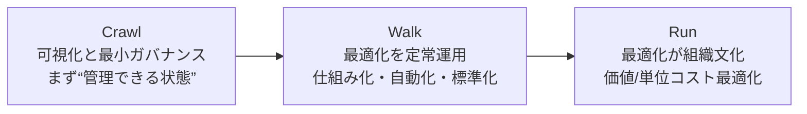
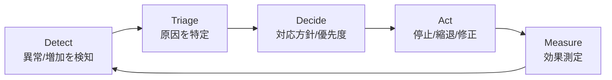
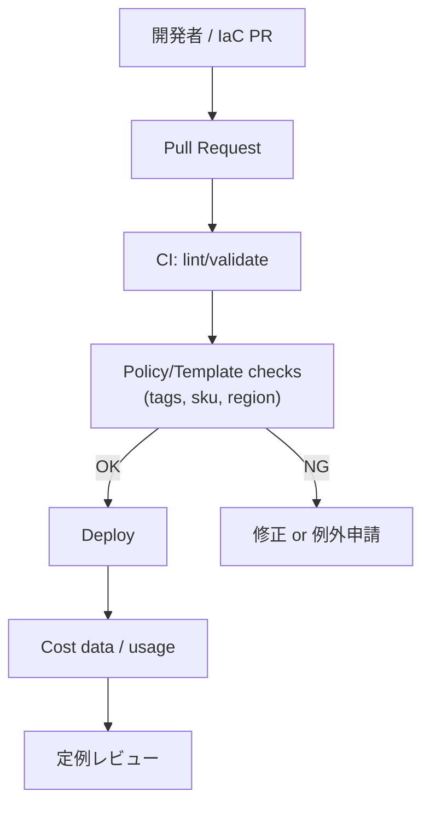

Title: FinOps 料金最適化（Cost Optimization）: Crawl 段階でやること / Walk 段階へ進む準備（Azure 向け）
Date: 2026-01-27
Slug: finops-cost-optimization-crawl-walk-azure
Lang: ja-jp
Category: notebook
Tags: azure,FinOps
Summary: FinOps の「料金最適化」ケイパビリティにおいて、Crawl 段階で最低限整えるべき要素と、Walk 段階に移行するための準備（Azure の具体策）をチェックリストと図解で整理します。

FinOps の料金最適化（Cost Optimization）は「節約ネタ探し」ではなく、**継続的に最適化を回すための仕組み作り**です。
ここでは FinOps Foundation の成熟度（Crawl / Walk / Run）を前提に、Azure 利用者向けに **Crawl 段階で求められること**と **Walk 段階への準備**をまとめます。

---

## 0. 前提：Crawl / Walk の境界を決める

「やってるつもり」になりやすいので、まずは段階の違いを一枚で。



この投稿のスコープは以下です。

- **Crawl（必須）**: 支出を説明できる、責任を分けられる、異常に気づける、基本的な最適化が回る
- **Walk（準備）**: 最適化バックログが回り、効果測定でき、予約/節約プラン等のコミットメントや自動化を“安全に”回せる

---

## 1. Crawl 段階に求められること（料金最適化ケイパビリティ）

### 1-1. まず整えるべき「土台」

料金最適化の Crawl は、**最適化そのものより、最適化が成立する土台**が中心です。

#### A) スコープの整理（誰の、どの支出を最適化する？）

- Azure のスコープ（例）
	- 課金アカウント / 請求プロファイル
	- 管理グループ / サブスクリプション
	- リソースグループ / リソース
- 組織スコープ（例）
	- 事業部門 / プロダクト / チーム
	- 環境（prod / dev / sandbox）

**Crawl のゴール**: “この範囲の支出はこの責任者が持つ”が決まっている。

#### B) 配賦（Allocation）の最小ライン

最適化は「どこが使っているか」が分からないと回りません。

- 最低限の配賦キー（Azure Tag の例）
	- `CostCenter`
	- `Application`（プロダクト名）
	- `Owner`（責任者）
	- `Environment`（prod/dev）
	- `Service`（ワークロード種別）

**Crawl のゴール**:
- 主要コスト（上位 80%）が、上のキーで説明できる
- 「タグがないから不明」が例外になる

#### C) 事実データの確保（単発の画面ではなく“継続取得”）

最適化の議論は「今月の画面」だけだと必ず止まります。

- Azure 側で最低限揃える
	- Cost Management + Billing のコスト分析（基礎）
	- 予算（Budget）とアラート（予算超過/予測超過）
	- コストデータのエクスポート（継続取得）

**Crawl のゴール**:
- “いつでも再現できるデータ”（エクスポート等）がある
- 異常の検知が「人の気づき」ではなく「仕組み」になる

```mermaid
flowchart TD
	CM["Azure Cost Management + Billing"] -->|Cost export (daily)| ST[("Storage Account<br/>cost-exports")]
	ST --> BI["Power BI / Excel"]
	ST --> ADX["Azure Data Explorer<br/>/ FinOps hubs"]
	BI --> RPT["定例レポート<br/>(コスト/予算/異常)"]
  ADX --> RPT
```

#### D) 運用の最小ループ（会議体ではなく“反復”）

最適化は、月1のレビューだけだと手遅れになりがちです。

**Crawl の推奨ループ（例）**
- 週次：異常・上位コスト確認、短期アクション
- 月次：トレンド/主要ドライバー、最適化結果、翌月の重点



**Crawl のゴール**: “検知→対応→効果測定”が、少なくとも一つの領域で回っている。

---

### 1-2. Crawl 段階で実施しやすい Azure の具体アクション（優先度順）

#### ① 「止める/下げる」系（影響が分かりやすい）
- 使っていないリソースの停止/削除（例：停止済み VM のディスク/パブリックIP放置）
- 非本番の稼働時間制御（例：夜間停止、週末停止）
- 高額 SKU の棚卸し（例：過剰な Premium/Enterprise SKU）

#### ② 「サイズ」系（Rightsizing）
- VM サイズの最適化（CPU/メモリの利用率で見直し）
- DB/ストレージの階層見直し（ホット/クール/アーカイブ）

#### ③ 「設定」系（気づきにくいが積み上がる）
- ログ/メトリクスの保持期間や収集対象の最適化
- ネットワーク転送料（egress）の発生源確認（設計起因が多い）

#### ④ 「短期でやり切れるガードレール」
- 予算（Budget）を“最小単位”で置く（Subscription / RG / Tag スコープ）
- Azure Policy で最低限のタグ強制や SKU 制限をかける

---

### 1-3. Crawl の Definition of Done（チェックリスト）

以下が揃うと「Walk に進む準備ができた」と判断しやすいです。

- 主要コストの配賦（上位 80%）ができている（タグ/階層で説明可能）
- 予算（Budget）と通知が動いている（オーナーに届く）
- コストデータの継続取得（Export など）ができている
- 週次 or 月次で最適化アクションが回り、効果測定が残る
- “削減額（見込み/実績）”の共通ルールがある（例：月額換算、期間、ベースライン）

---

## 2. Walk 段階への準備（Crawl から抜けるために必要なこと）

Walk の主語は「最適化」より **運用の標準化・自動化・意思決定** です。

### 2-1. 最適化バックログを“プロダクト化”する

最適化ネタは無限に出ます。Walk では、優先度と回し方を固定します。

- バックログ項目に最低限持たせる情報
	- 対象（Subscription/RG/Resource/Tag）
	- 根拠（どのデータ/どの期間）
	- 期待効果（$ / 月、リスク、影響範囲）
	- 実行手順（誰が、いつ、どこまで）
	- 完了条件（効果測定の方法、監視）

**Azure のネタ源（例）**
- Azure Advisor（推奨事項）
- Cost Management の推奨/分析
- ワークロード固有のメトリクス（CPU/IO/リクエスト）

### 2-2. “コミットメント”を安全に扱える状態にする

Azure で代表的なコミットメント施策は以下です。

- Azure Reservations（予約）
- Azure Savings Plan for Compute（節約プラン）

Walk で重要なのは「買うこと」ではなく、以下ができることです。

- 適用範囲（Shared/Single）や対象が理解されている
- 利用率（utilization）とカバレッジ（coverage）を追える
- 失敗時の影響（コミット過多）を許容できる意思決定プロセスがある

**準備の具体策（Walk 入り口）**
- まずは“安定稼働している基盤”に限定して適用する（例：常時稼働の VM/AKS ノード）
- 期間は短めから（まずはコミット運用を学ぶ）
- 月次で利用率/カバレッジの定例レビューを設ける

### 2-3. ガードレールをコード化する（Policy / IaC / 標準）

Walk では「人のお願い」では回らないので、逸脱を減らします。

- Azure Policy（例）
	- 必須タグの付与（`CostCenter` など）
	- 許可 SKU の制限（高額 SKU を勝手に作れない）
	- リージョン制限（転送/データ主権の観点も）
- IaC（Bicep/Terraform）
	- 標準テンプレートにコスト最適化の設定を埋め込む
	- “例外申請”のルートを用意する（例外が正当なケースもある）



### 2-4. “単位コスト”の導入準備（価値とつなぐ）

Walk に入ると「いくら減った」だけでは評価が難しくなります。

- 例）単位コスト
	- 1 リクエストあたりのコスト
	- 1 ユーザーあたりのコスト
	- 1 ジョブ/1 パイプライン実行あたりのコスト

**準備のポイント**
- まず 1 つの重要ワークロードで試す
- “メトリクス（分母）”が取れる仕組みを作る（App Insights / Log Analytics など）
- コストとメトリクスを同じ粒度で見られるようにする

---

## 3. Azure 利用者向け：Crawl→Walk の移行ロードマップ（ざっくり）

1. Cost Management で現状把握（上位コスト・急増・主要リソース）
2. タグ/階層で配賦（まず上位 80%）
3. Budget + アラート + エクスポートで“仕組み化”
4. 週次/月次の最適化ループを回し、効果測定を残す
5. 最適化バックログ化（優先度と実行手順を固定）
6. 予約/節約プランを“小さく安全に”始める
7. Policy/IaC で逸脱を減らし、単位コストにつなげる

---

## 4. まとめ

- Crawl で求められるのは、最適化ネタより **可視化・配賦・データ継続取得・運用ループ**
- Walk への準備は、**バックログ化・コミットメント運用・ガードレールのコード化・単位コスト**
- Azure では Cost Management / Budget / Export / Advisor / Policy を軸に、必要に応じて ADX / FinOps hubs で分析基盤を拡張する

---

## 参考 URL

- FinOps Framework（Optimize / Crawl-Walk-Run）
	- https://www.finops.org/framework/
	- https://www.finops.org/framework/optimize/
- Azure Cost Management + Billing
	- https://learn.microsoft.com/azure/cost-management-billing/cost-management-billing-overview
	- https://learn.microsoft.com/azure/cost-management-billing/costs/tutorial-acm-export-data
- Azure Advisor
	- https://learn.microsoft.com/azure/advisor/advisor-overview
- Azure Reservations
	- https://learn.microsoft.com/azure/cost-management-billing/reservations/save-compute-costs-reservations
- Azure Savings Plan for Compute
	- https://learn.microsoft.com/azure/cost-management-billing/savings-plan/savings-plan-compute-overview
- Azure Policy
	- https://learn.microsoft.com/azure/governance/policy/overview
- FinOps Toolkit / FinOps hubs
	- https://learn.microsoft.com/cloud-computing/finops/toolkit/hubs/finops-hubs-overview

