Title: SRE Agent の資料作成ノート
Date: 2026-01-27
Slug: SRE-Agent-Planning
Lang: ja-jp
Category: notebook
Tags: azure, SRE Agent, AIOps
Summary: SRE Agent の概要資料を作成するための勉強ノート


本稿は **Microsoft Learn の記述に基づく事実のみ**を材料として、PowerPoint 化しやすいように「説明文（話す文章）＋スライド要点」に再整理したノートです。

引用の出し方:
- 本文中は `[章-番号]` の参照番号のみを付けます（URL を本文に直書きしません）。
- 各章の末尾に **参考（番号付き / URL + 短い引用）** をまとめます。

---

## アジェンダ（案）

> 大枠は「機能紹介」と「デモ」。各スライドは「説明文（話す文章）＋要点」で作る。

### 機能紹介（構成案）
- イントロ: 何ができる/何ができない（承認が必要な write、英語UIなど）[1-2][1-3]
- 導入前提: RBAC とネットワークの落とし穴[2-1][2-2]
- セキュリティ: “誰が/何で/どの範囲で” の3要素で説明[3-1]
- 実行: Review/Autonomous の違いと同意モデル[5-1][5-5]
- 運用: Incident management と response plan で何が自動化できるか[7-1][7-2]
- コンテキスト: Memory system とチーム共有の前提[8-2][8-9]
- 拡張: Subagent / Tools / Connectors / MCP の関係と境界[9-2][9-3]

### デモ（構成案）
- デモA: “App Service が遅い/タイムアウト” → Cosmos DB 429/ホットパーティション切り分け（既存）
- デモB: “散発的タイムアウト” → Cosmos DB 408 切り分け（既存）

### まとめ（構成案）
- 実運用で効くポイント（RBAC/同意/スコープ/メモリ/拡張）を早見表で締める[11-2]

---

## 0. 公式ページ（最小セット）

- Overview[0-1]
- Create and use an agent[0-2]
- Roles and permissions overview[0-3]
- Managed identity[0-4]
- Agent run modes[0-5]
- Scheduled tasks[0-6]
- Incident management[0-7]
- Incident response plan[0-8]
- Memory system[0-9]
- Subagent builder overview[0-10]
- Connectors[0-11]
- Custom logic (Python)[0-12]
- Custom MCP server[0-13]
- FAQ[0-14]

### 参考（第0章）
- [0-1] [https://learn.microsoft.com/en-us/azure/sre-agent/overview](https://learn.microsoft.com/en-us/azure/sre-agent/overview) — “AI-powered monitoring, troubleshooting, and remediation capabilities.”
- [0-2] [https://learn.microsoft.com/en-us/azure/sre-agent/usage](https://learn.microsoft.com/en-us/azure/sre-agent/usage) — “Make sure that your user account has the `Microsoft.Authorization/roleAssignments/write` permissions”
- [0-3] [https://learn.microsoft.com/en-us/azure/sre-agent/roles-permissions-overview](https://learn.microsoft.com/en-us/azure/sre-agent/roles-permissions-overview) — “consists of three main components”
- [0-4] [https://learn.microsoft.com/en-us/azure/sre-agent/agent-managed-identity](https://learn.microsoft.com/en-us/azure/sre-agent/agent-managed-identity) — “Azure SRE Agent has its own managed identity”
- [0-5] [https://learn.microsoft.com/en-us/azure/sre-agent/agent-run-modes](https://learn.microsoft.com/en-us/azure/sre-agent/agent-run-modes) — “generates an execution plan and waits for your consent”
- [0-6] [https://learn.microsoft.com/en-us/azure/sre-agent/scheduled-tasks](https://learn.microsoft.com/en-us/azure/sre-agent/scheduled-tasks) — “automate workflows such as monitoring, maintenance, and security checks”
- [0-7] [https://learn.microsoft.com/en-us/azure/sre-agent/incident-management](https://learn.microsoft.com/en-us/azure/sre-agent/incident-management) — “receives alerts from … Azure Monitor alerts … PagerDuty … ServiceNow”
- [0-8] [https://learn.microsoft.com/en-us/azure/sre-agent/incident-response-plan](https://learn.microsoft.com/en-us/azure/sre-agent/incident-response-plan) — “Filters … Execution mode … Customize instructions”
- [0-9] [https://learn.microsoft.com/en-us/azure/sre-agent/memory-system](https://learn.microsoft.com/en-us/azure/sre-agent/memory-system) — “gives agents the knowledge they need to troubleshoot effectively”
- [0-10] [https://learn.microsoft.com/en-us/azure/sre-agent/subagent-builder-overview](https://learn.microsoft.com/en-us/azure/sre-agent/subagent-builder-overview) — “Incident response plans or scheduled tasks trigger subagents.”
- [0-11] [https://learn.microsoft.com/ja-jp/azure/sre-agent/connectors#what-are-connectors](https://learn.microsoft.com/ja-jp/azure/sre-agent/connectors#what-are-connectors) — “通信コネクタ … ナレッジ コネクタ … カスタム コネクタ … MCP サーバー エンドポイント”
- [0-12] [https://learn.microsoft.com/ja-jp/azure/sre-agent/custom-logic-python#create-a-python-tool](https://learn.microsoft.com/ja-jp/azure/sre-agent/custom-logic-python#create-a-python-tool) — “左側のナビゲーションから [Builder>Subagent builder ] … 作成>ツール … Python ツール”
- [0-13] [https://learn.microsoft.com/en-us/azure/sre-agent/custom-mcp-server](https://learn.microsoft.com/en-us/azure/sre-agent/custom-mcp-server) — “only accessible through subagents and aren't directly accessible to main Azure SRE Agent.”
- [0-14] [https://learn.microsoft.com/en-us/azure/sre-agent/faq](https://learn.microsoft.com/en-us/azure/sre-agent/faq) — “Avoid relying solely on group-based role assignments … Use the Check Access feature”

---

## 1. SRE Agent の基本挙動（Overview）

### 何の機能か（説明）
Azure SRE Agent は、運用に関する監視・トラブルシューティング・リメディエーションを AI で支援する、チャットボット型の体験として提供されます。[1-1]

### 何が大事か（スライド要点）
- 「診断（read）」と「変更（write）」が同じ会話の流れで扱える（ただし write は承認が前提）。[1-2]
- チャット UI の言語制約（英語のみ）があるので、社内展開時は運用手順・プロンプトを英語で標準化する設計が必要です。[1-3]
- エージェント作成時に Application Insights / Log Analytics / Managed Identity が自動作成されるため、運用データや権限の“置き場”が増える点を理解しておく必要があります。[1-4]

### 会話→診断→変更の流れ

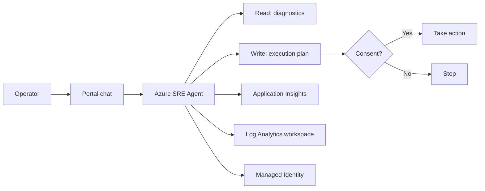

### 参考（第1章）
- [1-1] [https://learn.microsoft.com/en-us/azure/sre-agent/overview](https://learn.microsoft.com/en-us/azure/sre-agent/overview) — “AI-powered monitoring, troubleshooting, and remediation capabilities.”
- [1-2] [https://learn.microsoft.com/en-us/azure/sre-agent/overview](https://learn.microsoft.com/en-us/azure/sre-agent/overview) — “any action that an agent takes on your behalf requires your approval.”
- [1-3] [https://learn.microsoft.com/en-us/azure/sre-agent/overview](https://learn.microsoft.com/en-us/azure/sre-agent/overview) — “English is the only supported language in the chat interface.”
- [1-4] [https://learn.microsoft.com/en-us/azure/sre-agent/overview](https://learn.microsoft.com/en-us/azure/sre-agent/overview) — “Azure Application Insights / Log Analytics workspace / Managed Identity”

---

## 2. 作成前提（Usage）

### 何が必要か（説明）
SRE Agent を作成するには、ユーザー側に `Microsoft.Authorization/roleAssignments/write` の権限が必要です。[2-1]

また、ネットワーク的には `*.azuresre.ai` への到達性が前提になります。[2-2]

### スライド要点（「導入で詰まりやすい点」）
- 権限要件は「SRE Agent リソースの作成」だけでなく、背後で行われる role assignment を通すために重要です。[2-1]
- `*.azuresre.ai` がブロックされると、Portal 側の体験が破綻するケースがあるため、最初にネットワーク確認を入れるのが現実的です。[2-2]

### 作成の前提チェック

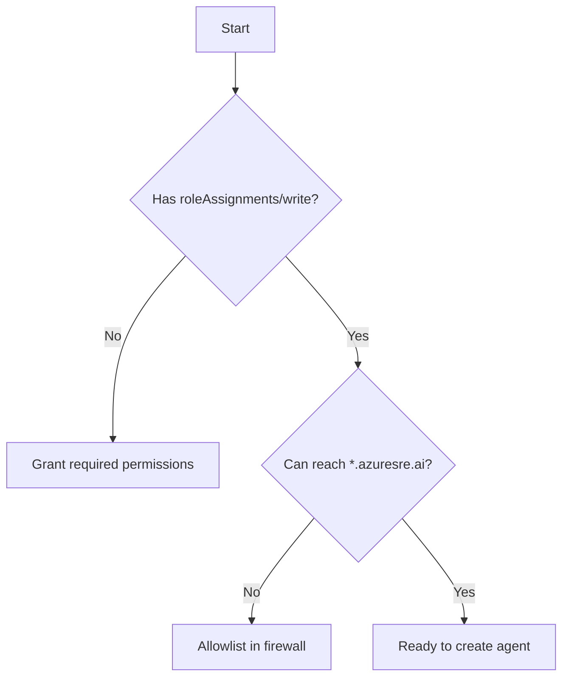

### 参考（第2章）
- [2-1] [https://learn.microsoft.com/en-us/azure/sre-agent/usage](https://learn.microsoft.com/en-us/azure/sre-agent/usage) — “Make sure that your user account has the `Microsoft.Authorization/roleAssignments/write` permissions”
- [2-2] [https://learn.microsoft.com/en-us/azure/sre-agent/usage](https://learn.microsoft.com/en-us/azure/sre-agent/usage) — “Add `*.azuresre.ai` to the allowlist in your firewall settings.”

---

## 3. セキュリティモデル（3要素 + 境界）

### 何を説明すべきか（説明）
SRE Agent の権限は、(1) ユーザーが SRE Agent に対して持つロール、(2) エージェント自身の managed identity、(3) 実行モード（run modes）の3要素で説明できます。[3-1]

この3要素は「誰が（RBAC）」「何で（エージェントのID）」「どの範囲で（実行モード＋同意/資格情報）」を分解して説明するのに向いています。[3-6]

### スライド要点（役割分離の説明）
- SRE Agent のユーザーロールは 3 種類（Admin / Standard User / Reader）として定義されています。[3-2]
- エージェントの managed identity は Reader / Privileged の permission level を持ち得ます。[3-3]
- “Autonomous” は無条件ではなく、incident management plan のコンテキストに限定されます。[3-4]
- エージェント側のスコープが優先されるという「境界」の説明は、権限迂回の懸念に対する答えになります。[3-5]

補足（説明）:
- 私は要点を「RBAC でユーザー機能を制御」「MI は閲覧者/特権のレベルを持つ」「実行モードは同意の扱いに影響」「特権昇格防止のためエージェントのアクセス許可が優先」の4点で説明します。[3-7]

### セキュリティモデルの3要素

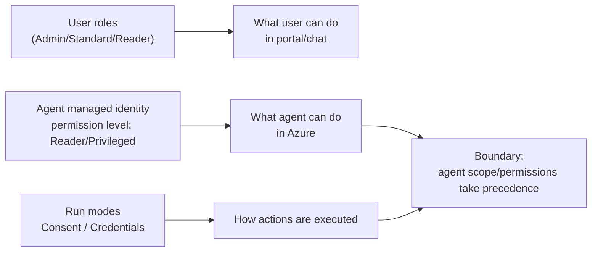

### 参考（第3章）
- [3-1] [https://learn.microsoft.com/en-us/azure/sre-agent/roles-permissions-overview](https://learn.microsoft.com/en-us/azure/sre-agent/roles-permissions-overview) — “consists of three main components”
- [3-2] [https://learn.microsoft.com/en-us/azure/sre-agent/roles-permissions-overview](https://learn.microsoft.com/en-us/azure/sre-agent/roles-permissions-overview) — “Three primary roles (*SRE Agent Admin*, *SRE Agent Standard User*, and *SRE Agent Reader*)”
- [3-3] [https://learn.microsoft.com/en-us/azure/sre-agent/roles-permissions-overview](https://learn.microsoft.com/en-us/azure/sre-agent/roles-permissions-overview) — “either *Reader* or *Privileged* access”
- [3-4] [https://learn.microsoft.com/en-us/azure/sre-agent/agent-run-modes](https://learn.microsoft.com/en-us/azure/sre-agent/agent-run-modes) — “you can only enable autonomous mode in the context of an incident management plan”
- [3-5] [https://learn.microsoft.com/en-us/azure/sre-agent/roles-permissions-overview](https://learn.microsoft.com/en-us/azure/sre-agent/roles-permissions-overview) — “Agent permissions take precedence … to prevent privilege escalation”
- [3-6] [https://learn.microsoft.com/ja-jp/azure/sre-agent/roles-permissions-overview#key-concepts](https://learn.microsoft.com/ja-jp/azure/sre-agent/roles-permissions-overview#key-concepts) — “セキュリティ モデルは、次の 3 つの主要なコンポーネントで構成”
- [3-7] [https://learn.microsoft.com/ja-jp/azure/sre-agent/roles-permissions-overview#security-model-at-a-glance](https://learn.microsoft.com/ja-jp/azure/sre-agent/roles-permissions-overview#security-model-at-a-glance) — “ロールベースのアクセス制御 … アクセス許可レベル … 操作モード … エージェントのアクセス許可 … 優先”

---

## 4. Managed Identity（Reader/Privileged と OBO）

### 何のための仕組みか（説明）
SRE Agent は「自身の managed identity」を持ち、管理対象の resource groups に対して、その identity を使って操作します。[4-1]

ポータル作成時に “Reader / 特権付き（Privileged）” のアクセス許可レベルを選べます。[4-5]

### スライド要点（“Reader で始めて大丈夫か” の説明）
- Permission level が Reader の場合、必要に応じてユーザーに一時的な昇格を要求し、OBO フローで完了させます。[4-2]
- managed resource group に対して事前に割り当てられるロールとして、Log Analytics Reader / Azure Reader / Monitoring Reader が挙げられています。[4-3]
- 権限を絞るときは「特定権限を剥がす」ではなく「resource group をスコープから外す」方針で整理します。[4-4]

補足（説明）:
- エージェントは「ユーザーの同意」と「適切な RBAC 割り当て」が揃う場合にのみアクションを実行します。[4-6]
- レビュー モードは明示的同意、インシデント対応計画のコンテキストでは暗黙的同意として扱います。[4-7]

### MI と OBO の流れ

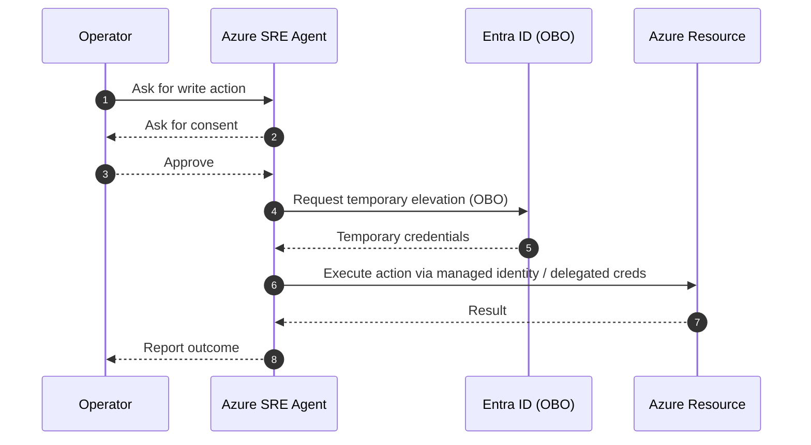

### 参考（第4章）
- [4-1] [https://learn.microsoft.com/en-us/azure/sre-agent/agent-managed-identity](https://learn.microsoft.com/en-us/azure/sre-agent/agent-managed-identity) — “Azure SRE Agent has its own managed identity”
- [4-2] [https://learn.microsoft.com/en-us/azure/sre-agent/agent-managed-identity](https://learn.microsoft.com/en-us/azure/sre-agent/agent-managed-identity) — “prompts the user for a temporary elevation using OBO flow”
- [4-3] [https://learn.microsoft.com/en-us/azure/sre-agent/agent-managed-identity](https://learn.microsoft.com/en-us/azure/sre-agent/agent-managed-identity) — “preconfigured with the following role assignments”
- [4-4] [https://learn.microsoft.com/en-us/azure/sre-agent/agent-managed-identity](https://learn.microsoft.com/en-us/azure/sre-agent/agent-managed-identity) — “You can't directly remove specific permissions … remove the entire resource group from the agent's scope.”
- [4-5] [https://learn.microsoft.com/ja-jp/azure/sre-agent/agent-managed-identity#agent-permissions](https://learn.microsoft.com/ja-jp/azure/sre-agent/agent-managed-identity#agent-permissions) — “ポータルからエージェントを作成するときに、次のいずれかのアクセス許可レベルを適用できます”
- [4-6] [https://learn.microsoft.com/ja-jp/azure/sre-agent/agent-managed-identity#agent-actions](https://learn.microsoft.com/ja-jp/azure/sre-agent/agent-managed-identity#agent-actions) — “ユーザーの同意 … 適切な RBAC 割り当てがある場合にのみアクションを実行”
- [4-7] [https://learn.microsoft.com/ja-jp/azure/sre-agent/agent-managed-identity#agent-actions](https://learn.microsoft.com/ja-jp/azure/sre-agent/agent-managed-identity#agent-actions) — “レビュー モード … 明示的な同意 … インシデント対応計画のコンテキスト … 暗黙的な同意”

---

## 5. Run modes（Consent と Credentials の分解）

### 何が起きているか（説明）
SRE Agent の write action では、(a) 実行計画に対する同意（Consent）と、(b) 権限が足りない場合の一時的な資格情報アクセス（Credentials）を分けて扱います。[5-1]

既定はレビュー モードで、実行プランを生成して同意を待ってからアクションを実行します。[5-5]

Review mode は、実行計画を生成したうえで consent を待ってから実行します。[5-2]

Credentials の許可が必要になった場合は、OBO フローで一時的に資格情報を使い、作業完了後に revoke されます。[5-3]

Autonomous mode は “implicit consent” として扱われますが、無制限ではなく incident management plan のコンテキストに限定される点が重要です。[5-4]

また、自律モードを「どのコンテキストでも」有効化できるわけではありません。スコープを制限して安全な境界内で動かします。[5-6]

### フロー図（Review mode）

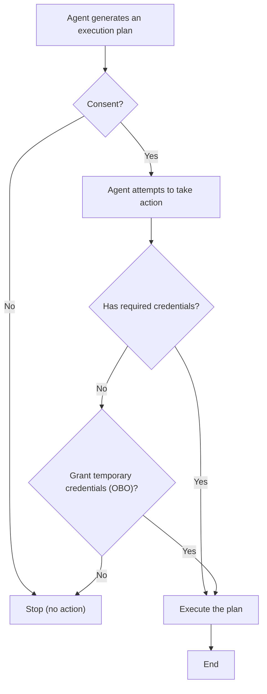

### 参考（第5章）
- [5-1] [https://learn.microsoft.com/en-us/azure/sre-agent/agent-run-modes](https://learn.microsoft.com/en-us/azure/sre-agent/agent-run-modes) — “Consent / Credentials”
- [5-2] [https://learn.microsoft.com/en-us/azure/sre-agent/agent-run-modes](https://learn.microsoft.com/en-us/azure/sre-agent/agent-run-modes) — “generates an execution plan and waits for your consent”
- [5-3] [https://learn.microsoft.com/en-us/azure/sre-agent/agent-run-modes](https://learn.microsoft.com/en-us/azure/sre-agent/agent-run-modes) — “Any access to user credentials are revoked once the action is complete.”
- [5-4] [https://learn.microsoft.com/en-us/azure/sre-agent/agent-run-modes](https://learn.microsoft.com/en-us/azure/sre-agent/agent-run-modes) — “implicit consent”
- [5-5] [https://learn.microsoft.com/ja-jp/azure/sre-agent/agent-run-modes#review-vs-autonomous-mode](https://learn.microsoft.com/ja-jp/azure/sre-agent/agent-run-modes#review-vs-autonomous-mode) — “既定では … レビュー モード … 実行プランを生成し、同意を待ってからアクションを実行”
- [5-6] [https://learn.microsoft.com/ja-jp/azure/sre-agent/agent-run-modes#review-vs-autonomous-mode](https://learn.microsoft.com/ja-jp/azure/sre-agent/agent-run-modes#review-vs-autonomous-mode) — “どのコンテキストでも自律的に作業できるのではなく … 制限付きスコープ”

---

## 6. Scheduled tasks

### 何の機能か（説明）
Scheduled tasks は、monitoring / maintenance / security checks といったワークフローをスケジュール実行する機能です。[6-1]

### 作成方法（説明）
作成は UI から行えます。チャット中に依頼したり、incident response の一部として自動生成させることもできます。[6-2]

スケジュール（自然言語）から cron への変換を支援する “Draft the cron for me” と、指示文を改善する “Polish instructions” を使えます。[6-3][6-4]

### 作り方と実行パス

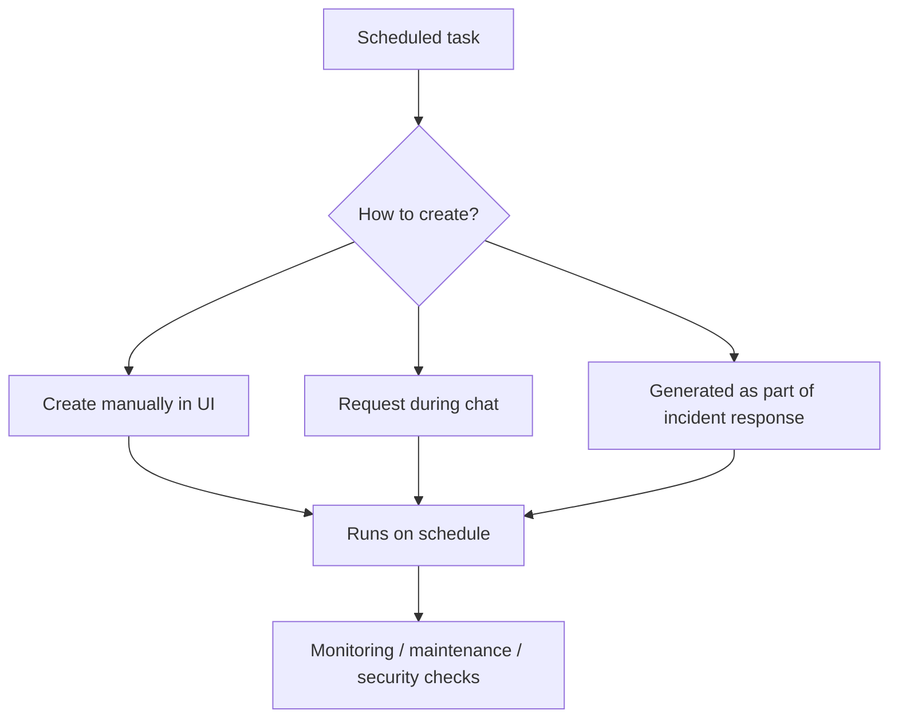

### 参考（第6章）
- [6-1] [https://learn.microsoft.com/en-us/azure/sre-agent/scheduled-tasks](https://learn.microsoft.com/en-us/azure/sre-agent/scheduled-tasks) — “automate workflows such as monitoring, maintenance, and security checks”
- [6-2] [https://learn.microsoft.com/en-us/azure/sre-agent/scheduled-tasks](https://learn.microsoft.com/en-us/azure/sre-agent/scheduled-tasks) — “create these tasks manually, request them during a chat … allow the agent to generate them autonomously as part of incident response”
- [6-3] [https://learn.microsoft.com/en-us/azure/sre-agent/scheduled-tasks](https://learn.microsoft.com/en-us/azure/sre-agent/scheduled-tasks) — “Draft the cron for me”
- [6-4] [https://learn.microsoft.com/en-us/azure/sre-agent/scheduled-tasks](https://learn.microsoft.com/en-us/azure/sre-agent/scheduled-tasks) — “Polish instructions”

---

## 7. Incident management / Incident response plan

### 何の機能か（説明）
Incident management は、Azure Monitor alerts / PagerDuty / ServiceNow などの incident management platform からアラートを受け取り、分析・対応する仕組みです。[7-1]

Azure Monitor は既定の統合で、最小限のセットアップで使えます。一方、PagerDuty / ServiceNow などは追加のセットアップが必要です。[7-6]

補足（説明）:
- Incident management の設定は、Azure portal でエージェントを開いて **[インシデント プラットフォーム]** タブから入ります。[7-7]
- 既定では Azure Monitor アラートがインシデント管理プラットフォームとして構成されます。[7-8]

### Incident response plan の位置づけ（説明）
Incident response plan は、incidents の検知/レビュー/ミティゲーションのやり方を定義します。filters / execution mode / custom instructions をカスタマイズできます。[7-2]

### 既定値（説明）
Incident management を有効化した場合の既定として、Azure Monitor alerts と接続し、low priority を全サービス対象にして review mode で処理します。[7-3]

### テスト（説明）
Incident response plan は過去インシデントに対して test mode で実行できます。test mode は read-only です。[7-4]

### エージェントの応答（説明）
- インシデントが検出されると、最初の分析を含む新しいスレッドがチャット履歴に作成されます。[7-9]
- 閲覧者モードでは推奨を提示し、人間の介入が必要です。自律モードでは構成に応じてインシデントを自動終了したり是正措置を実行でき、管理プラットフォーム側のインシデント更新/終了も行う場合があります。[7-10]
- 管理プラットフォーム側の構成により、SRE Agent に送るインシデントの種類（例: 低優先度は送るが高優先度は人間が対応）を制御できます。[7-11]
- インシデント ハンドラーをカスタマイズすることで、(例) 自律性レベル、使えるツール、カスタム手順などを制御できます。[7-12]

### ダッシュボード（説明）
Incident management タブには、エージェントが管理するインシデントの一元ビュー（主要メトリック、保留中のインシデントなど）を提供するダッシュボードがあります。[7-13]
集計された視覚化と AI によって生成された根本原因分析を提供し、傾向把握や対応計画の最適化に使えます。[7-14]

### インシデント処理の流れ

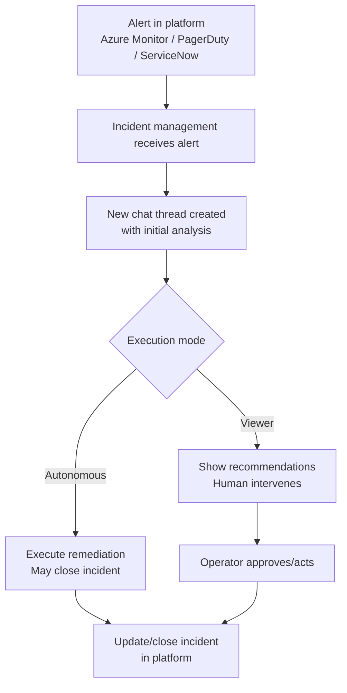

### PagerDuty 連携の注意（説明）
PagerDuty 統合では User API key が必要です。General API key では acknowledge ができません。[7-5]

### 参考（第7章）
- [7-1] [https://learn.microsoft.com/en-us/azure/sre-agent/incident-management](https://learn.microsoft.com/en-us/azure/sre-agent/incident-management) — “receives alerts from … Azure Monitor alerts … PagerDuty … ServiceNow”
- [7-2] [https://learn.microsoft.com/en-us/azure/sre-agent/incident-response-plan](https://learn.microsoft.com/en-us/azure/sre-agent/incident-response-plan) — “Filters … Execution mode … Customize instructions”
- [7-3] [https://learn.microsoft.com/en-us/azure/sre-agent/incident-response-plan](https://learn.microsoft.com/en-us/azure/sre-agent/incident-response-plan) — “Processes all low priority incidents … Runs in review mode”
- [7-4] [https://learn.microsoft.com/en-us/azure/sre-agent/incident-response-plan](https://learn.microsoft.com/en-us/azure/sre-agent/incident-response-plan) — “In test mode … always operates in a read-only mode.”
- [7-5] [https://learn.microsoft.com/en-us/azure/sre-agent/incident-management](https://learn.microsoft.com/en-us/azure/sre-agent/incident-management) — “You must use a User API key … General API keys don't allow the agent to acknowledge incidents properly”
- [7-6] [https://learn.microsoft.com/ja-jp/azure/sre-agent/incident-management?tabs=azmon-alerts#platform-integration](https://learn.microsoft.com/ja-jp/azure/sre-agent/incident-management?tabs=azmon-alerts#platform-integration) — “Azure Monitor (既定の統合) には最小限のセットアップ … PagerDuty や ServiceNow … 追加のセットアップ”
- [7-7] [https://learn.microsoft.com/ja-jp/azure/sre-agent/incident-management?tabs=azmon-alerts#platform-integration](https://learn.microsoft.com/ja-jp/azure/sre-agent/incident-management?tabs=azmon-alerts#platform-integration) — “エージェントを開き、[ インシデント プラットフォーム ] タブ”
- [7-8] [https://learn.microsoft.com/ja-jp/azure/sre-agent/incident-management?tabs=azmon-alerts#platform-integration](https://learn.microsoft.com/ja-jp/azure/sre-agent/incident-management?tabs=azmon-alerts#platform-integration) — “既定では、Azure Monitor アラートは … 構成されます”
- [7-9] [https://learn.microsoft.com/ja-jp/azure/sre-agent/incident-management?tabs=azmon-alerts#agent-responses](https://learn.microsoft.com/ja-jp/azure/sre-agent/incident-management?tabs=azmon-alerts#agent-responses) — “インシデントが検出されると … 新しいスレッドがチャット履歴に作成”
- [7-10] [https://learn.microsoft.com/ja-jp/azure/sre-agent/incident-management?tabs=azmon-alerts#agent-responses](https://learn.microsoft.com/ja-jp/azure/sre-agent/incident-management?tabs=azmon-alerts#agent-responses) — “閲覧者モード … 自律モード … 自動的に終了 … 是正措置 … インシデントを更新または終了”
- [7-11] [https://learn.microsoft.com/ja-jp/azure/sre-agent/incident-management?tabs=azmon-alerts#agent-responses](https://learn.microsoft.com/ja-jp/azure/sre-agent/incident-management?tabs=azmon-alerts#agent-responses) — “構成設定を制御することで … インシデントの種類を制御”
- [7-12] [https://learn.microsoft.com/ja-jp/azure/sre-agent/incident-management?tabs=azmon-alerts#agent-responses](https://learn.microsoft.com/ja-jp/azure/sre-agent/incident-management?tabs=azmon-alerts#agent-responses) — “インシデント ハンドラーをカスタマイズ … 自律性レベル … 使用できるツール … カスタム手順”
- [7-13] [https://learn.microsoft.com/ja-jp/azure/sre-agent/incident-management?tabs=azmon-alerts#dashboard](https://learn.microsoft.com/ja-jp/azure/sre-agent/incident-management?tabs=azmon-alerts#dashboard) — “ダッシュボード … すべてのインシデントの一元的なビュー … 主要なメトリック … 保留中のインシデント”
- [7-14] [https://learn.microsoft.com/ja-jp/azure/sre-agent/incident-management?tabs=azmon-alerts#dashboard](https://learn.microsoft.com/ja-jp/azure/sre-agent/incident-management?tabs=azmon-alerts#dashboard) — “集計された視覚化と AI によって生成された根本原因分析”

---

## 8. Memory system

### 何の機能か（説明）
Memory system は、トラブルシューティングを効果的に行うために、runbooks・チーム標準・サービス固有のコンテキストを与える仕組みです。[8-1]

### 構成（説明）
Memory system のコンポーネントは User Memories / Knowledge Base / Documentation connector / Session insights の4つです。[8-2]

補足（説明）:
- Session insights はセッションからエージェントが生成するメモリ（自動）です。[8-7]

### 取り出し方（説明）
`SearchMemory` は4コンポーネントを横断検索するツールです。Custom subagents ではツール追加が必要です。[8-3]

より対象を絞った検索として `SearchNodes` がフィルターをサポートし、`includeNeighbors` を `true` にすると接続されたノード（リソースや関連インシデント等）も返します。[8-8]

### データ投入の注意（説明）
秘密情報（secrets/credentials/API keys）は保存しません。[8-4]

メモリはチームで共有され、検索用にインデックスが作成されます。[8-9]

### Knowledge Base の仕様（説明）
Knowledge Base は `.md` と `.txt` を扱い、1ファイル最大 16MB です。[8-5]

さらに、1回のアップロード内で合計 100MB の制限があります。[8-10]

### メモリ構成と検索

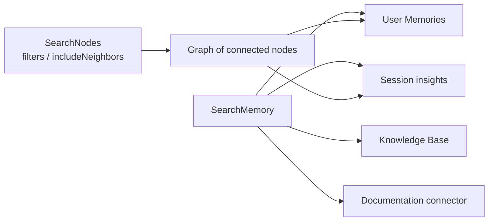

### User memories の操作（説明）
User memories は `#remember` / `#forget` / `#retrieve` のチャットコマンドを使います。[8-6]

`#remember` は将来の会話のために fact/standard/context を保存し、`#forget` は保存済みメモリを検索して削除し、`#retrieve` はエージェントの推論をトリガーせずに検索・表示します。[8-11]

### User Memories の実用例（提案）

前提:
- メモリに secrets/credentials/API keys を保存しません（運用手順で徹底）。[8-4]
- チームで共有され検索用にインデックス化されるので、「個人メモ」ではなく「運用の構成情報」として扱います。[8-9]

実用例 1: “最初の一言” を短くする（環境コンテキスト）
- ねらい: 毎回の前提説明（prod/stg、主要リソース、既知の監視ポイント）を省略し、診断にすぐ入る。
- 例（保存）:

```text
#remember
In our environment:
- Production: <subscription-alias>, <resource-group>
- Primary workload: <service-name> (App Service / Container Apps)
- Logs: <Log Analytics workspace alias>
- APM: Application Insights enabled
```

実用例 2: Runbook と“判断基準”を固定する（チーム標準）
- ねらい: “何を確認したら次に何をするか” を、記憶（標準手順）として持たせる。
- 例（保存）:

```text
#remember
Runbook standard:
1) Confirm symptom, time window (UTC), and impact
2) Collect evidence: errors/exceptions + dependency latency + resource metrics
3) Produce a short incident summary (What/When/Where/Impact/Suspected cause/Next actions)
```

実用例 3: “検索だけ”を安全に使う（確認・棚卸し）
- ねらい: エージェントの推論を走らせず、保存済みメモリを確認する。
- 例（取得）:

```text
#retrieve runbook
```

実用例 4: 更新時の事故を減らす（削除）
- ねらい: 交代/変更で古くなった運用前提を残さない。
- 例（削除）:

```text
#forget on-call rotation
```

スライド要点:
- User Memories は「チーム標準の短文化」に向く（毎回の前提説明を削れる）。[8-6][8-11]
- “共有され検索される” 前提なので、運用のコンフィグとして扱う（秘密情報は入れない）。[8-4][8-9]

### Session insights（説明）
セッション分析情報は、各セッションから「症状、解決手順、根本原因、落とし穴」をキャプチャして検索可能なメモリになり、関連する過去の分析情報が今後のセッションで自動的に取得されます。[8-12]

分析情報は「会話完了後に定期的に（約30分ごと）自動生成」されるか、「チャット フッターで[セッション分析情報の生成]を選ぶと約30秒でオンデマンド生成」されます。[8-13]

### 参考（第8章）
- [8-1] [https://learn.microsoft.com/en-us/azure/sre-agent/memory-system](https://learn.microsoft.com/en-us/azure/sre-agent/memory-system) — “gives agents the knowledge they need to troubleshoot effectively”
- [8-2] [https://learn.microsoft.com/en-us/azure/sre-agent/memory-system](https://learn.microsoft.com/en-us/azure/sre-agent/memory-system) — “consists of four complementary components”
- [8-3] [https://learn.microsoft.com/en-us/azure/sre-agent/memory-system](https://learn.microsoft.com/en-us/azure/sre-agent/memory-system) — “SearchMemory tool retrieves all memory components … Custom subagents: Add SearchMemory”
- [8-4] [https://learn.microsoft.com/en-us/azure/sre-agent/memory-system](https://learn.microsoft.com/en-us/azure/sre-agent/memory-system) — “Don't store secrets, credentials, API keys”
- [8-5] [https://learn.microsoft.com/en-us/azure/sre-agent/memory-system](https://learn.microsoft.com/en-us/azure/sre-agent/memory-system) — “Upload `.md` or `.txt` files (up to 16 MB each).”
- [8-6] [https://learn.microsoft.com/en-us/azure/sre-agent/memory-system](https://learn.microsoft.com/en-us/azure/sre-agent/memory-system) — “chat commands (`#remember`, `#forget`, `#retrieve`)”
- [8-7] [https://learn.microsoft.com/ja-jp/azure/sre-agent/memory-system#memory-components](https://learn.microsoft.com/ja-jp/azure/sre-agent/memory-system#memory-components) — “セッションの分析情報 … セッションからエージェントによって生成されたメモリ … 自動”
- [8-8] [https://learn.microsoft.com/ja-jp/azure/sre-agent/memory-system#advanced-search-parameters](https://learn.microsoft.com/ja-jp/azure/sre-agent/memory-system#advanced-search-parameters) — “`SearchNodes` … フィルターオプション … `includeNeighbors` を `true` … 接続されているノードも返されます”
- [8-9] [https://learn.microsoft.com/ja-jp/azure/sre-agent/memory-system#tool-configuration](https://learn.microsoft.com/ja-jp/azure/sre-agent/memory-system#tool-configuration) — “チームはメモリを共有し、システムによって検索用にインデックスが作成されます”
- [8-10] [https://learn.microsoft.com/ja-jp/azure/sre-agent/memory-system#supported-file-types-and-limits](https://learn.microsoft.com/ja-jp/azure/sre-agent/memory-system#supported-file-types-and-limits) — “要求ごと … 合計 100 MB”
- [8-11] [https://learn.microsoft.com/ja-jp/azure/sre-agent/memory-system#chat-commands](https://learn.microsoft.com/ja-jp/azure/sre-agent/memory-system#chat-commands) — “`#remember` … `#forget` … `#retrieve`”
- [8-12] [https://learn.microsoft.com/ja-jp/azure/sre-agent/memory-system#session-insights](https://learn.microsoft.com/ja-jp/azure/sre-agent/memory-system#session-insights) — “症状、解決手順、根本原因、および落とし穴をキャプチャ … 検索可能なメモリ … 自動的に取得”
- [8-13] [https://learn.microsoft.com/ja-jp/azure/sre-agent/memory-system#when-insights-are-generated](https://learn.microsoft.com/ja-jp/azure/sre-agent/memory-system#when-insights-are-generated) — “約 30 分ごと … [セッション分析情報の生成 ] … (約 30 秒)”

---

## 9. Subagent builder / Tools / Connectors / Custom MCP

### Subagent builder（説明）
Subagent builder は、運用ワークフロー向けに「インテリジェントなサブエージェントを作成・カスタマイズ・管理」する機能です。[9-1]

サブエージェント ビルダーで作れるものとして、カスタム サブエージェント、データ統合（監視ツール/ナレッジソース接続）、自動トリガー（インシデント対応計画/スケジュールタスク）、アクション（外部サービスとの連携）を押さえます。[9-4]

サブエージェント設計は「目的と運用スコープを定義→データ ソースを接続→システム ツール/MCP 統合を関連付け→カスタム命令→ハンドオフ ルール」で整理します。[9-5]

また、インシデント対応計画またはスケジュールされたタスクがサブエージェントをトリガーします。[9-6]

### Python カスタム ロジック（説明）
サブエージェント ビルダー上で Python ツールを作成できます。作成手順は **[Builder > Subagent builder]** → **作成 > ツール** → **Python ツール** です。[9-7]

Python ツールは「タイムアウト 5〜900秒（既定 120）」「`def main` を含む必要がある」「戻り値は JSON にシリアル化（dict/list/プリミティブ/None→null）」などの仕様です。[9-8][9-9]

さらに、ツール モード（自動/手動/隠れた）でエージェントがツールを呼ぶ方法を制御できます。Azure リソースへアクセスする必要がある場合は **[ID]** タブでマネージド ID アクセスを構成します。[9-10][9-11]

### Connectors（説明）
コネクタは SRE Agent の機能を拡張する統合です。通信コネクタ（Outlook/Teams 等）とナレッジ/テレメトリの取り込み（Datadog/Dynatrace/New Relic 等）に加えて、任意の MCP エンドポイントへ接続するカスタム コネクタがあります。[9-12]

コネクタ設定は **[設定] > [コネクタ]** から種類（Outlook/Teams/カスタム MCP）を選びます。Outlook/Teams は OAuth、MCP は URL と資格情報または OAuth トークンを指定します。[9-13]

### Custom MCP（説明）
Custom MCP server は HTTPS で到達可能なリモートホストが必須です。SRE Agent 内でローカル実行はできません。[9-2]

さらに、MCP のツールは main agent から直接は使えず、サブエージェント経由でのみアクセスできます。[9-3]

補足（説明）:
- カスタム MCP 接続では、コネクタが「MCP サーバー エンドポイント」「トランスポート（SSE/HTTP）」「認証メカニズム」を定義します。[9-14]
- 追加は **[設定] → [コネクタ] → [コネクタの追加] → 種類: MCP サーバー** を選び、名前/接続の種類（SSE/HTTP）/MCP サーバー URL/認証などを入力して検証します。[9-15]

### Main agent / Subagent / Tools の関係

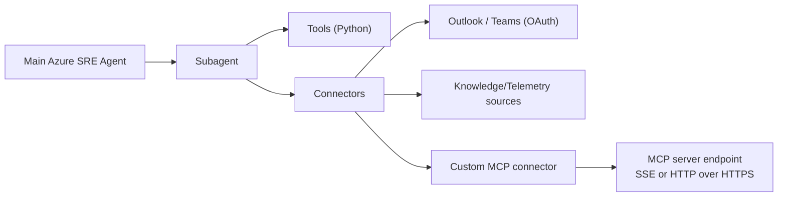

### Tool が多い前提での整理（提案）

添付画像のように、ポータル上の「ツール」はカテゴリ単位（例: DevOps / Diagnostics / Knowledge Base …）で大量に並ぶ前提で設計します。

整理のしかた（例）:
- Diagnostics: Kusto（Log Analytics / App Insights）やメトリック取得、クエリ検証など
- DevOps: GitHub Issue / コメント、Azure DevOps Work Item、リポジトリ紐付け など
- Knowledge Base: Memory/Knowledge の検索・投入
- Connectors: Outlook/Teams、外部監視/ナレッジ、カスタム MCP
- Custom logic: Python ツール（用途特化の“薄い関数”）[9-8][9-9]

スライド要点:
- “ツールが多い” のは正常（能力を足していくと増える）。設計で重要なのは「どれをいつ使うか」を主語にすること。
- main agent から直接使えないツールがある（MCP は subagent 経由）。[9-3]

### SubAgent の設計方法（他 MS AI ドキュメントの原則を援用）

SRE Agent の Subagent 仕様は製品ドキュメント中心ですが、**プロンプト（system/instructions）設計の作法**は一般化できます。

要点（設計チェックリスト）:
- 役割と成果物を最初に書く（assistant の job）。[9-16]
- 境界条件（やらないこと）を明示する。[9-16]
- 出力フォーマット（例: Markdown の章立て、JSON のキー固定）を固定する。[9-16]
- 不確実なときの方針（質問する/わからないと言う）を明示する。[9-16]
- 指示は具体的に、解釈の余地を減らす（Be Specific など）。[9-17]

ツール呼び出しを安定させるコツ（設計）:
- ツールは「説明（description）」「引数の説明」を厚くし、システム指示で“いつ呼ぶか”を明示する。[9-18]
- 重要な確認が欠けている場合は、推測せず質問させる（例: 対象リソース/時間範囲）。[9-18]

複数エージェントに分けるときの注意（一般論）:
- 役割を分割して、主エージェントは “委譲と統合” に徹する（責務分離）。[9-19]
- 深さや引用の伝播など、マルチエージェント固有の制約がある（設計で吸収する）。[9-20]

#### シナリオ例（提案）: HTTP 500 のインシデントを「証跡収集→報告→Issue化」まで

ゴール（提案）:
- インシデントを診断し、**証跡（KQL/メトリクス/例外）**を揃え、開発者が着手できる GitHub Issue を作る。
- 本番変更や自動緩和はしない（diagnose + report に限定）。

分担（例）:
- Subagent A: Diagnostics（ログ/例外/メトリクス）
- Subagent B: Repo triage（該当箇所の候補、設定/IaC の差分観点）
- Subagent C: Reporter（Issue/Teams の定型出力）

プロンプト構成（疑似例）:

```yaml
api_version: azuresre.ai/v1
kind: AgentConfiguration
spec:
  name: Http500EvidencePackager
  system_prompt: >-
    Role: Incident diagnostics assistant.
    Goal: Collect concrete evidence (KQL queries + key metrics) for HTTP 500 incidents,
    summarize findings, then draft a developer-ready GitHub issue.
    Boundaries: Do not execute mitigations or production changes. Do not store secrets.
    Output format: Use Markdown with sections: Summary / Evidence / Suspected causes / Next checks.
    When unsure: Ask one clarifying question.
  tools:
    - Diagnostics (Log Analytics / App Insights / Metrics)
    - GitHub
    - Teams
```

ハンドオフ（Main → Subagent A）のプロンプト例:

```text
Task: Collect evidence for an HTTP 500 incident.
Context:
- Service: <service-name>
- Time window (UTC): <start> - <end>
- Environment: <prod/stg>
Constraints:
- Read-only. No mitigations.
Output contract:
1) 3-5 KQL queries (Log Analytics / App Insights) with what each query proves
2) 3 key metrics to chart (name + dimension if any)
3) A short summary (What/When/Impact/Suspected cause)
If missing critical identifiers, ask one question.
```

ハンドオフ（Main → Subagent C）のプロンプト例:

```text
Task: Create a GitHub-issue-ready report.
Inputs:
- Evidence pack (queries, metrics, notable exceptions)
- Suspected code areas (paths/functions)
Output contract (Markdown):
- Title
- Impact
- Timeline (UTC)
- Evidence (with KQL snippets)
- Suspected cause(s)
- Proposed next actions
```

### 参考（第9章）
- [9-1] [https://learn.microsoft.com/en-us/azure/sre-agent/subagent-builder-overview](https://learn.microsoft.com/en-us/azure/sre-agent/subagent-builder-overview) — “Incident response plans or scheduled tasks trigger subagents.”
- [9-2] [https://learn.microsoft.com/en-us/azure/sre-agent/custom-mcp-server](https://learn.microsoft.com/en-us/azure/sre-agent/custom-mcp-server) — “must host … remotely and make them reachable over HTTPS … doesn't support running MCP servers locally”
- [9-3] [https://learn.microsoft.com/en-us/azure/sre-agent/custom-mcp-server](https://learn.microsoft.com/en-us/azure/sre-agent/custom-mcp-server) — “only accessible through subagents and aren't directly accessible to main Azure SRE Agent.”
- [9-4] [https://learn.microsoft.com/ja-jp/azure/sre-agent/subagent-builder-overview#what-you-can-build-with-subagent-builder](https://learn.microsoft.com/ja-jp/azure/sre-agent/subagent-builder-overview#what-you-can-build-with-subagent-builder) — “カスタム サブエージェント … データ統合 … 自動トリガー … アクション”
- [9-5] [https://learn.microsoft.com/ja-jp/azure/sre-agent/subagent-builder-overview#work-with-subagent-builder](https://learn.microsoft.com/ja-jp/azure/sre-agent/subagent-builder-overview#work-with-subagent-builder) — “主な目的と運用スコープ … データ ソース … システム ツールと MCP 統合 … カスタム命令 … ハンドオフ ルール”
- [9-6] [https://learn.microsoft.com/ja-jp/azure/sre-agent/subagent-builder-overview#work-with-subagent-builder](https://learn.microsoft.com/ja-jp/azure/sre-agent/subagent-builder-overview#work-with-subagent-builder) — “インシデント対応計画またはスケジュールされたタスクは、サブエージェントをトリガー”
- [9-7] [https://learn.microsoft.com/ja-jp/azure/sre-agent/custom-logic-python#create-a-python-tool](https://learn.microsoft.com/ja-jp/azure/sre-agent/custom-logic-python#create-a-python-tool) — “左側のナビゲーションから [Builder>Subagent builder ] … 作成>ツール … Python ツール”
- [9-8] [https://learn.microsoft.com/ja-jp/azure/sre-agent/custom-logic-python#create-a-python-tool](https://learn.microsoft.com/ja-jp/azure/sre-agent/custom-logic-python#create-a-python-tool) — “タイムアウト (秒) | 5 ~ 900 … 既定値は 120 … Python コード … def main 関数を含む必要があります”
- [9-9] [https://learn.microsoft.com/ja-jp/azure/sre-agent/custom-logic-python#write-the-main-function](https://learn.microsoft.com/ja-jp/azure/sre-agent/custom-logic-python#write-the-main-function) — “システムは戻り値を JSON に自動的にシリアル化 … 次の種類がサポート”
- [9-10] [https://learn.microsoft.com/ja-jp/azure/sre-agent/custom-logic-python#configure-tool-mode](https://learn.microsoft.com/ja-jp/azure/sre-agent/custom-logic-python#configure-tool-mode) — “自動 … 手動 … 隠れた”
- [9-11] [https://learn.microsoft.com/ja-jp/azure/sre-agent/custom-logic-python#set-up-identity](https://learn.microsoft.com/ja-jp/azure/sre-agent/custom-logic-python#set-up-identity) — “Azure リソースにアクセスする必要があるツール … [ ID] タブ … マネージド ID アクセスを構成”
- [9-12] [https://learn.microsoft.com/ja-jp/azure/sre-agent/connectors#what-are-connectors](https://learn.microsoft.com/ja-jp/azure/sre-agent/connectors#what-are-connectors) — “通信コネクタ … ナレッジ コネクタ … カスタム コネクタ … MCP サーバー エンドポイント”
- [9-13] [https://learn.microsoft.com/ja-jp/azure/sre-agent/connectors#configure-a-connector](https://learn.microsoft.com/ja-jp/azure/sre-agent/connectors#configure-a-connector) — “設定 … コネクタ … Outlook と Teams … OAuth … MCP URL と資格情報または OAuth トークン”
- [9-14] [https://learn.microsoft.com/ja-jp/azure/sre-agent/custom-mcp-server#how-custom-mcp-connections-work](https://learn.microsoft.com/ja-jp/azure/sre-agent/custom-mcp-server#how-custom-mcp-connections-work) — “コネクタは次を定義 … エンドポイント … トランスポート … 認証”
- [9-15] [https://learn.microsoft.com/ja-jp/azure/sre-agent/custom-mcp-server#add-a-custom-mcp-server-connector](https://learn.microsoft.com/ja-jp/azure/sre-agent/custom-mcp-server#add-a-custom-mcp-server-connector) — “Azure portal … [ 設定] → [コネクタ] … [ コネクタの追加] … MCP サーバー … SSE … HTTP … URL … 認証”
- [9-16] [https://learn.microsoft.com/en-us/azure/ai-foundry/openai/concepts/advanced-prompt-engineering?view=foundry-classic#design-checklist](https://learn.microsoft.com/en-us/azure/ai-foundry/openai/concepts/advanced-prompt-engineering?view=foundry-classic#design-checklist) — “Start with the assistant’s job … Define boundaries … Specify the output format … Add a “when unsure” policy”
- [9-17] [https://learn.microsoft.com/en-us/azure/ai-foundry/openai/concepts/prompt-engineering?view=foundry-classic#best-practices](https://learn.microsoft.com/en-us/azure/ai-foundry/openai/concepts/prompt-engineering?view=foundry-classic#best-practices) — “Be Specific … Order Matters … Give the model an “out””
- [9-18] [https://learn.microsoft.com/en-us/azure/ai-foundry/openai/how-to/function-calling?view=foundry-classic#prompt-engineering-with-functions](https://learn.microsoft.com/en-us/azure/ai-foundry/openai/how-to/function-calling?view=foundry-classic#prompt-engineering-with-functions) — “Provide more context in the system message … Ask for clarification if a user request is ambiguous.”
- [9-19] [https://learn.microsoft.com/en-us/azure/ai-foundry/agents/how-to/connected-agents?view=foundry-classic](https://learn.microsoft.com/en-us/azure/ai-foundry/agents/how-to/connected-agents?view=foundry-classic) — “break down complex tasks into coordinated, specialized roles”
- [9-20] [https://learn.microsoft.com/en-us/azure/ai-foundry/agents/how-to/connected-agents?view=foundry-classic#limitations](https://learn.microsoft.com/en-us/azure/ai-foundry/agents/how-to/connected-agents?view=foundry-classic#limitations) — “maximum depth of 2 … not possible to guarantee citations …”
- [9-21] [https://learn.microsoft.com/en-us/azure/cloud-adoption-framework/ai-agents/build-secure-process#agent-instructions](https://learn.microsoft.com/en-us/azure/cloud-adoption-framework/ai-agents/build-secure-process#agent-instructions) — “Standardize instruction architecture … Identity and tone … Scope and boundaries … Tool mandates … Citation rules”

---

## 10. デモ:

> 注意: ここは「何をどう壊す/どう直す」を構成した **デモ案（提案）**です。
> ただし、各ステップの“事実として言い切る部分”は Microsoft Learn の記述に基づき、参照番号で根拠を示します。

### デモA: 「App Service が遅い/タイムアウトする」＝ Cosmos DB の 429（スロットリング）/ホットパーティションを切り分ける

#### ゴール（提案）
- “アプリ（App Service）の症状”から入り、根因が“バックエンド（Cosmos DB）のスループット/パーティション”であることを、Portal のメトリクスで確証していく。
- その後、Azure SRE Agent（Cosmos DB SRE Agent）に「診断の起点」を作らせ、運用の会話の型を作る。[10A-1]

#### 全体像

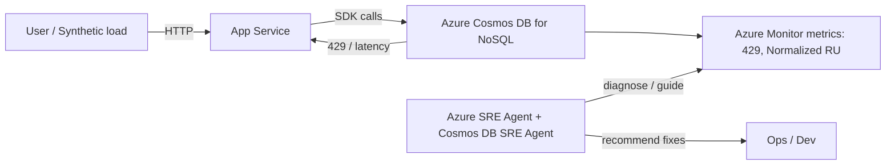

#### 事前準備（Azure portal での設定 / 事実＋提案を分離）

**A) Cosmos DB（NoSQL）を Azure portal で作る（事実）**
1) Azure portal で **Azure Cosmos DB** を検索し、**Create** から **Azure Cosmos DB for NoSQL** を選ぶ。[10A-2]
2) **Review + create** → **Create** → **Go to resource** でアカウントを作成する。[10A-3]

**B) Data Explorer で DB/Container を作る（事実）**
1) Cosmos アカウントのメニューで **Data Explorer** を開く。[10A-4]
2) **New Container** を選び、DB と container を作成する（partition key とスループット（Manual/Autoscale）を設定する）。[10A-5][10A-6]

**C) App Service を Azure portal で作り、アプリをデプロイする（事実＋提案）**
1) Azure portal で **App Services** → **+ Create > Web App** で App Service を作成する。[10A-7]
2) デモ用アプリは、(提案) Cosmos DB を読む/書くエンドポイント（例: `/healthz` と `/burst`）を持つように用意する。
3) Portal の案内に沿って進めるなら、App Service の **Deployment Center** から Git リポジトリを設定してデプロイする（例: **Source: External Git** → **Repository/Branch** を指定 → **Save**）。[10A-8]
4) デプロイ後は App Service の **Overview** で **Browse** を使い、アプリが起動することを確認する（起動に少し時間がかかることがある）。[10A-18]

**D) App Service へ Cosmos 接続情報を注入する（事実）**
1) App Service の左メニューで **Settings > Environment variables > Connection strings** を開く。[10A-9]
2) 新規追加は **Add**、反映は **Apply**（ダイアログ側）→ **Apply**（Environment variables 画面側）で行う。[10A-19]
3) Cosmos DB の接続文字列を connection string として登録でき、App Service は環境変数として提供する（Cosmos DB は `DOCDBCONNSTR_` プレフィックスとして定義されている）。[10A-10][10A-11]
4) Portal 上では connection string の値は既定で非表示で、必要に応じて **Show value** / **Show values** で表示できる。[10A-20]

#### 障害の作り方（提案）
- “429 を出す”には、(提案) 低い RU/s の container に対して短時間に集中アクセスを発生させる。
- “ホットパーティション”を意図的に作るなら、(提案) 特定の partition key 値に偏ったリクエストを投げ続ける。

#### 切り分け（Azure portal の手順 / 事実）

**Step 1: 429 が出ているかを確認する（事実）**
- 429 は “Request rate too large” で、Cosmos DB が rate limited を返していることを示す。[10A-12]
- まず Cosmos DB アカウントの **Insights > Requests > Total Requests by Status Code** で、429 の比率を確認する。[10A-13]

**Step 2: 正常な範囲か、問題かを判断する（事実）**
- 1〜5% 程度の 429 は “healthy sign” として言及されている（エンドツーエンド遅延が許容なら追加対応不要）。[10A-14]
- 429 が高率かつ継続する場合、次のステップへ進む。

**Step 3: ホットパーティションかどうかを見る（事実）**
- ホットパーティションがあると、一部の partition key range が 100% に張り付き、429 が発生し得る。[10A-15]
- **Insights > Throughput > Normalized RU Consumption (%) By PartitionKeyRangeID** で偏りを確認する（高い PartitionKeyRangeId があればホットパーティション候補）。[10A-16]

**Step 4: 何を直すべきかの分岐（事実）**

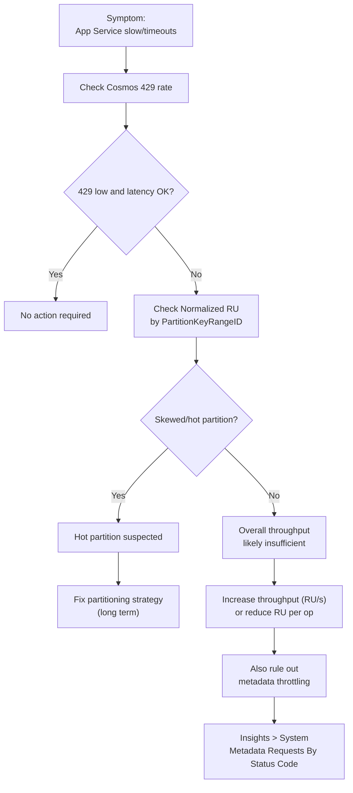

補足（事実）:
- メタデータ操作（DB/コンテナのCRUD、一覧、スループット確認など）は system-reserved RU limit があり、データ側の RU/s を増やしても効果がないケースがある（“increasing … RU/s … has no effect” と明記）。[10A-21]
- 調査導線として **Insights > System > Metadata Requests By Status Code** が提示されている。[10A-22]

#### SRE Agent で“会話の起点”を作る（事実＋提案）
- Cosmos DB SRE Agent は「Azure SRE Agent を使って Cosmos DB のトラブルシューティングを簡素化する」AI-powered diagnostic tool と説明されている。[10A-1]
- セットアップは「SRE Agent を作成→Cosmos リソースを追加→Preview Upgrade Channel を有効化→会話開始」という流れで説明されている。[10A-17]
- (提案) チャットの型としては、`My App Service is slow. Check Cosmos throttling/hot partitions.` のように「症状→疑う観点」を明示して投げる。

#### 参考（デモA）
- [10A-1] [https://learn.microsoft.com/en-us/azure/cosmos-db/site-reliability-engineering-agent](https://learn.microsoft.com/en-us/azure/cosmos-db/site-reliability-engineering-agent) — “AI-powered diagnostic tool … simplify troubleshooting”
- [10A-2] [https://learn.microsoft.com/en-us/azure/cosmos-db/quickstart-portal#create-an-account](https://learn.microsoft.com/en-us/azure/cosmos-db/quickstart-portal#create-an-account) — “select **Create**, and then **Azure Cosmos DB for NoSQL**.”
- [10A-3] [https://learn.microsoft.com/en-us/azure/cosmos-db/quickstart-portal#create-an-account](https://learn.microsoft.com/en-us/azure/cosmos-db/quickstart-portal#create-an-account) — “select **Review + create** … select **Create** … select **Go to resource**”
- [10A-4] [https://learn.microsoft.com/en-us/azure/cosmos-db/quickstart-portal#create-a-database-and-container](https://learn.microsoft.com/en-us/azure/cosmos-db/quickstart-portal#create-a-database-and-container) — “select **Data Explorer**”
- [10A-5] [https://learn.microsoft.com/en-us/azure/cosmos-db/quickstart-portal#create-a-database-and-container](https://learn.microsoft.com/en-us/azure/cosmos-db/quickstart-portal#create-a-database-and-container) — “select the **New Container** option.”
- [10A-6] [https://learn.microsoft.com/en-us/azure/cosmos-db/how-to-create-container](https://learn.microsoft.com/en-us/azure/cosmos-db/how-to-create-container) — “Enter a **Partition key** … Select **Autoscale** or **Manual** throughput”
- [10A-7] [https://learn.microsoft.com/en-us/azure/sre-agent/troubleshoot-azure-app-service](https://learn.microsoft.com/en-us/azure/sre-agent/troubleshoot-azure-app-service) — “search for **App Services** … select **+ Create** > **Web App**.”
- [10A-8] [https://learn.microsoft.com/en-us/azure/sre-agent/troubleshoot-azure-app-service](https://learn.microsoft.com/en-us/azure/sre-agent/troubleshoot-azure-app-service) — “select **Deployment Center** … **Source** … **Save**”
- [10A-9] [https://learn.microsoft.com/en-us/azure/app-service/configure-common#configure-connection-strings](https://learn.microsoft.com/en-us/azure/app-service/configure-common#configure-connection-strings) — “select **Settings** > **Environment variables** … select **Connection strings**.”
- [10A-10] [https://learn.microsoft.com/en-us/azure/app-service/configure-common#configure-connection-strings](https://learn.microsoft.com/en-us/azure/app-service/configure-common#configure-connection-strings) — “Connection strings are always encrypted … (encrypted at rest).”
- [10A-11] [https://learn.microsoft.com/en-us/azure/app-service/reference-app-settings#variable-prefixes](https://learn.microsoft.com/en-us/azure/app-service/reference-app-settings#variable-prefixes) — “`DOCDBCONNSTR_` | Connection string to a database in Azure Cosmos DB.”
- [10A-12] [https://learn.microsoft.com/en-us/azure/cosmos-db/troubleshoot-request-rate-too-large](https://learn.microsoft.com/en-us/azure/cosmos-db/troubleshoot-request-rate-too-large) — “A \"Request rate too large\" … indicates that your requests … are being rate limited.”
- [10A-13] [https://learn.microsoft.com/en-us/azure/cosmos-db/troubleshoot-request-rate-too-large#request-rate-is-large](https://learn.microsoft.com/en-us/azure/cosmos-db/troubleshoot-request-rate-too-large#request-rate-is-large) — “navigate to **Insights** > **Requests** > **Total Requests by Status Code**.”
- [10A-14] [https://learn.microsoft.com/en-us/azure/cosmos-db/monitor-normalized-request-units](https://learn.microsoft.com/en-us/azure/cosmos-db/monitor-normalized-request-units) — “if you see between 1-5% of requests with 429s … this is a healthy sign … No action is required.”
- [10A-15] [https://learn.microsoft.com/en-us/azure/cosmos-db/troubleshoot-request-rate-too-large#step-2-determine-if-theres-a-hot-partition](https://learn.microsoft.com/en-us/azure/cosmos-db/troubleshoot-request-rate-too-large#step-2-determine-if-theres-a-hot-partition) — “A hot partition … can lead to 429 responses”
- [10A-16] [https://learn.microsoft.com/en-us/azure/cosmos-db/troubleshoot-request-rate-too-large#step-2-determine-if-theres-a-hot-partition](https://learn.microsoft.com/en-us/azure/cosmos-db/troubleshoot-request-rate-too-large#step-2-determine-if-theres-a-hot-partition) — “navigate to **Insights** > **Throughput** > **Normalized RU Consumption (%) By PartitionKeyRangeID**.”
- [10A-17] [https://learn.microsoft.com/en-us/azure/cosmos-db/site-reliability-engineering-agent](https://learn.microsoft.com/en-us/azure/cosmos-db/site-reliability-engineering-agent) — “Create an Azure SRE Agent … Add your Azure Cosmos DB resources … Enable the Preview Upgrade Channel”
- [10A-18] [https://learn.microsoft.com/en-us/azure/sre-agent/troubleshoot-azure-app-service](https://learn.microsoft.com/en-us/azure/sre-agent/troubleshoot-azure-app-service) — “select **Overview** … select **Browse**”
- [10A-19] [https://learn.microsoft.com/en-us/azure/app-service/configure-common#configure-connection-strings](https://learn.microsoft.com/en-us/azure/app-service/configure-common#configure-connection-strings) — “select **Add** … select **Apply** … select **Apply** on the **Environment variables** page.”
- [10A-20] [https://learn.microsoft.com/en-us/azure/app-service/configure-common#configure-connection-strings](https://learn.microsoft.com/en-us/azure/app-service/configure-common#configure-connection-strings) — “values for connection strings are hidden … select **Show value** … **Show values**.”
- [10A-21] [https://learn.microsoft.com/en-us/azure/cosmos-db/troubleshoot-request-rate-too-large#rate-limiting-on-metadata-requests](https://learn.microsoft.com/en-us/azure/cosmos-db/troubleshoot-request-rate-too-large#rate-limiting-on-metadata-requests) — “There's a system-reserved RU limit … increasing … RU/s … has no effect”
- [10A-22] [https://learn.microsoft.com/en-us/azure/cosmos-db/troubleshoot-request-rate-too-large#rate-limiting-on-metadata-requests](https://learn.microsoft.com/en-us/azure/cosmos-db/troubleshoot-request-rate-too-large#rate-limiting-on-metadata-requests) — “Navigate to **Insights** > **System** > **Metadata Requests By Status Code**.”

---

### デモB: 「App Service が散発的にタイムアウトする」＝ Cosmos DB 408（Request timeout）/ホットパーティション起点で切り分ける

狙い（提案）:
- アプリ側の “タイムアウト” を、Cosmos DB の 408（Request timeout）として観測し、ホットパーティション/429 併発の可能性まで含めて切り分ける。

切り分けの軸（事実）:
- 408 の原因の一つとして “Hot partition key” が挙げられており、判断に **Normalized RU Consumption** を使う導線が示されている。[10B-1]
- 408 が SLA 違反かどうかで「リトライで耐える」か「サポートへ」が分かれる。[10B-2]

#### 参考（デモB）
- [10B-1] [https://learn.microsoft.com/en-us/azure/cosmos-db/troubleshoot-request-time-out](https://learn.microsoft.com/en-us/azure/cosmos-db/troubleshoot-request-time-out) — “Hot partition key … Use the Normalized RU Consumption metric”
- [10B-2] [https://learn.microsoft.com/en-us/azure/cosmos-db/troubleshoot-request-time-out](https://learn.microsoft.com/en-us/azure/cosmos-db/troubleshoot-request-time-out) — “The application should handle this scenario and retry … Contact Azure Support”

---

## 11. FAQ 由来のトラブルシュート早見表（事実）

| 症状 | Learn が挙げる原因 | Learn が挙げる対処 |
| --- | --- | --- |
| portal が unresponsive | firewall が Azure domain をブロック | `*.azuresre.ai` を allowlist に追加 | 
| 403/CORS、チャットできない | 権限不足や割り当ての問題 | Contributor/Owner を確認、グループ割り当てに頼らず直接付与、Check Access を使う |

- `*.azuresre.ai` allowlist は portal unresponsive の対処として挙げられている。[11-1]
- 権限エラー対処として “Avoid relying solely on group-based role assignments” や “Check Access” が挙げられている。[11-2]

### 早見表の判断フロー

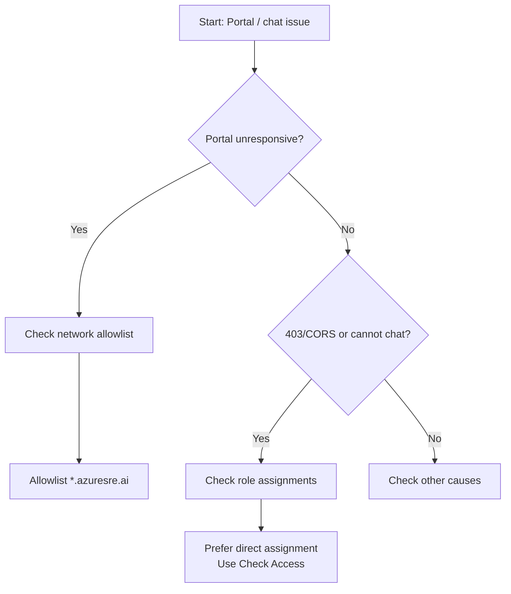

### 参考（第11章）
- [11-1] [https://learn.microsoft.com/en-us/azure/sre-agent/faq](https://learn.microsoft.com/en-us/azure/sre-agent/faq) — “add `*.azuresre.ai` to the allow list”
- [11-2] [https://learn.microsoft.com/en-us/azure/sre-agent/faq](https://learn.microsoft.com/en-us/azure/sre-agent/faq) — “Avoid relying solely on group-based role assignments … Use the Check Access feature”

---

## 付録: Learn の公式チュートリアル（参照のみ）

- App Service を SRE Agent でトラブルシュートする手順がある。[A-1]
- Container Apps を SRE Agent でトラブルシュートする手順がある。[A-2]

### 参考（付録）
- [A-1] [https://learn.microsoft.com/en-us/azure/sre-agent/troubleshoot-azure-app-service](https://learn.microsoft.com/en-us/azure/sre-agent/troubleshoot-azure-app-service) — “Troubleshoot an App Service app by using Azure SRE Agent Preview”
- [A-2] [https://learn.microsoft.com/en-us/azure/sre-agent/troubleshoot-azure-container-apps](https://learn.microsoft.com/en-us/azure/sre-agent/troubleshoot-azure-container-apps) — “Troubleshoot a container app by using Azure SRE Agent Preview”


---


