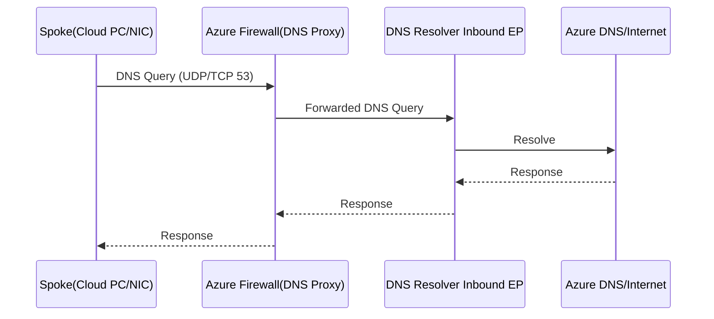
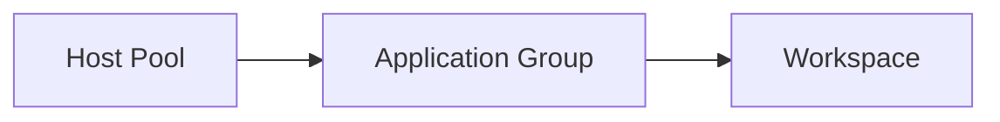

Title: Windows 365 向け Azure インフラ構築手順（Bicep テンプレートベース）
Date: 2026-02-17
Slug: win365-azure-infra-bicep
Lang: ja-jp
Category: notebook
Tags: azure, Windows 365, bicep, networking, firewall, dns
Summary: Cloud Diaries: Windows 365（Cloud PC）向けに Azure 側のネットワーク/Firewall/DNS 基盤を Bicep ベースで構築する手順メモです。
Modified: 2026-02-17

本稿は、Windows 365（Cloud PC）を使うための「Azure 側の基盤（Hub-Spoke / Firewall / DNS Private Resolver）」にフォーカスした構築メモです。AVD 手順は本筋ではないため付録扱いにしています。

## 目的 / スコープ
- 本資料は、Windows 365（Cloud PC）利用のための **Azure 側のネットワーク/セキュリティ/DNS 基盤**を構築する手順をまとめたものです。
- **AVD（Azure Virtual Desktop）自体は本番構成として作成不要**のため、AVD 作成手順は「参考（付録）」として末尾に記載します。

## このテンプレートの前提（重要）
このリポジトリのテンプレート（`privateJustPersonal/main.bicep`）は、ポータル等のエクスポートを起点としているため、**そのままではデプロイ時にエラーになり得ます**（例: 読み取り専用プロパティ、重複定義による依存サイクル）。

- GitHub: <https://github.com/TakumiSeo/Tech-BLOG/blob/main/privateJustPersonal/main.bicep>

本資料では、次の 2 つの進め方を提示します。
- **推奨**: テンプレート（`main.bicep`）を「Windows 365 用の基盤（Network/Firewall/DNS）」に絞って整理した上でデプロイ
- 参考: 既存テンプレートの意図（構成/ルール/アドレス設計）を読み解き、手動または別テンプレートで再構築

以降は「推奨」手順（テンプレート整理 → デプロイ）で記載します。

---

## 1. 構成概要

### 1.1 ネットワーク構成（論理）
```mermaid
flowchart LR
  subgraph HUB[Hub VNet: <hubVnetName>]
    AFW[Azure Firewall: <firewallName>\n(Policy: <firewallPolicyName>)]
    BAS[Bastion: <bastionName>\nPublic IP: <bastionPipName>]
    HUBSUB1[Subnet: <hubSubnet01Name>]
    AFSUB[AzureFirewallSubnet]
    BASSUB[AzureBastionSubnet]
  end

  subgraph SPOKE[Spoke VNet: <spokeVnetName>]
    W365SUB[Subnet: <spokeSubnetName>\n(UDR → Firewall)]
    W365VM[(Cloud PC / NIC群\n※実体VMは不要)]
  end

  subgraph DNSVNET[Private Resolver VNet: <privateResolverVnetName>]
    DNSR[Azure DNS Private Resolver: <dnsResolverName>]
    INEP[Inbound EP: <dnsInboundEndpointName>\nIP: <dnsInboundIp>]
    OUTEP[Outbound EP: <dnsOutboundEndpointName>]
  end

  SPOKE <--> HUB
  DNSVNET <--> HUB

  W365VM -->|DNS: 53| AFW
  AFW -->|DNS Proxy| INEP
  DNSR --- INEP
  DNSR --- OUTEP
```

### 1.2 主要な意図（何をしているか）
- Spoke 側（Windows 365 関連サブネット）からの **既定ルート (0.0.0.0/0)** を Azure Firewall に強制し、外向き通信を制御します。
- Spoke の DNS を Firewall に向け、Firewall 側の **DNS Proxy** で Private Resolver（Inbound Endpoint）へ転送します。
- Azure Firewall Policy で、Windows 365 / Intune / Office 365 / Windows Update などの **FQDN タグ**を許可します。

---

## 2. 事前準備

### 2.1 必要な権限
- 対象サブスクリプションに対し、少なくとも以下が必要です。
  - リソース作成権限（例: Contributor）
  - Azure Firewall / Network / DNS Private Resolver 作成に必要な権限

### 2.2 ローカル環境
- Azure CLI（`az`）
- Bicep CLI（通常は Azure CLI に同梱、または `az bicep install`）

---

## 3. パラメータ設計（リソース名を固定しない）

### 3.1 ルール
- **リソース名はすべてパラメータ**として外出しし、資料内では固定値を置きません。
- 例: `<hubVnetName>`, `<spokeVnetName>`, `<firewallName>`, `<firewallPolicyName>` のようにプレースホルダーで表現します。

### 3.2 `bicepparam` の作り方（例）
`main.bicep` の先頭には多数の `param ... string` が並びます。ここに対応する `main.bicepparam`（新規）を作成し、値を埋めます。

例（抜粋）:
```bicep
using './main.bicep'

param virtualNetworks_vnet_hub_win365_name = '<hubVnetName>'
param virtualNetworks_vnet_spoke_win365_nic_name = '<spokeVnetName>'
param virtualNetworks_vnet_privateresolver_name = '<privateResolverVnetName>'

param azureFirewalls_vnet_hub_win365_Firewall_name = '<firewallName>'
param firewallPolicies_FirewallPolicy_vnet_hub_win365_Firewall_name = '<firewallPolicyName>'

param publicIPAddresses_vnet_hub_win365_firewall_name = '<firewallPipName>'
param publicIPAddresses_vnet_hub_win365_IPv4_name = '<bastionPipName>'

param routeTables_udr_win365_name = '<udrName>'
param bastionHosts_win365_bastion_name = '<bastionName>'

param dnsResolvers_apdr_win365_name = '<dnsResolverName>'
```

---

## 4. テンプレート整理（デプロイ可能にするチェックリスト）

`main.bicep` はエクスポート起点のため、次の点を整理してください。

### 4.1 読み取り専用プロパティを削除
代表例:
- Public IP の `properties.ipAddress`（割り当て後にのみ値が入るため、作成時に指定できません）
- Bastion の `properties.dnsName`（作成後に付与される値）

### 4.2 重複定義（依存サイクル）を解消
典型的な問題:
- VNet の `subnets: [...]` でサブネットを定義しつつ、別途 `Microsoft.Network/virtualNetworks/subnets` を子リソースとしても定義している

対応方針（どちらかに統一）:
- **方針A**: VNet リソースの `subnets` 配列にまとめ、子リソース定義を削除
- **方針B**: VNet は addressSpace のみにして、サブネットは子リソース定義に寄せる

### 4.3 「Windows 365 基盤」に不要なリソースを分離
本番の Windows 365 基盤として不要になりがちなもの（必要なら残す）:
- AVD HostPool / Workspace / Application Group
- テスト用 VM / NIC / Disk

付録に参考として残し、基盤デプロイからは外すのが運用上シンプルです。

---

## 5. デプロイ手順（Azure CLI）

### 5.1 デプロイの流れ
```mermaid
flowchart TB
  A[変数/プレースホルダーを決定] --> B[main.bicep を整理\n(ROプロパティ削除・重複解消・不要リソース分離)]
  B --> C[main.bicepparam を作成]
  C --> D[リソースグループ作成]
  D --> E[az deployment group create]
  E --> F[デプロイ後検証\n(Peering/UDR/Firewall/DNS)]
```

### 5.2 コマンド例（プレースホルダー使用）
```powershell
# 1) ログイン
az login

# 2) サブスクリプション選択
az account set --subscription <subscriptionId>

# 3) リソースグループ作成
az group create -n <resourceGroupName> -l <location>

# 4) デプロイ
az deployment group create \
  -g <resourceGroupName> \
  -f .\main.bicep \
  -p .\main.bicepparam
```

---

## 6. デプロイ後の確認ポイント

### 6.1 VNet Peering
- Hub ↔ Spoke
- Hub ↔ Private Resolver

### 6.2 UDR（既定ルート）
- Spoke の `<spokeSubnetName>` に UDR が関連付いていること
- `0.0.0.0/0` の Next Hop が Firewall（仮想アプライアンス）になっていること

### 6.3 DNS
- Spoke の VNet DNS が Firewall のプライベート IP を向く
- Firewall Policy の DNS Settings が Private Resolver の Inbound IP を向く（DNS Proxy 有効）

DNS フロー（例）:


---

## 7. Azure Firewall ルール（見やすい表 + ARM JSON コピペ）

> 注: 以下は `main.bicep` に記載されている内容（Windows 365/Intune/Office/Update など）を、運用向けに整理したものです。送信元 CIDR などは環境に合わせて `<...>` を置き換えてください。

### 7.1 Application ルール（L7 / FQDN タグ）

| Rule 名 | FQDN Tag | Protocol | Port | Source | 目的 |
|---|---|---:|---:|---|---|
| Allow Windows 365 | `Windows365` | Https | 443 | `<spokeSubnetCidr>` | Windows 365 サービス通信 |
| Allow Intune | `MicrosoftIntune` | Https | 443 | `<spokeSubnetCidr>` | Intune 管理通信 |
| Allow Office 365 | `Office365.Common.*` | Https | 443 | `<spokeSubnetCidr>` | M365 通信（必要範囲） |
| Allow Windows Update | `WindowsUpdate` | Https | 443 | `<spokeSubnetCidr>` | Windows Update |
| AVD (参考) | `WindowsVirtualDesktop` | Https | 443 | `<spokeSubnetCidr>` | AVD 通信（参考） |

#### ARM JSON（Application Rule Collection Group）
以下は **コピペ用**の最小例です（パラメータ化を前提）。
```json
{
  "type": "Microsoft.Network/firewallPolicies/ruleCollectionGroups",
  "apiVersion": "2024-07-01",
  "name": "[format('{0}/DefaultApplicationRuleCollectionGroup', parameters('firewallPolicyName'))]",
  "location": "[parameters('location')]",
  "properties": {
    "priority": 300,
    "ruleCollections": [
      {
        "ruleCollectionType": "FirewallPolicyFilterRuleCollection",
        "name": "Win365-requirement",
        "priority": 500,
        "action": { "type": "Allow" },
        "rules": [
          {
            "ruleType": "ApplicationRule",
            "name": "Allow Windows 365",
            "protocols": [{ "protocolType": "Https", "port": 443 }],
            "fqdnTags": ["Windows365"],
            "sourceAddresses": ["[parameters('spokeSubnetCidr')]"],
            "terminateTLS": false
          },
          {
            "ruleType": "ApplicationRule",
            "name": "Allow Intune",
            "protocols": [{ "protocolType": "Https", "port": 443 }],
            "fqdnTags": ["MicrosoftIntune"],
            "sourceAddresses": ["[parameters('spokeSubnetCidr')]"],
            "terminateTLS": false
          },
          {
            "ruleType": "ApplicationRule",
            "name": "Allow Office 365",
            "protocols": [{ "protocolType": "Https", "port": 443 }],
            "fqdnTags": [
              "Office365.Common.Allow.Required",
              "Office365.Common.Default.Required",
              "Office365.Common.Default.NotRequired"
            ],
            "sourceAddresses": ["[parameters('spokeSubnetCidr')]"],
            "terminateTLS": false
          },
          {
            "ruleType": "ApplicationRule",
            "name": "Allow Windows Update",
            "protocols": [{ "protocolType": "Https", "port": 443 }],
            "fqdnTags": ["WindowsUpdate"],
            "sourceAddresses": ["[parameters('spokeSubnetCidr')]"],
            "terminateTLS": false
          },
          {
            "ruleType": "ApplicationRule",
            "name": "AVD (reference)",
            "protocols": [{ "protocolType": "Https", "port": 443 }],
            "fqdnTags": ["WindowsVirtualDesktop"],
            "sourceAddresses": ["[parameters('spokeSubnetCidr')]"],
            "terminateTLS": false
          }
        ]
      }
    ]
  },
  "dependsOn": [
    "[resourceId('Microsoft.Network/firewallPolicies', parameters('firewallPolicyName'))]"
  ]
}
```

### 7.2 Network ルール（L4）

| Rule 名 | Protocol | Dest | Ports | Source | 目的 |
|---|---|---|---|---|---|
| Windows Activation | TCP | FQDNs（IoT/Provisioning 系） | 443, 5671 | `<spokeSubnetCidr>` | デバイス/アクティベーション関連 |
| Registration01 | TCP | `azkms.core.windows.net` | 1688 | `<spokeSubnetCidr>` | KMS |
| TURN | UDP | `<turnIpCidr>` | 3478 | `<spokeSubnetCidr>` | TURN（音声/映像等） |
| Entra | TCP | Service Tag: `AzureActiveDirectory` | 443 | `<spokeSubnetCidr>` | Entra ID |
| dns | TCP/UDP | `<privateResolverVnetCidr>` | 53 | `<spokeSubnetCidr>` | DNS 転送 |

Windows Activation の宛先 FQDN（テンプレート記載の例）:
```text
global.azure-devices-provisioning.net
hm-iot-in-prod-preu01.azure-devices.net
hm-iot-in-prod-prap01.azure-devices.net
hm-iot-in-prod-prna01.azure-devices.net
hm-iot-in-prod-prau01.azure-devices.net
hm-iot-in-prod-prna02.azure-devices.net
hm-iot-in-2-prod-prna01.azure-devices.net
hm-iot-in-3-prod-prna01.azure-devices.net
hm-iot-in-2-prod-preu01.azure-devices.net
hm-iot-in-3-prod-preu01.azure-devices.net
hm-iot-in-4-prod-prna01.azure-devices.net
```

#### ARM JSON（Network Rule Collection Group）
```json
{
  "type": "Microsoft.Network/firewallPolicies/ruleCollectionGroups",
  "apiVersion": "2024-07-01",
  "name": "[format('{0}/DefaultNetworkRuleCollectionGroup', parameters('firewallPolicyName'))]",
  "location": "[parameters('location')]",
  "properties": {
    "priority": 200,
    "ruleCollections": [
      {
        "ruleCollectionType": "FirewallPolicyFilterRuleCollection",
        "name": "Window365L4Required",
        "priority": 1000,
        "action": { "type": "Allow" },
        "rules": [
          {
            "ruleType": "NetworkRule",
            "name": "Windows Activation",
            "ipProtocols": ["TCP"],
            "sourceAddresses": ["[parameters('spokeSubnetCidr')]"],
            "destinationFqdns": [
              "global.azure-devices-provisioning.net",
              "hm-iot-in-prod-preu01.azure-devices.net",
              "hm-iot-in-prod-prap01.azure-devices.net",
              "hm-iot-in-prod-prna01.azure-devices.net",
              "hm-iot-in-prod-prau01.azure-devices.net",
              "hm-iot-in-prod-prna02.azure-devices.net",
              "hm-iot-in-2-prod-prna01.azure-devices.net",
              "hm-iot-in-3-prod-prna01.azure-devices.net",
              "hm-iot-in-2-prod-preu01.azure-devices.net",
              "hm-iot-in-3-prod-preu01.azure-devices.net",
              "hm-iot-in-4-prod-prna01.azure-devices.net"
            ],
            "destinationPorts": ["443", "5671"]
          },
          {
            "ruleType": "NetworkRule",
            "name": "Registration01",
            "ipProtocols": ["TCP"],
            "sourceAddresses": ["[parameters('spokeSubnetCidr')]"],
            "destinationFqdns": ["azkms.core.windows.net"],
            "destinationPorts": ["1688"]
          },
          {
            "ruleType": "NetworkRule",
            "name": "TURN",
            "ipProtocols": ["UDP"],
            "sourceAddresses": ["[parameters('spokeSubnetCidr')]"],
            "destinationAddresses": ["[parameters('turnIpCidr')]"],
            "destinationPorts": ["3478"]
          },
          {
            "ruleType": "NetworkRule",
            "name": "Entra",
            "ipProtocols": ["TCP"],
            "sourceAddresses": ["[parameters('spokeSubnetCidr')]"],
            "destinationAddresses": ["AzureActiveDirectory"],
            "destinationPorts": ["443"]
          },
          {
            "ruleType": "NetworkRule",
            "name": "dns",
            "ipProtocols": ["TCP", "UDP"],
            "sourceAddresses": ["[parameters('spokeSubnetCidr')]"],
            "destinationAddresses": ["[parameters('privateResolverVnetCidr')]"],
            "destinationPorts": ["53"]
          }
        ]
      }
    ]
  },
  "dependsOn": [
    "[resourceId('Microsoft.Network/firewallPolicies', parameters('firewallPolicyName'))]"
  ]
}
```

---

## 8. 参考: AVD 作成（この環境では作成不要）

Windows 365 の Azure 側インフラとしては、通常 **お客様が AVD HostPool 等を作る必要はありません**。
ただし、検証や比較のために AVD を作成したい場合は以下を参考にしてください。

### 8.1 何を作るか（高レベル）


### 8.2 注意点
- AVD 用のセッションホスト VM やドメイン参加方式、FSLogix、プロファイル格納などは別途設計が必要です。
- 本資料の Firewall ルールには `WindowsVirtualDesktop` の FQDN タグが含まれていますが、**参考**として扱ってください。

---

## 付録: 置き換え用プレースホルダー一覧（例）
- `<subscriptionId>`
- `<resourceGroupName>`
- `<location>`
- `<hubVnetName>`, `<spokeVnetName>`, `<privateResolverVnetName>`
- `<firewallName>`, `<firewallPolicyName>`
- `<dnsResolverName>`, `<dnsInboundIp>`
- `<spokeSubnetName>`, `<spokeSubnetCidr>`, `<privateResolverVnetCidr>`
- `<udrName>`, `<bastionName>`, `<bastionPipName>`, `<firewallPipName>`
