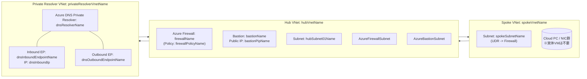
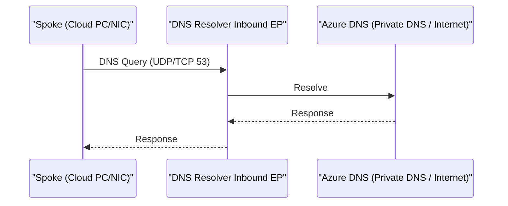
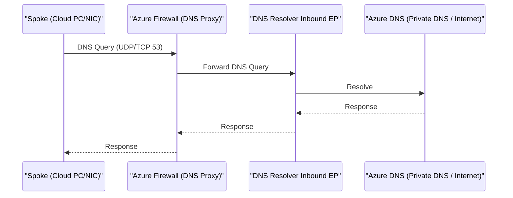
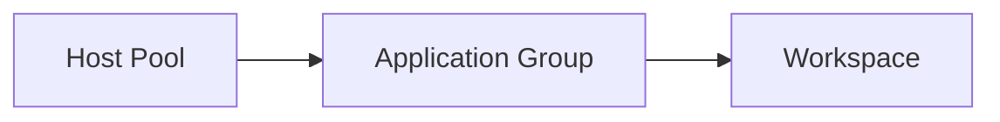

Title: Windows 365 向け Azure インフラ構築手順（Azure Portal 手順）
Date: 2026-02-17
Slug: win365-azure-infra-portal
Lang: ja-jp
Category: notebook
Tags: azure, Windows 365, networking, firewall, dns
Summary: Cloud Diaries: Windows 365（Cloud PC）向けに Azure 側のネットワーク/Firewall/DNS 基盤を Azure Portal で構築する手順メモです。
Modified: 2026-02-17

本稿は、Windows 365（Cloud PC）を使うための「Azure 側の基盤（Hub-Spoke / Firewall / DNS Private Resolver）」にフォーカスした構築メモです。AVD 手順は本筋ではないため付録扱いにしています。

## 目的 / スコープ
- 本資料は、Windows 365（Cloud PC）利用のための **Azure 側のネットワーク/セキュリティ/DNS 基盤**を構築する手順をまとめたものです。
- **AVD（Azure Virtual Desktop）自体は本番構成として作成不要**のため、AVD 作成手順は「参考（付録）」として末尾に記載します。

## 前提

- 本資料は **Azure Portal で作成する前提**の手順です（コマンドやテンプレートの説明はしません）。
- リソース名や CIDR は環境に合わせて `<...>` のプレースホルダーを置き換えてください。

---

## 1. 構成概要

### 1.1 ネットワーク構成（論理）

### 1.2 主要な意図（何をしているか）
- Spoke 側（Windows 365 関連サブネット）からの **既定ルート (0.0.0.0/0)** を Azure Firewall に強制し、外向き通信を制御します。
- Spoke の DNS を Firewall に向け、Firewall 側の **DNS Proxy** で Private Resolver（Inbound Endpoint）へ転送します。
- Azure Firewall Policy で、Windows 365 / Intune / Office 365 / Windows Update などの **FQDN タグ**を許可します。

### 1.3 DNS 設計の選択肢（案1〜4）

案は 1〜4 まであります。

本稿では **案2** と **案4** を取り上げます。

#### 案1

#### 案2

#### 案3

#### 案4

---

以降では DNS の構成として、案2 → 案4 の順に説明します。

### 1.4 DNS 設計（案2）: Inbound Endpoint を DNS として直指定（DNS Proxy なし / 添付2枚目）
DNS の入口を Firewall ではなく **Inbound Endpoint** にし、Firewall は **ルーティング（トランジット）**として通します。

ポイント:
- Spoke VNet の DNS サーバーは Inbound Endpoint を指定します
- 戻り経路も Firewall 経由に揃えるため、DNS VNet 側にも戻り用の UDR を設定します

DNS フロー（案2の概念）:

### 1.5 DNS 設計（案4）: Azure Firewall の DNS Proxy を使う
- Spoke VNet の DNS を **Azure Firewall のプライベート IP** に設定
- Firewall Policy で **DNS Proxy を有効化**し、転送先 DNS として Private Resolver の **Inbound Endpoint**（例: `<dnsInboundIp>`）を指定

この案は、DNS の入口を Firewall に寄せられるため、運用上は「DNS の経路を一箇所に集約しやすい」構成です。

DNS フロー（案4の概念）:

---

## 2. 事前準備（Azure Portal）

### 2.1 必要な権限
- 対象サブスクリプションに対し、少なくとも以下が必要です。
  - リソース作成権限（例: Contributor）
  - Azure Firewall / Network / DNS Private Resolver 作成に必要な権限

### 2.2 事前に決めておく値（チェックリスト）
- リソースグループ: `<resourceGroupName>` / リージョン: `<location>`
- VNet とアドレス空間
  - Hub: `<hubVnetName>` / `<hubVnetCidr>`
  - Spoke: `<spokeVnetName>` / `<spokeVnetCidr>`
  - DNS VNet（Private Resolver 用）: `<privateResolverVnetName>` / `<privateResolverVnetCidr>`
- Azure Firewall のプライベート IP（固定化推奨）: `<firewallPrivateIp>`
- Private Resolver Inbound Endpoint のプライベート IP（固定化推奨）: `<dnsInboundIp>`

---

## 3. Azure Portal での構築手順（共通）

### 3.1 リソースグループを作成
- Azure Portal → **リソース グループ** → 作成
- 名前: `<resourceGroupName>` / リージョン: `<location>`

### 3.2 VNet（Hub / Spoke / DNS VNet）とサブネットを作成

1. Hub VNet（例: `<hubVnetName>`）

    - Azure Portal → **仮想ネットワーク** → 作成
    - サブネット
        - `AzureFirewallSubnet`（Firewall 用。名前は固定）
        - `AzureBastionSubnet`（Option: Bastion を使う場合。名前は固定）
        - 運用用サブネット（Option: 例: `<hubSubnet01Name>`）

2. Spoke VNet（例: `<spokeVnetName>`）

    - Windows 365 用のサブネット（例: `<spokeSubnetName>`）を作成

3. DNS VNet（Private Resolver 用。例: `<privateResolverVnetName>`）

    - Inbound Endpoint 用サブネット（例: `sub-inbound`）を作成
    - Outbound Endpoint 用サブネット（例: `sub-outbound`）を作成

### 3.3 VNet Peering（Hub ↔ Spoke、Hub ↔ DNS VNet）

この手順は **ExpressRoute Gateway（Virtual Network Gateway）が Hub VNet に存在する前提**です。
Spoke/DNS VNet からオンプレミス（ExpressRoute）へ到達させたい場合は、ピアリングの Gateway 関連設定も合わせて有効化します。

1. ピアリングを作成（Hub ↔ Spoke、Hub ↔ DNS VNet）

    - Azure Portal → 各 VNet → **ピアリング** → 追加
    - Hub ↔ Spoke、Hub ↔ DNS VNet の **両方向**で作成（Portal の案内に従って作成）

2. 推奨設定（要件に合わせ調整）

    - **仮想ネットワーク アクセス: 許可**
        - ピアリングした VNet 同士で相互に通信できるようにします。
    - **転送されたトラフィック: 許可**
        - Hub の Azure Firewall を経由するような“トランジット通信”で必要になります（UDR で Firewall に送った通信が、別 VNet 宛として転送されるため）。

3. ExpressRoute Gateway（Hub）を Spoke/DNS VNet から利用する場合の設定

    - Hub 側（Hub → Spoke / Hub → DNS VNet のピアリング）
        - **ゲートウェイ トランジットを許可（Allow gateway transit）: 有効**
            - Hub の Virtual Network Gateway（ExpressRoute Gateway）を、ピアリング先に“共有”できるようにします。
    - Spoke 側（Spoke → Hub のピアリング）
        - **リモート ゲートウェイを使用（Use remote gateways）: 有効**
            - Spoke からオンプレミス（ExpressRoute）への経路として、Hub の Gateway を利用します。
    - DNS VNet 側（DNS VNet → Hub のピアリング）
        - DNS VNet からもオンプレミス到達が必要な場合のみ、Spoke と同様に **リモート ゲートウェイを使用**を有効にします。

### 3.4 Azure Firewall と Firewall Policy

1. Firewall Policy を作成

    - Azure Portal → **Firewall ポリシー** → 作成（例: `<firewallPolicyName>`）

2. Azure Firewall を作成

    - Azure Portal → **Azure Firewall** → 作成（例: `<firewallName>`）
    - 仮想ネットワーク: Hub VNet
    - サブネット: `AzureFirewallSubnet`
    - パブリック IP: 新規作成（または既存）
    - Firewall Policy: 3.4-1 で作成したものを関連付け

### 3.5 ルート テーブル（UDR）を作成し、Spoke サブネットに関連付け
- Azure Portal → **ルート テーブル** → 作成（例: `<udrName>`）
- ルート
  - 宛先: `0.0.0.0/0`
  - 次ホップの種類: 仮想アプライアンス
  - 次ホップ アドレス: `<firewallPrivateIp>`
- Azure Portal → Spoke VNet → サブネット `<spokeSubnetName>` → **ルート テーブル** を関連付け

### 3.6 Azure DNS Private Resolver（Inbound/Outbound Endpoint）

1. Private Resolver を作成

    - Azure Portal → **Azure DNS Private Resolver** → 作成（例: `<dnsResolverName>`）
    - VNet: DNS VNet（`<privateResolverVnetName>`）

2. Inbound Endpoint を作成（IP 固定推奨）

    - Private Resolver → **Inbound endpoints** → 追加
    - サブネット: `sub-inbound`
    - IP: `<dnsInboundIp>`

3. Outbound Endpoint を作成

    - Private Resolver → **Outbound endpoints** → 追加
    - サブネット: `sub-outbound`

### 3.7 必要な場合 Private DNS zone を DNS VNet にリンク
- 各 Private DNS zone → **仮想ネットワーク リンク** → DNS VNet（`<privateResolverVnetName>`）にリンク

---

## 4. DNS の設定

## 4.1 案2: Inbound Endpoint を DNS として直指定

### Spoke VNet の DNS を Inbound Endpoint に向ける
- Azure Portal → Spoke VNet → **DNS サーバー**
- 「カスタム」 → DNS サーバー: `<dnsInboundIp>`

### 戻り経路を揃える（DNS VNet 側の UDR が重要）
案2は「Spoke →（既定ルートにより）Firewall → DNS VNet → Inbound Endpoint」と流れます。
このとき DNS VNet 側が peering のシステムルートで Spoke に直帰すると **非対称ルーティング**になり、Firewall でドロップし得ます。

そのため DNS VNet 側にも以下の UDR を入れ、戻りも Firewall 経由にします。

1. ルート テーブルを作成（DNS 戻り用）

    - Azure Portal → **ルート テーブル** → 作成（例: `<udrDnsReturnName>`）
    - ルート
        - 宛先: `<spokeVnetCidr>`（例: `10.0.1.0/24`）
        - 次ホップの種類: 仮想アプライアンス
        - 次ホップ アドレス: `<firewallPrivateIp>`

2. DNS VNet のサブネットに関連付け

    - Azure Portal → DNS VNet → サブネット `sub-inbound`  に `<udrDnsReturnName>` を関連付け

### Firewall の L4 ルールで DNS(53) を許可
- Azure Portal → Firewall Policy `<firewallPolicyName>` → **ルール**
- Network rule で、以下を許可
  - 送信元: `<spokeSubnetCidr>`
  - 宛先: `<dnsInboundIp>`
  - プロトコル: TCP/UDP
  - ポート: 53

### （FQDN ベースの Network ルールを使う場合）DNS Proxy の考え方
FQDN ベースの Network ルール（宛先を FQDN で指定）を使う場合、Azure Firewall 側が FQDN を IP に解決できる必要があるため、一般に **DNS Proxy を有効化**し、 DNS サーバー を `<dnsInboundIp>` にします。

ただし、案2は Spoke の DNS を `<dnsInboundIp>` に直指定しているため、**Spoke の DNS クエリ自体は Firewall を経由しません**。

## 4.2 案4: Azure Firewall の DNS Proxy を使う（添付1枚目）

### Spoke VNet の DNS を Firewall に向ける
- Azure Portal → Spoke VNet → **DNS サーバー**
- 「カスタム」 → DNS サーバー: `<firewallPrivateIp>`

### Firewall Policy で DNS Proxy を有効化し、転送先を Inbound Endpoint にする
- Azure Portal → Firewall Policy `<firewallPolicyName>` → **DNS 設定**
- DNS プロキシ: 有効
- DNS サーバー（転送先）: `<dnsInboundIp>`

補足:
- 転送先 DNS は、Private Endpoint（`privatelink.*`）を確実に解決できるように **`<dnsInboundIp>`（Private Resolver Inbound Endpoint）推奨**です。
- Azure Default を指定すると、Private DNS zone の解決ができずに Private Endpoint 名が引けない構成になりやすいです。

---

## 5. Azure Firewall のルール（Portal で設定）

> 注: Windows 365 の宛先要件は更新される可能性があるため、最終的には Microsoft の公開情報に沿って見直してください。ここでは Portal での作り方と代表例をまとめます。

### 5.1 Application ルール（L7 / FQDN タグ）

Azure Portal → Firewall Policy `<firewallPolicyName>` → **ルール** → Application rule collection group を作成し、FQDN タグを追加します。

| Rule 名 | FQDN Tag | Protocol | Port | Source | 目的 |
|---|---|---:|---:|---|---|
| Allow Windows 365 | `Windows365` | Https | 443 | `<spokeSubnetCidr>` | Windows 365 サービス通信 |
| Allow Intune | `MicrosoftIntune` | Https | 443 | `<spokeSubnetCidr>` | Intune 管理通信 |
| Allow Office 365 | `Office365.Common.*` | Https | 443 | `<spokeSubnetCidr>` | M365 通信（必要範囲） |
| Allow Windows Update | `WindowsUpdate` | Https | 443 | `<spokeSubnetCidr>` | Windows Update |
| Allow AVD | `WindowsVirtualDesktop` | Https | 443 | `<spokeSubnetCidr>` | AVD 通信 |

### 5.2 Network ルール（L4）

Azure Portal → Firewall Policy `<firewallPolicyName>` → **ルール** → Network rule collection group を作成し、必要な L4 通信を許可します。

| Rule 名 | Protocol | Dest | Ports | Source | 目的 |
|---|---|---|---|---|---|
| Registration01 | TCP | `azkms.core.windows.net` | 1688 | `<spokeSubnetCidr>` | KMS |
| TURN | UDP | `<turnIpCidr>` | 3478 | `<spokeSubnetCidr>` | TURN（音声/映像等） |
| Entra | TCP | Service Tag: `AzureActiveDirectory` | 443 | `<spokeSubnetCidr>` | Entra ID |
| DNS (案2) | TCP/UDP | `<dnsInboundIp>` | 53 | `<spokeSubnetCidr>` | Spoke → Inbound Endpoint の DNS 転送 |
| DNS (案4: 必要な場合) | TCP/UDP | `<dnsInboundIp>` | 53 | `<hubVnetCidr>`（または Firewall 送信元に絞った範囲） | Firewall DNS Proxy → Inbound Endpoint の転送 |

---

## 6. 作成後の確認ポイント（Portal で確認）

### 6.1 VNet Peering
- Hub ↔ Spoke
- Hub ↔ DNS VNet

### 6.2 UDR（既定ルート / 戻りルート）
- Spoke サブネットに `0.0.0.0/0 → <firewallPrivateIp>` が付いている
- （案2の場合）DNS VNet サブネットに `<spokeVnetCidr> → <firewallPrivateIp>` が付いている

### 6.3 DNS
- Spoke VNet の DNS サーバー設定が想定どおり（案4なら Firewall、案2なら Inbound Endpoint）
- Private DNS zone のリンクが DNS VNet に張られている

---

## 7. 参考: オンプレ（DNS フォワーダ）から Azure Private DNS を引く場合

オンプレ側の DNS サーバー（フォワーダ）で、必要なドメインに対して **条件付きフォワーダ**を作成します。

- 例: `privatelink.<service>.windows.net`
- 転送先:
  - 案4: Firewall のプライベート IP（DNS Proxy が Inbound Endpoint に転送）
  - 案2: Inbound Endpoint の IP（`<dnsInboundIp>`）

---

Windows 365 の Azure 側インフラとしては、通常 **お客様が AVD HostPool 等を作る必要はありません**。
ただし、検証や比較のために AVD を作成したい場合は以下を参考にしてください。

### 8.1 何を作るか（高レベル）

### 8.2 注意点
- AVD 用のセッションホスト VM やドメイン参加方式、FSLogix、プロファイル格納などは別途設計が必要です。
- 本資料の Firewall ルールには `WindowsVirtualDesktop` の FQDN タグが含まれていますが、**参考**として扱ってください。

---

## 付録: 置き換え用プレースホルダー一覧（例）
- `<subscriptionId>`
- `<resourceGroupName>`
- `<location>`
- `<hubVnetName>`, `<spokeVnetName>`, `<privateResolverVnetName>`
- `<firewallName>`, `<firewallPolicyName>`
- `<dnsResolverName>`, `<dnsInboundIp>`
- `<spokeSubnetName>`, `<spokeSubnetCidr>`, `<privateResolverVnetCidr>`
- `<udrName>`, `<bastionName>`, `<bastionPipName>`, `<firewallPipName>`
